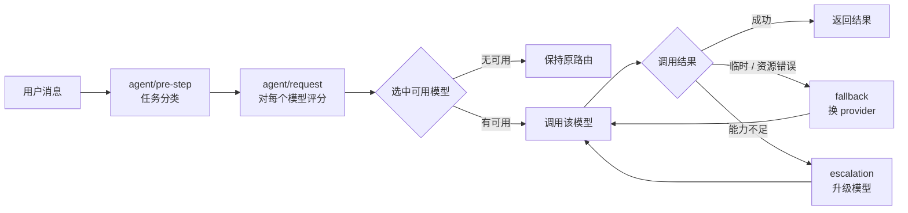

# DeepSeek Harness 专用自动路由插件

[](LICENSE)
[](https://github.com/deepseek-ai/deepseek-harness)
[](https://www.typescriptlang.org/)

> DeepSeek Harness 的可配置智能模型路由插件：根据每次请求的任务需求，从**已注册的模型**中自动选择最合适的 provider/model，而非固定使用一个模型。

**纯插件实现，零核心修改**——图片自动切视觉模型、代码任务切代码模型、限流自动换 provider、能力不足自动升级。

## 目录

- [为什么需要](#为什么需要)
- [特性](#特性)
- [安装](#安装)
- [快速开始](#快速开始)
- [工作原理](#工作原理)
- [配置参考](#配置参考)
- [Fallback 与 Escalation](#fallback-与-escalation)
- [手动覆盖](#手动覆盖)
- [安全边界](#安全边界)
- [常见问题](#常见问题)
- [测试](#测试)
- [License](#license)

## 为什么需要

默认情况下，dsh 用固定一个模型处理所有请求，这会带来几个问题：

| 问题 | 后果 |
|------|------|
| 图片发给纯文本模型 | 模型无视图片，答非所问（甚至卡住） |
| 复杂代码 / 长文本发给轻量模型 | 能力不足，回复质量差、超上下文 |
| 单个 provider 限流 / 故障 | 请求直接失败，无法自动恢复 |

`llm-router` 在 `agent/request` 边界自动改写模型选择，让**每个请求都路由到最合适的模型**——你只需要写配置，不用改任何代码。

## 特性

- 🧩 **纯插件**：不改 DSH 核心，通过 npm 包即可安装。
- 🎯 **智能分类**：规则 + 能力启发式识别 vision / coding / reasoning / tool_use / 长文本等任务（非 ML，可解释）。
- 🖼️ **视觉路由**：图片自动切到支持视觉的模型。
- 💻 **代码路由**：代码复杂度越高，越倾向能力强（贵）的模型。
- 🔁 **自动 fallback**：限流 / 配额 / 超时等临时错误 → 换另一个 provider 重试。
- ⬆️ **自动 escalation**：空回复 / 超上下文等能力不足 → 升级更强模型（有上限）。
- 🔒 **安全边界**：模型只能从 Registry 选，任何「模型推荐」都经 `ModelRegistry.resolve()` 校验。
- ⚙️ **可配置可关闭**：支持手动模式、`/model` 覆盖、成本 / 延迟策略。

## 安装

本插件是 dsh 的**树外插件**（out-of-tree plugin），需与 dsh 一起使用。它依赖 dsh 已提供的 `cordis` / `dsh-agent` / `dsh-llm` / `dsh-settings`（作为 peerDependencies 声明）。

**前置条件**：已安装 DeepSeek Harness（`@deepseek-ai/dsh`）。

### 从 GitHub 安装

```bash
npm install github:4060415/8kinfe-llm-router
```

## 快速开始

> 示例中的 `provider` / `model` 名是示意，替换成你实际注册的即可。

### 第 0 步：确认有可路由的模型

Router 只从**已注册**的 Model Registry 里选模型，不硬编码任何模型名。先确认你的 dsh 里注册了至少一个 provider/model：

- **DeepSeek 官方**：dsh 内置 `deepseek-official` provider（在 `.credentials.yaml` 配好 API Key 即可）。
- **其他 OpenAI 兼容 API**（Kimi/月之暗面、阿里百炼、OpenRouter 等）：通过 `dsh-llm-pi-ai` 在 `settings.yaml` 里注册：

```yaml
llm-pi-ai:
  providers:
    moonshotai-cn:
      apiKeyEnv: MOONSHOT_API_KEY   # 从环境变量读 Key
      models:
        - id: kimi-k2.6
        - id: kimi-k2.7-code
```

> `provider` 名（`moonshotai-cn`）和 `model` 名（`kimi-k2.6`）就是后面 Router 配置里要引用的标识。

### 第 1 步：安装插件

进入 dsh 的 profile 目录（通常是 `~/.dsh/profiles/web`）：

```bash
npm install github:4060415/8kinfe-llm-router
```

### 第 2 步：挂载 + 最小配置

编辑该 profile 的 `cordis.patch.yml`：

```yaml
- id: llm-router
  name: '8kinfe-llm-router'
  config:
    mode: auto
    preferred:
      provider: deepseek-official
      model: deepseek-v4-flash
```

启动 dsh 即可工作：普通聊天走 `preferred`，遇到图片 / 代码等任务会自动切换模型。

### 第 3 步：声明模型能力（推荐）

只有 `preferred` 时，特殊任务只能「兜底」。给模型标上能力元数据后，Router 才能「择优」：

```yaml
- id: llm-router
  name: '8kinfe-llm-router'
  config:
    mode: auto
    preferred:
      provider: deepseek-official
      model: deepseek-v4-flash
    models:
      deepseek-official/deepseek-v4-flash:
        coding: 0.6
        reasoning: 0.6
        vision: 0        # 不支持图片
        cost: 1
        latency: 1
      moonshotai-cn/kimi-k2.6:
        coding: 0.5
        reasoning: 0.7
        vision: 1        # 支持图片
        cost: 3
        latency: 2
```

### 常见场景

#### 场景 A：图片自动切视觉模型

发一张图片，Router 在 `agent/pre-step` 识别到 image 后，会自动跳过不支持视觉的模型、改选 `vision: 1` 的 kimi-k2.6，而不是 flash。配好第 3 步的 `models` 即可，无需额外操作。

#### 场景 B：代码任务走代码模型

复杂代码任务会综合 `coding` / `reasoning` / `cost` / `latency` 加权打分，选综合最优的模型；任务越复杂，越偏向能力强的模型，简单任务则倾向便宜模型。

#### 场景 C：限流自动换 provider（fallback）

某 provider 触发 `RATE_LIMIT`（429）、`QUOTA`、`SERVER`、`TIMEOUT` 等临时 / 资源错误时，Router 自动 fallback 到**另一个 provider** 的模型并重试：

```yaml
    fallback:
      enabled: true
      routes: {}
      # 留空 = 自动选不同 provider 的最强模型；也可显式指定：
      # routes:
      #   RATE_LIMIT: { provider: deepseek-official, model: deepseek-v4-flash }
```

#### 场景 D：能力不足自动升级（escalation）

模型返回 `EMPTY_RESPONSE`（空回复）或 `CONTEXT_WINDOW_EXCEEDED`（超上下文）时，Router 升级到能力更强的模型，最多 `maxEscalations` 次：

```yaml
    escalation:
      enabled: true
      triggerCodes: [EMPTY_RESPONSE, CONTEXT_WINDOW_EXCEEDED]
    maxEscalations: 2
```

### 验证路由

临时开 `debug`：

```yaml
      debug: true
```

日志会打印每次请求的任务分类、各模型评分和最终选择（`llm-router: ...` 前缀），确认行为符合预期后关掉即可。

### 手动接管

对话里输入 `/model <name>` 或通过 UI 切换模型，Router 会尊重你的手动选择、不再改写；切回默认后重新接管。

## 工作原理

Router 在 dsh 的三个 agent 扩展点插入逻辑：

| 事件 | 用途 |
|------|------|
| `agent/pre-step` | 读取进入 step 的 user message，做任务分类（规则 + 能力启发式，非 ML） |
| `agent/request` | 对 Registry 中每个模型评分，改写 provider/model |
| `agent/request-error` | 失败恢复：先委托给下游重试（如 `llm-retry`），再 fallback / escalation |

一次请求的处理流程：



Provider 连接由 `dsh-llm-pi-ai` 等适配器负责；Router 只存「provider 名 + model 名 + 能力元数据」，与 endpoint / API Key 完全解耦。

## 配置参考

### 插件入口（cordis.patch.yml）

```yaml
- id: llm-router
  name: '8kinfe-llm-router'
  config:
    mode: auto
    costPolicy: balanced
    maxEscalations: 2
    preferred:
      provider: deepseek-official
      model: deepseek-v4-flash
    models:
      # key = "provider/model"，替换成你实际的 provider / model
      deepseek-official/deepseek-v4-flash:
        coding: 0.6
        reasoning: 0.6
        vision: 0
        cost: 1
        latency: 1
        context: 128000
      moonshotai-cn/kimi-k2.6:
        coding: 0.5
        reasoning: 0.7
        vision: 1
        cost: 3
        latency: 2
        context: 128000
```

### 配置项（`llm-router` settings namespace，支持热重载）

| 字段 | 类型 | 默认 | 说明 |
|------|------|------|------|
| `enabled` | boolean | `true` | 总开关，关闭后 Router 完全惰性 |
| `mode` | `auto` \| `manual` | `auto` | `manual` 时永不改写调用方的选择 |
| `debug` | boolean | `false` | 输出选型解释日志 |
| `costPolicy` | `quality_first` \| `balanced` \| `cost_first` \| `speed_first` | `balanced` | 成本 / 延迟姿态 |
| `maxEscalations` | number | `2` | 每个 agent 自动升级次数上限 |
| `preferred` | `{provider, model}` | — | `auto` 模式下 simple_chat 的偏好模型 |
| `models` | dict | `{}` | 能力元数据，key 为 `provider/model` |
| `weights` | object | 见下 | 评分权重 |
| `escalation` | object | 见下 | 升级触发条件 |
| `fallback` | object | 见下 | 失败降级映射 |

`models` 条目字段（均可选，缺省取中性值）：

| 字段 | 类型 | 说明 |
|------|------|------|
| `coding` / `reasoning` / `vision` / `toolCalling` | 0..1 | 能力强度 |
| `context` | number | 上下文窗口 token 数 |
| `cost` | 1..5 | 成本（1 最便宜） |
| `latency` | 1..5 | 延迟（1 最快） |

> `vision` 未配置时，从适配器报告的 `inputModalities` 是否含 `image` 自动推断。

`weights` 默认：

```yaml
capability: 1
cost: 0.3
latency: 0.3
context: 0.2
toolCalling: 0.2
```

`escalation` 默认（能力不足触发升级）：

```yaml
enabled: true
triggerCodes: [EMPTY_RESPONSE, CONTEXT_WINDOW_EXCEEDED]
```

`fallback` 默认（临时 / 资源错误触发换模型）：

```yaml
enabled: true
routes: {}   # 可显式指定 code -> {provider, model}
```

## Fallback 与 Escalation

- **Fallback**：`RATE_LIMIT` / `QUOTA` / `SERVER` / `TIMEOUT` / `TRANSPORT` / `AUTH` 等临时或资源性错误 → 换到另一个 provider（显式 `fallback.routes[code]` 优先，否则自动选不同 provider 的最强模型）。
- **Escalation**：`EMPTY_RESPONSE` / `CONTEXT_WINDOW_EXCEEDED` 等能力不足 → 升级到能力更强的模型，受 `maxEscalations` 限制。

两者在 `agent/request-error` 中都会先 `await next()`，把重试机会让给下游（例如 `llm-retry` 的同 provider 重试），只有当重试策略耗尽时才介入。

## 手动覆盖

- `mode: manual`：Router 完全不动模型。
- `mode: auto`：调用方通过 `/model <name>` 或 UI 手动切换后，Router 检测到该覆盖并**尊重它**，不会改写；切换回默认后重新接管。
- `preferred`：simple_chat 或无可服务模型时的偏好兜底。

## 安全边界

模型只能从已注册的 Model Registry 中选择。任何「模型推荐」（包括显式配置的 fallback 路由）都必须经过 `ModelRegistry.resolve()` 验证命中已注册模型后才会执行；API Key、endpoint、权限、系统配置对模型不可写。

## 常见问题

**Q：为什么没有切到我预期的模型？**

按顺序排查：

1. 目标模型是否真的注册在 Registry 里（`models` 的 key 要和 `provider/model` 完全一致）。
2. `mode` 是否为 `auto`（`manual` 下 Router 不动模型）。
3. 是否手动用 `/model` 切换过（手动覆盖会被尊重）。
4. 开 `debug: true` 看选型日志，确认分类与评分是否符合预期。

**Q：怎么知道 Router 每次选了哪个模型？**

设 `debug: true`，日志会打印每次请求的任务分类、各模型评分和最终选择（`llm-router: ...` 前缀）。

**Q：某个模型不支持图片怎么办？**

在 `models` 里把它的 `vision` 标成 `0`，Router 遇到图片任务就会跳过它；不标的话会从适配器报告的 `inputModalities` 自动推断。

**Q：能完全关掉自动路由吗？**

能。设 `mode: manual` 让 Router 永不改写，或设 `enabled: false` 让插件完全惰性。

**Q：fallback 和 escalation 有什么区别？**

fallback 处理「临时 / 资源」错误（限流、超时等），换到**另一个 provider**；escalation 处理「能力不足」（空回复、超上下文），升级到**更强模型**。

## 测试

```bash
npm test
```

覆盖规格书 Test 1–7：普通 / 复杂 coding 选型、图片选型、复杂视觉选型、Flash→Pro 升级、429 fallback、手动覆盖不被覆盖。

## License

[MIT](./LICENSE) © 2026 8Kinfe
