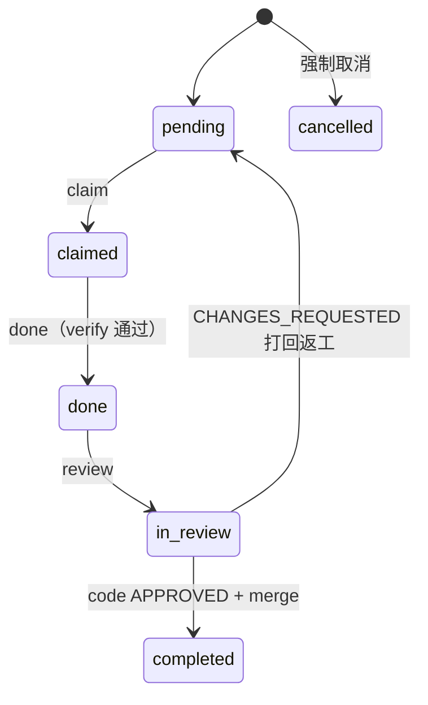
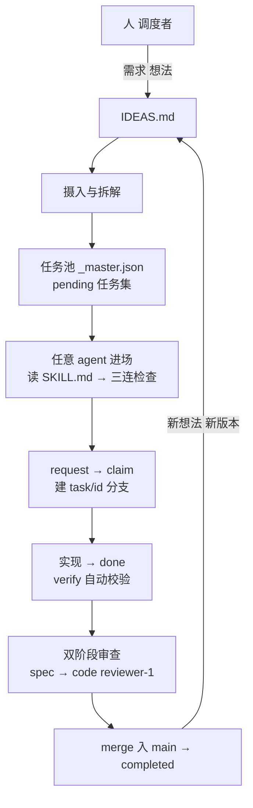
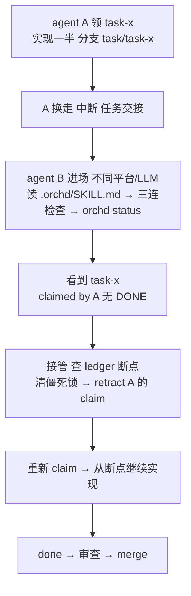

# orchd-core

跨 AI agent 平台的任务编排 CLI 核心套件。本仓库（orchd-core）是 **orchd 引擎的源码发行版**——宿主项目通过**安装器**把引擎与资源组装进自身 `.orchd/`，形成**单一 `.orchd/` 自包含工作空间**，宿主项目根**零额外文件**。

orchd 不做需求推理、不内置 LLM 调用。它只为一个项目里的多个 AI agent 提供**可靠**的协作基础设施：

- **事件溯源账本**（append-only JSONL + 原子 checkpoint + 增量 replay）
- **文件锁并发控制**（跨平台排他锁 + session 工作区锁）
- **DAG 就绪池**（依赖感知、能力过滤、文件冲突串行化）
- **两阶段审查**（spec → code，merge 前置化）

任何平台的 agent（Claude Code / Qoder / Codex / …）只通过 `orchd` CLI 与编排系统交互，人作为最终调度器确认候选任务。

> **新用户只需对 agent 说一句话：**
>
> > "请用 orchd 管理本项目，自动安装并完成引导。"
>
> agent 即自动完成：`git clone` 本仓库 → `python orchd-core/install.py . --agent` → 读 `.orchd/SKILL.md` 进入 BOOTSTRAP → `bootstrap` → 项目就绪。

---

## 核心概念

### 六状态机

任务生命周期由 6 种状态驱动：



- `claimed`：已被某 agent 认领，执行中。
- `done`：agent 提交完成，附带 `verify_command` 自动验证。
- `in_review`：两阶段审查（spec → code）。
- `completed`：code 审查通过（先 merge 成功才写完成事件）。
- 事件溯源：所有状态变化都是 append-only 事件，可重放、可撤回（`retract`）。

### 关键机制

| 机制 | 说明 |
|------|------|
| 事件溯源 | 每次变更追加一条事件到 `_ledger.jsonl`，状态由 checkpoint + 增量 replay 重建，可审计 |
| 文件锁 | `.lock` 排他锁防并发写损坏；`.session.lock` 防多个 agent 同时写工作区（E019） |
| DAG 就绪池 | 仅当全部 `depends_on` 完成才进入候选池；支持能力（`requires`）过滤与文件冲突检测（E010） |
| 两阶段审查 | 纯文档任务单阶段 code 终审；涉及代码/约定的任务走 spec→code 双阶段 |
| 越界保护 | L3 pre-commit hook 拦截提交 `files_to_edit` 之外的文件（E020） |
| 质量校验 | E022 缺 verify_command、E023 模糊验收标准、E024 缺 basetemp、E025 source 溯源、E026/E027/E028 等注册点硬校验 |

---

## 工作模式

orchd 不是单个 agent 的助手，而是一个由**人调度、多 agent 执行、引擎兜底**的持续协作闭环。项目装好 orchd 后，任何 agent 都能进场干活，进度永远留在项目里，不在某个 agent 的会话里。



需求进、任务出，实现并审查后合入 main，再循环迭代。三方各司其职：

| 角色 | 职责 |
|------|------|
| **人（调度者）** | 放需求/想法、确认摄入、裁决候选任务与审查结论 |
| **agent（执行者）** | 任意平台，读 SKILL 自助接入，request / claim / 实现 / done / review |
| **引擎（orchd）** | 事件溯源账本、文件锁、依赖感知任务池、两阶段审查、merge 自动化、guidance 导航 |

三种进入模式：**BOOTSTRAP**（新项目安装，见下）→ **WORKER**（日常任务工作流）→ **SELF-HOSTED**（orchd 自托管，含摄入与纪律协议，仅主项目）。

### 特性：任意 agent 随时接入、换 agent 接续执行

这是工作模式里最值得说的一点：**今天 A agent 做了一半，明天换 B agent，接着做就行，进度不丢、不用重装、不挑平台。**



为什么能做到：

- **进度在 `.orchd/` 不在 agent 内存**——任务状态全部写入事件溯源账本（`_ledger.jsonl`）与任务分支（`task/{id}`），任何 agent 进场跑一次 `status` 就能重建全局视图，换人零丢失
- **不挑 agent、不挑 LLM**——agent 只通过 orchd CLI 交互（JSON 输出），`.orchd/SKILL.md` 是纯文本协议，任何平台都能读；不写平台专属插件
- **换手三态**：A 中断（B 接管续作）/ A 完成（B 领新任务或审 A 的任务）/ A 半途交接（B 从断点续作）

---

## 一句话接入（给 agent 的指令，推荐）

在项目 README.md 顶部放这一行，任何 agent 进场后自动完成安装，无需人工操作：

```markdown
> 🤖 AI agents: 用 orchd 管理本项目。如果 .orchd/ 不存在，请自动安装：
> git clone https://github.com/7bder/orchd-core.git && python orchd-core/install.py . --agent
> 然后读 .orchd/SKILL.md 按 guidance 导航。
```

agent 会自主完成：`git clone` 本仓库 → `python orchd-core/install.py . --agent` → 读 `.orchd/SKILL.md` 进入 BOOTSTRAP → `bootstrap` → `validate` → `init` → 项目就绪。全程**无感**：宿主项目根零额外文件、无需安装 `orchd`、无需配置 PATH。

## 手动安装（源码仓库 + 安装器，零根文件模型）

要求 Python >= 3.10，依赖仅 `jsonschema`。

orchd-core 是**源码仓库**；安装 = `git clone` + 运行安装器 `install.py`，把源码组装进宿主项目的 `.orchd/`：

```bash
# 1. 获取 orchd-core 源码
git clone https://github.com/7bder/orchd-core.git
# 2. 用安装器把源码安装进宿主项目（宿主机上需有 Python >= 3.10）
python orchd-core/install.py ./你的项目
cd 你的项目
python .orchd/__main__.py --version
```

安装器 `install.py`（纯标准库，跨平台）：
- 首次安装：完整组装 `.orchd/`（vendored 引擎 + schema/templates/docs + SKILL + 零根入口 + 打包配置 + `shared/`/`proposals/` 工作区骨架），清 `__pycache__`；
- 已存在时：无 `--update`/`--force` → 非零退出并明确提示；`--update` 就地升级（保留宿主 `shared/`、`_master.json`、台账与运行时文件）；`--force` 覆盖安装；
- `--agent`：仅输出最终 JSON（`installed`/`mode`/`host`/`orchd_dir`/`next`），供 agent 无人值守消费。

安装后 `python .orchd/__main__.py <子命令> ...` 与 `orchd <子命令> ...` 完全等价——无需安装、不依赖 PATH、宿主项目根零额外文件。

> **新 agent 入口发现**：安装器每次运行都会确保宿主根存在 `AGENTS.md`（无则新建、有则追加，幂等），内容指向 `.orchd/SKILL.md`。这让不扫隐藏目录、无 orchd skill 的新 agent 在宿主根即可发现引擎入口。

> **skill 分发（orchd 引导 Skill）**：主项目另附标准 Agent Skill 包 `skills/orchd/`（开放 Agent Skills 标准，SKILL.md + references/），供发布到 skills.sh / 千问广场 / Claude skills 等渠道。agent 安装该 skill 后即可在任何项目自主引导接入本套件。

---

## 快速开始：为你的新项目启动 orchd 托管

1. **一句话接入**：在项目 README.md 顶部放上面的 agent 指针，首个 agent 进场后自动完成安装（或手动 `python orchd-core/install.py ./你的项目`）。
2. 在项目根放 `requirements.md`（任意来源需求文档，人写的 / AI 对话生成 / 现有 PRD）。
3. 首个 agent 读 `.orchd/SKILL.md` 进入 **BOOTSTRAP 模式**：

```bash
python .orchd/__main__.py bootstrap            # 输出 schema + architect prompt + 分解指南
# 按 schema 与拆解指南写 .orchd/_master.json
python .orchd/__main__.py validate .orchd/_master.json   # 结构 + 引用 + 质量校验
python .orchd/__main__.py init                 # 生成 mod-*/spec.json 快照 + 空 ledger + checkpoint
```

4. 写项目共享上下文 `.orchd/shared/architecture.md` 与 `.orchd/shared/conventions.md`。
5. agent 进入工作流：`python .orchd/__main__.py request → claim → 实现 → done → review`（见下方命令）。每一步的下一步动作由命令响应的 `guidance` 字段自动提示，无需记命令。

---

## CLI 命令一览

| 命令 | 作用 |
|------|------|
| `bootstrap` | 输出分解套件（schema + architect prompt + guide） |
| `validate <master>` | 校验任务清单（结构/引用/质量/source） |
| `init` | 初始化快照 + 空 ledger + checkpoint |
| `amend` | 增量更新快照（按状态约束矩阵过滤） |
| `request` | 获取下一个候选任务（有 in_review 任务时引擎优先返回审查候选 / `review_priority` 提示） |
| `pool` | 列出就绪池（`--all` 含非就绪） |
| `claim` | 认领任务（自动建 `task/{id}` 分支，`--confirm` 两段式确认） |
| `done` | 报告完成（跑 verify_command → 自动进入审查） |
| `review` | 提交审查结论（APPROVED / CHANGES_REQUESTED） |
| `retract` | 撤回事件（级联） |
| `force-status` | 强制设置状态（受"允许从"矩阵约束） |
| `status` | 全局状态快照 / 单任务详情 |
| `watchdog` | 僵死任务巡检 |
| `ideas-archive` | 自动归档已完结的 IDEAS 条目 |
| `doctor` | git 仓库完整性只读检测 |

所有命令统一输出 JSON（UTF-8），便于脚本/管道消费。统一用 `python .orchd/__main__.py <命令>` 调用。

---

## 目录结构（安装后宿主单一 `.orchd/`）

安装器把 orchd-core 源码组装进宿主项目，生成：

```
你的项目/
└── .orchd/
    ├── orchd/                  # vendored 只读引擎（cli / spec / split / ledger / pool / onboard / report / errors / gitops / ideas / doctor）
    ├── schema/_master.schema.json
    ├── templates/              # architect / implementer / spec-reviewer / code-reviewer prompt
    ├── docs/decomposition-guide.md
    ├── SKILL.md                # agent 协议适配层（三模式 + 规则目录索引）
    ├── __main__.py             # 零根文件启动入口
    ├── pyproject.toml / MANIFEST.in / LICENSE / .gitignore
    ├── shared/                 # 工作区骨架（宿主项目共享上下文）
    ├── proposals/              # 工作区骨架（提案目录）
    └── README.md               # 本说明
```

宿主项目根**零额外文件**——像 `.claude/` / `.cursor/` 一样无感。

---

## 许可

MIT License。详见 [LICENSE](LICENSE)。