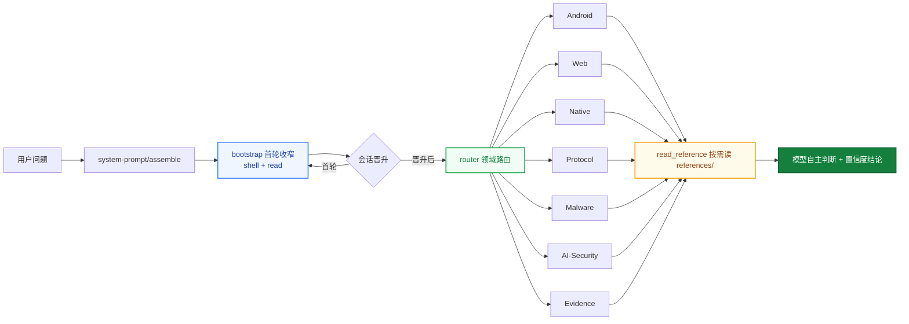

<div align="center">

# helmd

**DeepSeek Harness 破甲一体化安全分析插件**

一个 preset 挂载 · Android · Web · Native · Protocol · Malware · AI-Security 六大领域即开即用

[English](README.en.md) | 中文

[](https://t.me/helm_xD)
[](https://github.com/topics/dsh-plugin)
[](https://github.com/topics/deepseek-harness)
[](https://nodejs.org)
[](https://pnpm.io)
[](LICENSE)

</div>

> 仅供学习交流。使用者须遵守所在地法律法规，对使用本项目产生的后果自负。

## Why helmd

<table>
<tr>
<td width="50%">

### 破甲一体化

Android · Web · Native · Protocol · Malware · AI-Security 六大安全领域聚合在一个 preset 里。装一次，全领域工具就绪，不再逐领域拼装。

</td>
<td width="50%">

### 十个 bundle · 零拼装

10 个 `@dsh-security/*` bundle 独立发布、按需加载。`install.ps1` / `install.sh` 一条命令装齐，preset 与 router 自动挂载。

</td>
</tr>
<tr>
<td width="50%">

### 知识按需读

领域知识、规则、工作流、案例全部放 `references/`，工具按需读取——不塞进 system prompt 替模型做决定，控 token，也保判断。

</td>
<td width="50%">

### 首轮工具锚定

首个顶层请求只暴露 shell + `read`，晋升后放开完整目录。文本首答不会困在 bootstrap，第二轮一定见到全量工具。

</td>
</tr>
</table>

## 为什么做这个

DSH 的安全分析能力分散在多个领域 bundle：装 Android 要 add，装 Web 要 add，装 Native 还要 add，preset 和 router 也得自己拼。

helmd 把六个领域 + 证据链（evidence）+ 首轮工具锚定（bootstrap）打包成一个 preset：

`一个 preset` &ensp; `十个 bundle` &ensp; `零手动拼装`

装一次，会话里发 `helmd`，全领域工具就绪。

## 架构



- **首轮收窄**：首个顶层请求只暴露 shell + `read`，晋升后放开完整工具目录
- **领域路由**：`router` 用 `skill_catalog` / `read_reference` 把问题路由到对应领域
- **按需参考**：`references/` 是知识库，不是注入物；模型读完后自主判断

## 快速上手

**前提**：已安装 [`dsh`](https://github.com/deepseek-ai/deepseek-harness) CLI 与 pnpm。

Windows（双击 `install.bat`，或 PowerShell 运行）：

```powershell
.\install.ps1
```

macOS / Linux：

```bash
./install.sh
```

安装器会装 10 个 bundle、挂 `helmd` preset、设默认一步到位。然后启动：

```bash
dsh web
```

会话里发送 `helmd` 即激活。

## 验证

```bash
dsh --profile web --dump-config   # 应看到 10 个 @dsh-security bundle 行
```

会话里发送 `helmd` 后：

```text
skill_catalog        → 返回六领域路由
native_reference     → 读取 Native 领域参考
detect_packer <file> → 判定 PE/ELF 保护器
```

上面任一正常返回即安装成功。

## 包清单

| 包 | 注入 | 职责 | 暴露工具 |
| --- | --- | --- | --- |
| `@dsh-security/bootstrap` | systemPrompt | 首轮工具目录收窄，晋升后放开 | 无 |
| `@dsh-security/router` | tools | 领域路由与目录 | `skill_catalog`、`read_reference` |
| `@dsh-security/skill-android` | tools | Android 逆向 | `apk_fingerprint` |
| `@dsh-security/skill-web` | tools | Web 安全 | `web_reference`、`bot_analyze` |
| `@dsh-security/skill-native` | tools | Native / 二进制逆向 | `native_reference`、`detect_packer`、`scan_strings`、`xor_bruteforce`、`encoding_detect` |
| `@dsh-security/skill-protocol` | tools | 协议 / 流量 | `protocol_reference`、`pcap_parse`、`state_machine`、`parse_har` |
| `@dsh-security/skill-malware` | tools | 恶意样本 | `malware_reference`、`ioc_extract`、`yara_gen` |
| `@dsh-security/skill-ai-security` | tools | AI / LLM 安全 | `ai_reference`、`llm_sim` |
| `@dsh-security/skill-evidence` | tools | 证据 / 报告 / case | `evidence_reference`、`create_case`、`triage_artifact`、`hash_artifact` |
| `@dsh-security/toolbox` | tools | 工具库推荐 | `tool_recommend` |

每个 `*_reference` 工具按需读取对应 `references/`，入口是各自的 `index.md`。

## 方案选型

| 方案 | 不选的原因 |
|------|-----------|
| 逐领域手装 bundle | 9 次 add + 手动拼 preset + router，重复且易错 |
| 只挂原生 shell 工具 | 无领域知识，模型靠猜，结论不可复现 |
| 知识塞进 system prompt | token 爆炸，且替模型做决定，违背按需原则 |
| helmd | 一个 preset 全聚合，知识按需读，模型自主判断 |

## 常用命令

```bash
pnpm install                # 安装依赖（prepare 自动 tsc）
pnpm build                  # 构建全部 10 个 bundle
pnpm typecheck              # 干净树 tsc --noEmit 类型门禁
```

本地打包交付：

```powershell
.\scripts\repack.ps1                            # 生成 dist-tgz\*.tgz
dsh plugin --profile web add .\dist-tgz\*.tgz   # 装进 web profile
```

## 部署

一键安装见上「快速上手」；手动分步如下。前置：10 个 `@dsh-security/*` 包已发布到 npm（见「发布」）。

### 1. 安装 bundle 到 profile

```bash
dsh plugin --profile web add \
  @dsh-security/bootstrap \
  @dsh-security/router \
  @dsh-security/skill-android \
  @dsh-security/skill-web \
  @dsh-security/skill-native \
  @dsh-security/skill-protocol \
  @dsh-security/skill-malware \
  @dsh-security/skill-ai-security \
  @dsh-security/skill-evidence
  @dsh-security/toolbox
```

`dsh plugin` 会把参数转发给 profile 目录里的 pnpm，包落到 `$DSH_HOME/profiles/node_modules/`。

### 2. 挂载 preset

把 `presets/full-reverse/` 复制到 DSH 用户 preset 根目录 `$DSH_HOME/.agent-presets/helmd/`：

macOS / Linux：

```bash
mkdir -p ~/.dsh/.agent-presets/helmd
cp presets/full-reverse/agent.cordis.yml ~/.dsh/.agent-presets/helmd/
cp presets/full-reverse/preset.yml ~/.dsh/.agent-presets/helmd/
```

Windows（PowerShell）：

```powershell
$p = Join-Path $env:USERPROFILE '.dsh\.agent-presets\helmd'
New-Item -ItemType Directory -Force $p | Out-Null
Copy-Item presets\full-reverse\agent.cordis.yml $p
Copy-Item presets\full-reverse\preset.yml $p
```

### 3. 设为默认 preset

在 UI 的 preset 选择器里选 `helmd`，或改 `$DSH_HOME/settings.yaml`：

```yaml
agent-presets:
  default: helmd
```

### 4. 启动并激活

```bash
dsh web
```

会话里发送 `helmd` 即激活。`DSH_HOME` 默认是 `~/.dsh`，自定义过就替换对应路径。

## 目录结构

```text
helmd/
├── packages/
│   ├── bootstrap/            首轮工具收窄过滤器
│   ├── router/               领域路由与目录
│   ├── skill-ai-security/    AI / LLM 安全
│   ├── skill-android/        Android 逆向
│   ├── skill-web/            Web 安全
│   ├── skill-native/         Native / 二进制逆向
│   ├── skill-protocol/       协议 / 流量
│   ├── skill-malware/        恶意样本
│   ├── skill-evidence/       证据 / 报告 / case
│   └── toolbox/              工具库推荐
├── presets/
│   └── full-reverse/
└── docs/
```

## 构建

需要 pnpm；构建产物目标 ES2022 / NodeNext。

```bash
pnpm install
pnpm -r build
```

根 `pnpm build` 等价于 `pnpm -r build`，逐包执行 `tsc`；`pnpm typecheck` 在干净树上执行 `tsc --noEmit` 类型门禁。

## 依赖

- `@deepseek-ai/cordis` `4.0.1`
- `@deepseek-ai/dsh-tools` `0.1.0-rc.6`

版本通过 `pnpm-workspace.yaml` 的 `overrides` 固定。

## 发布

- 根包 `private: true`，不发布；发布对象是 10 个 `@dsh-security/*` 子包。
- 各子包 `files` 白名单限定为 `dist`、`references`、`scripts`、`cordis.patch.yml`。
- 每个子包的 `prepare` 脚本会在发布前自动执行 `tsc`。
- 当前版本 `0.1.2`。

## 风险与缓解

| 风险 | 缓解 |
|------|------|
| DSH 宿主版本升级不兼容 | peer 依赖 cordis / dsh-tools，`overrides` 固定版本 |
| 本机缺 `python` | seam 自动探测 python / py / python3，缺失回退 `py` launcher |
| bundle 与 preset 版本错位 | 版本 0.1.2，tarball 与 release 同步发布 |
| 参考知识过时 | 按需读、模型自主判断，非硬性规则 |

## 参考项目

本项目融合了多个优秀开源项目的设计理念与实现思路，借鉴了社区中许多先行者的经验。如有雷同，那就是对优秀设计的借鉴与致敬。

- [ADWMC/helm-x](https://github.com/ADWMC/helm-x) — 提示词注入与计分制设计
- [yynxxxxx/Codex-X](https://github.com/yynxxxxx/Codex-X) — 提示词模板与可视化管理

## 文档

- [docs/principles.md](docs/principles.md) — 设计原则
- [docs/architecture.md](docs/architecture.md) — 架构
- [docs/architecture-v2.md](docs/architecture-v2.md) — 架构 v2（persona + 工具锚定 + 按需知识）

## Contributing

欢迎提 issue 与 PR。改动前请先阅读 [docs/principles.md](docs/principles.md)，并保持「参考知识按需读取、不替模型做决定」的架构约束。

## License

本项目基于 [MIT License](LICENSE) 开源，可自由使用、修改和分发。详见 [LICENSE](LICENSE)。

## AI 生成与法律风险

本仓库部分或全部代码由 AI 辅助生成，可能存在错误或不适用场景。使用前请自行审查，并自行判断是否适合你的使用场景与所在司法辖区；使用者须遵守所在地法律，对使用本项目产生的后果自负。本项目按 MIT “原样”提供，不附带任何担保。
