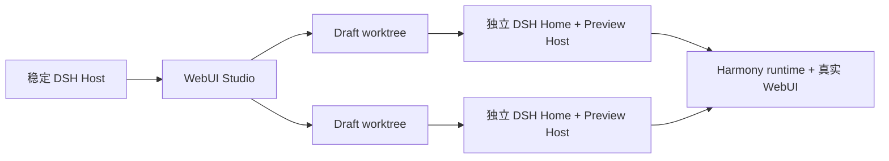

<div align="center">
  <a href="https://github.com/CH4ACKO3/dsh-harmony">
    
  </a>

  <h1>DeepSeek WebUI Studio</h1>

  <p>
    <strong>DSH WebUI 插件的可视化优先开发环境。</strong>
    <br />
    实时预览你的插件对 dsh webui 的修改效果，在可视化的集成开发工具中交互式地与 agent 协作构建插件客户端。
    <br />
    Powered by <a href="https://github.com/CH4ACKO3/dsh-harmony"><strong>dsh-harmony</strong></a>.
  </p>

  <p>
    <a href="#快速开始"><strong>快速开始</strong></a>
    ·
    <a href="https://github.com/CH4ACKO3/dsh-webui-studio/issues">报告问题</a>
    ·
    <a href="https://github.com/CH4ACKO3/dsh-webui-studio/issues">功能建议</a>
  </p>

  [](LICENSE)
  [](https://github.com/CH4ACKO3/dsh-webui-studio/actions/workflows/ci.yml)
  [](https://www.npmjs.com/package/dsh-webui-studio)
  [](package.json)
  [](https://github.com/CH4ACKO3/dsh-webui-studio/stargazers)
  [](https://github.com/CH4ACKO3/dsh-harmony)

  [简体中文](README.zh-CN.md) / [English](README.md)
</div>

## 面向真实 DSH WebUI 的可视化工作区

WebUI Studio 不是模拟页面生成器。它运行在官方 DSH WebUI 和真实插件图谱之上，
把可视化检查与源码修改转化为可分发、由插件自身拥有的产物。

Studio 是 [`dsh-harmony`](https://github.com/CH4ACKO3/dsh-harmony)
的独立下游应用。它通过公共 package exports 使用 Harmony 的 Host extension、runtime、
Patch engine 与 service API，并使用
[`dsh-harmony-react`](https://github.com/CH4ACKO3/dsh-harmony/tree/main/packages/react)
提供的通用 React 注册 API。依赖始终保持单向：Studio 依赖 Harmony，Harmony 不依赖 Studio。

## 你可以做什么

- [x] 创建最小 DSH Web Client 插件，或导入已有的本地插件文件夹
- [x] 为每个 Draft 分配独立 Git worktree、`DSH_HOME`、profile、依赖树和 child Host
- [x] 预览官方 WebUI，同时不把 Draft 代码加载进稳定 Host
- [x] 正常浏览，或检查 DOM、React owner、源码候选和 Patch trace
- [x] 自动展示插件注册的 Element 控件，并将默认值与限定在当前子树内的 CSS 保存回草稿源码
- [x] 检查 Component 声明命中后生成 CSS decorator，不修改既有调用点 Props
- [x] 通过一次事务热重载调整 Harmony Provider 与单个 Patch 的顺序和启停状态
- [x] 使用 CodeMirror 编辑 Draft 源码，并保持已安装依赖源码只读
- [x] 构建、经 Harmony 应用、重载，并确认实时 Client graph revision
- [x] 运行带显式 Studio tools 的 Draft 级 DSH Agent
- [x] 检查 package exports、构建产物、Patch 状态、顺序、依赖和 pack 输出
- [x] 同时运行多个相互隔离的 Draft Preview Host
- [x] 将当前 WebUI profile 或其它本地 profile 复制到每个 Draft 的隔离运行环境
- [x] 通过一次事务热重载调整插件顺序并启停 Harmony Provider

## 工作原理



稳定 Host 负责 Studio 界面、Draft registry 和 Agent session。每个 Draft 拥有隔离的
worktree 与 child Preview Host。只有在 Preview 确认新的实时 Client graph revision 后，
构建结果才会激活。停止 Draft 只终止 child Host，不会删除文件和状态。

Studio 的本地地址为：

```text
http://127.0.0.1:<dsh-port>/studio
```

托管数据位于 `$DSH_HOME/studio/`：

```text
studio/
├── workspace.json
├── drafts/<draft-id>.json
├── repositories/<draft-id>/
├── worktrees/<draft-id>/
└── runtimes/<draft-id>/dsh-home/profiles/web/
```

创建新插件时，Studio 会初始化并提交一个最小 DSH Web Client package，并默认只将它
保存在 Studio 内。创建时也可以记录一个新建或空白本地文件夹的绝对路径；在实例面板
显式点击“保存插件到文件夹”前，Studio 不会创建或修改该目录。后续保存会同步 Studio
中的项目快照，同时保留目标目录独有的 `node_modules` 等文件。导入已有插件时，
Studio 只接受本机绝对文件夹路径；验证 Web Client manifest 后，它会跳过 `.git` 与
`node_modules`，将快照复制到 Studio 自有 Git repository。符号链接会被拒绝，原插件
文件夹始终保持只读且不会被修改。

每个 Draft 可以使用稳定 Host 当前的 `web` profile，也可以通过绝对文件夹路径选择
另一个本地 DSH profile。Studio 会将其清单与配置复制到 Draft 的隔离运行环境，并以
所选源文件夹为基准解析相对 `link:` 依赖；源 profile 始终不会被修改。

Draft 显示名与 npm package identity 相互独立，可在实例面板中重命名。Studio 会在
`workspace.json` 中保存标签顺序与当前 Draft；关闭标签只会将其移出当前工作区，不会
停止或删除 Draft。Source 存在未保存
修改时，必须先按 `Ctrl+S` 或 `Command+S` 保存，才能切换或关闭标签。

## 快速开始

> [!IMPORTANT]
> Studio 依赖 [`docs/harmony-api-requirements.md`](docs/harmony-api-requirements.md)
> 中列出的 Harmony 公共 extension 与 service API，最低兼容版本为
> `dsh-harmony@0.4.2`。

```sh
dsh plugin --profile web add dsh-webui-studio
dsh web
```

Studio 会把 Harmony 作为传递依赖一并安装。第一次访问 `/studio` 时，点击
**安装 Harmony 并重启**；页面会安装 launcher，并在本地 DSH 进程重启后自动返回
Studio，无需再执行第二条 package 安装命令。已经安装 Harmony launcher 时会跳过此步骤。

如需开发 Studio 本身：

```sh
git clone https://github.com/CH4ACKO3/dsh-webui-studio.git
cd dsh-webui-studio
npm install
npm run check

dsh plugin --profile web add link:$(pwd)
dsh web
```

如需用发布产物验证相同的单包安装流程：

```sh
studio_tarball="$(npm pack --silent --ignore-scripts)"
dsh plugin --profile web add "file:$(pwd)/${studio_tarball}"
```

打开本地 `dsh web` 进程输出的 Studio 地址，创建或导入 Draft，然后启动它的 Preview Host。

Draft package 必须：

- 声明 `dsh.client.platform: "web"`；
- 导出 `.`, `./client` 和 `./package.json`；
- 定义非空的 `scripts.build` 命令。

## 开发命令

| 命令 | 用途 |
| --- | --- |
| `npm run typecheck` | 检查 Host、浏览器应用和 Preview bridge |
| `npm test` | 运行单元测试与组件测试 |
| `npm run build` | 构建 Host、Studio UI 和 Preview bridge |
| `npm run check` | 运行 typecheck、测试、构建和 tarball 全新安装集成验证 |
| `npm run test:integration` | 将 tarball 安装到全新的 DSH home，再端到端验证 Host、Draft、Preview、构建、激活与停止 |

集成测试需要 Harmony build 已公开兼容性说明中列出的 API。

## 设计边界

- 官方 WebUI 保持自己的同源 `/api` 与 WebSocket；Studio 不代理它们。
- Preview bridge 要求精确的 parent origin 和每次启动生成的 capability。
- 来自 Preview 的 DOM、React、源码、Patch 与注释数据均被视为不可信证据。
- 源码写入始终限制在所选 Draft package 内，且不会沿符号链接写到外部。
- 已注册 element boundary 与 Patch trace 只是候选证据，不代表对 DOM 的精确所有权声明。
- Element 控件通过插件 binding 修改实时 Preview。“保存到插件源码”会在 Draft 工作树中更新插件声明的默认初始化值与限定子树 CSS，不会改写组件使用位置，也不会固定运行时 binding。
- 自动 CSS Patch 使用 Harmony React 的 Component decorator。Studio 会先展示所有声明命中，再写入可立即加载的 Draft client export；现有 JSX 调用与 Props 保持不变。

## 常见问题

### Studio 与其他 WYSIWYG 工具有何不同？

DSH WebUI 的修改不能直接改动上游源码，而要以插件形式交付。界面元素还会参与
Cordis 的插件生命周期与控制逻辑，因此问题不只是操作静态 DOM 和 CSS。预览、修改、
验证与分发都需要理解 DSH 插件体系，这足以构成一套独立的专用工具。

### 为什么不直接让 Agent 对着源码修改？

Studio 仍然连接 DSH 内部真实的 Agent，同时为它提供更完整的项目上下文、集成预览、
专用 Agent 工具与 Skill，以及更紧密的编辑、构建、检查和验证闭环。Studio 不是取代
Agent，而是为 Agent 和开发者提供更好的交互式修改体验。

### Harmony 是什么，为什么选择 Harmony？

DSH WebUI 已经提供了许多 Slot 点位，但 Studio 不满足于此。我们希望实现更深层、
更高自由度的修改，包括修改其他插件加入的 UI 和逻辑，同时让不同修改插件之间尽可能
兼容。[`dsh-harmony`](https://github.com/CH4ACKO3/dsh-harmony) 提供的运行时 Patch 与
扩展模型，让这种能力成为可能。

## 相关项目

- [`dsh-harmony`](https://github.com/CH4ACKO3/dsh-harmony) - runtime patch、Host extension 挂载、插件重载与 Patch 检查
- [`dsh-harmony-react`](https://github.com/CH4ACKO3/dsh-harmony/tree/main/packages/react) - React-aware Patch 工厂与 Studio element/variable 注册

## 许可证

本项目采用 [MIT License](LICENSE)。
