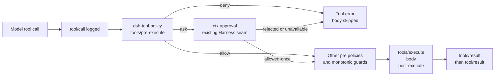

# dsh-tool-policy

Declarative, fail-closed governance for model-requested tools in [DeepSeek Harness](https://github.com/deepseek-ai/deepseek-harness).

> Community plugin. Not affiliated with or maintained by DeepSeek AI.

Repository: [Drifter-yh/dsh-tool-policy](https://github.com/Drifter-yh/dsh-tool-policy)

`dsh-tool-policy` is a small Cordis plugin that evaluates ordered rules at the public `tools/pre-execute` extension point. It can deny a tool call, route it to Harness's existing human approval seam, or delegate it unchanged. It does not replace the Harness approval, sandbox, timeout, retry, telemetry, or session systems. It is a per-call policy and routing layer, not a capability sandbox.

## Why this is needed

DeepSeek Harness already has strong primitives for tool execution: sandbox policy, one-shot approval, cooperative timeouts, provider retries, repeat-call reminders, and session telemetry. What is missing is a deployment-owned policy layer that applies the same rule vocabulary to every tool, including third-party and MCP tools.

Typical uses include:

- require approval for an entire MCP tool namespace such as `mcp__*`;
- deny a known destructive command pattern before the matched tool body starts;
- run a deny-by-default tool-call allowlist for unattended jobs;
- keep sensitive argument values out of policy feedback messages.

The plugin is intentionally not an audit logger or approval implementation. The Harness already owns those seams.

## Security model

The plugin operates on individual tool calls. Its rules match observable tool names and optional argument patterns before the tool body runs:

- **Harness sandbox:** Can this agent perform this class of operation at all? Harness sandboxing and runtime isolation are the layers responsible for enforcing capabilities such as filesystem writes or deletes, network access, and process execution.
- **Tool policy:** Should this particular known tool call be allowed, denied, or escalated? A matching `deny` prevents that call from executing; it does not revoke the underlying capability.
- **Harness approval:** Should an escalated `ask` call receive a one-shot human verdict?

A rule that matches one shell argument pattern, such as `rm -rf /foo`, only governs that call shape. A different tool or command sequence may produce the same effect. Tool policy and capability sandboxing are therefore complementary layers; production deployments should combine policy routing with a restrictive Harness sandbox.

### What this does not do

`dsh-tool-policy` does not implement sandboxing, capability enforcement, shell semantic analysis, or equivalent-operation detection. A `deny` rule makes the matched call unavailable, not destructive behavior impossible in general. It does not rewrite arguments or execute tool bodies.

## Installation

The public Harness package line is currently `0.1.0-rc.6`:

```sh
pnpm add dsh-tool-policy @deepseek-ai/cordis @deepseek-ai/dsh-tools
```

The Harness packages are peer dependencies so the host controls the runtime version. `@deepseek-ai/schemastery` is installed as the plugin's normal runtime dependency. The upstream source repository currently reports `0.1.0-rc.5` in `master`; this package is tested against the public `0.1.0-rc.6` registry artifacts.

### GitHub installation

The upstream profile-plugin documentation supports installing a TypeScript bundle directly from GitHub:

```sh
dsh plugin --profile my-profile add github:Drifter-yh/dsh-tool-policy#028e2ce4167a88ad32b0c6eec89ee22072189e71
```

Git installs fetch source, so this package's `prepare` script runs only the standalone `tsdown` build needed to create `dist/`. With pnpm 10 or newer, add the package to the profile's `pnpm-workspace.yaml` build allowlist if pnpm reports that the prepare script is blocked, then retry:

```yaml
allowBuilds:
  'dsh-tool-policy@https://codeload.github.com/Drifter-yh/dsh-tool-policy/tar.gz/5d7d4f15781aca9017bf5f420f6fd6bd6b2c0210': true
```

Review and pin the Git commit before allowing install-time code execution. `prepare` does not run tests or depend on a DeepSeek Harness checkout.

For local development, use the ordinary package-manager workflow from a clean clone: `pnpm install`.

### Harness profile bundle

The package also follows Harness's official profile-bundle contract: its `package.json` declares `dsh.bundle.patch`, and the published package contains `cordis.patch.yml`. Install it into a profile with:

```sh
dsh plugin --profile my-profile add dsh-tool-policy
```

That activates one `tool-policy` row with `defaultDecision: deny` and no rules. Before starting an agent, configure the row in `$DSH_HOME/profiles/my-profile/cordis.patch.yml`:

```yaml
- id: tool-policy
  config:
    defaultDecision: deny
    rules:
      - tool: 'read_*'
        decision: allow
      - tool: 'bash'
        decision: ask
        reason: 'Shell execution requires approval.'
```

Harness profile patches target the row by id and replace its whole `config`; repeat every configuration field you want to keep. The bundle patch is only a composition layer: the plugin remains usable as a direct Cordis entry.

## Quick Start

Add the community plugin directly to a Cordis composition. This example is explicitly deny-by-default and allows only tools matched by `read_*` unless another rule handles them:

```yaml
- id: tool-policy
  name: 'dsh-tool-policy'
  config:
    defaultDecision: deny
    rules:
      - tool: 'read_*'
        decision: allow
      - tool: 'bash'
        decision: ask
        reason: 'Shell execution requires approval.'
      - tool: 'mcp__*'
        decision: ask
        reason: 'External tool calls require approval.'
      - tool: 'delete_*'
        decision: deny
        reason: 'Delete operations are disabled in this deployment.'
```

The plugin is fail-closed at the tool-call layer when mounted: the default decision is `deny`, so only explicitly allowed calls run. Set `defaultDecision: allow` only when intentionally deploying a targeted or advisory policy.

## Configuration

```yaml
defaultDecision: deny # deny (default), ask, or allow
rules:
  # First matching rule wins.
  - tool: 'bash'
    decision: deny
    reason: 'Destructive shell commands are disabled.'
    argument:
      path: /command
      contains: 'rm -rf'

  - tool: 'record.update'
    decision: deny
    reason: 'System records are immutable.'
    argument:
      path: /scope
      equals: system

  - tool: 'safe_*'
    decision: allow

  - tool: '*'
    decision: ask
    reason: 'Unlisted tools require approval.'
```

`tool` is an anchored name pattern with one wildcard, `*`. Other regular-expression metacharacters are treated literally. `argument.path` is an RFC 6901 JSON Pointer into parsed tool arguments. A condition uses exactly one of `equals` (JSON scalar equality) or `contains` (non-empty substring on a string). Rule order is explicit and deterministic.

Decision semantics:

- `deny` returns a normal Harness tool error before the body runs;
- `ask` returns `{ kind: 'ask' }` and lets `ctx.approval` decide; without an approval channel Harness fails closed;
- `allow` calls `next()` and therefore does not override a prior or later policy listener;
- `defaultDecision` applies only when no rule matches.

Reasons never interpolate the call arguments. This avoids copying secrets or large payloads into model-visible approval feedback.

## Architecture



The plugin uses only `inject: ['tools']` and `ctx.on('tools/pre-execute', ...)`. Cordis owns listener disposal and reload behavior. The plugin does not patch `ToolRuntime` or `agent-loop`.

## Example

The checked-in demo loads `@deepseek-ai/dsh-system-prompt`, `@deepseek-ai/dsh-tools`, this plugin, and a fixture through the real Cordis Loader. It denies `delete_record` and allows `read_record`; the fixture proves the denied body is never invoked.

```sh
pnpm build
pnpm integration
```

Expected output contains:

```json
{
  "blocked": { "isError": true, "message": "deleting records is disabled in the demo" },
  "allowed": { "isError": false, "value": "record:42" },
  "executed": 1
}
```

## Compatibility with DeepSeek Harness

The plugin targets the Harness API range `>=0.1.0-rc.5 <0.2.0` and Cordis `>=4.0.1 <5`. It is currently validated against the published `0.1.0-rc.6` registry packages and upstream commit `47f943859bef60e4160492346772ded9b24f765a`. Its Harness-specific code uses the documented `Context`, `tools` service, and `tools/pre-execute` event only. The peer dependency upper bounds make later API drift visible at installation time.

The package's `dsh.bundle.patch` metadata follows the Harness profile-bundle specification. `cordis.patch.yml` inserts the plugin by package name, and profile composition applies that layer before the profile's own patch. The bundle defaults to deny with an empty rule list; configure the inserted `tool-policy` row in the profile layer before running tools.
DeepSeek Harness exposes MCP tools as `mcp__<serverName>__<rawName>`, so an `mcp__*` rule covers the complete MCP namespace.

## Current limitations

- Rules are deployment-global; use multiple Cordis contexts if different agents require different policy trees.
- The Harness API is still prerelease. The public registry currently provides `0.1.0-rc.6`, while exact `0.1.0-rc.5` package versions are unavailable there; the peer range still begins at rc.5 to reflect the intended API boundary, but fresh registry validation is currently rc.6-only.
- Matching supports one condition per rule, JSON Pointer scalar equality, or string containment. It does not implement a general expression language.
- `ask` depends on the Harness approval service and an answerer. The plugin does not provide a UI or automatically approve a request.
- Policy feedback is intentionally argument-free; an operator must inspect the original tool call in the Harness session or telemetry stream.
- The plugin is a per-call pre-dispatch policy, not capability enforcement. Use the Harness sandbox for filesystem, network, and process confinement.

## Roadmap

- add an optional policy decision trace through an opt-in plugin-owned observer, without duplicating session audit events;
- add reusable policy presets for common MCP, filesystem, and CI deployments;
- validate compatibility against the first stable Harness `0.1` release and publish a matching package version;
- consider a separate, independently scoped rate-limit plugin if deployments need time-window quotas.

## Development

```sh
pnpm install
pnpm typecheck
pnpm lint
pnpm format:check
pnpm test
pnpm build
pnpm integration
```

The pure matcher is covered by unit tests, the Cordis plugin is exercised through `ToolRuntime`, and `tests/loader.integration.spec.ts` boots the actual Harness Loader composition.

## License

MIT
