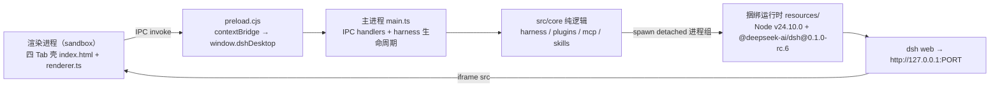

<div align="center">


# DSH Desktop Hub

**无需 Node.js，不碰 YAML，一站式使用和管理 DeepSeek Harness。**

DeepSeek Harness 官方 Web UI 桌面客户端 —— 内置插件市场、MCP 市场、Skills 市场与三套本地管理台。

[](https://github.com/FlashingChen/dsh-desktop-hub/releases/latest)
[](https://github.com/FlashingChen/dsh-desktop-hub/releases/latest)
[](https://github.com/FlashingChen/dsh-desktop-hub/releases)
[](LICENSE)
[](https://github.com/FlashingChen/dsh-desktop-hub/actions/workflows/ci.yml)
[](https://github.com/FlashingChen/dsh-desktop-hub/actions/workflows/release.yml)

</div>


---

## 社区交流

欢迎加入 QQ 交流群，获取使用帮助、交流插件与功能想法。

| QQ 交流群 |
| :---: |
|  |
| **群名：dsh-desktop-hub · 群号：1106611027** |

## 为什么不是普通 Desktop

不是套壳。官方 Web UI 原样保留在 Harness Tab 里，同时把三个命令行场景搬进同一个窗口：

- **开箱即用**：内置 Node.js + DeepSeek Harness 运行时（约 586MB），下载即用，本机不需要安装任何环境。
- **一体化**：在 Harness 对话、插件市场、MCP 市场、Skills 市场之间切换，不用再开终端敲 `dsh plugin` / 手写 YAML。
- **安全**：所有写操作原子落盘、自动备份 `.bak-<ts>`、官方 HMR 热生效，改错了随时可恢复。

## 核心能力

### 三类扩展市场

插件、MCP 与 Skills 共用一个目录体验：搜索、查看来源、来源等级与权限，确认后分别安装到当前 profile 或用户级 skills。插件默认来自 [DSH Plugin Market](https://github.com/dsh-market/dsh-market) 发布的 [Awesome DSH Plugin](https://github.com/awesome-dsh-plugin/awesome-dsh-plugin) 清单，MCP 合并官方 Registry 与 [DSH MCP Market](https://github.com/LKMeng2001/dsh-mcp-market)，Skills 合并 [ClawHub](https://clawhub.ai) 与 [SkillsMP](https://skillsmp.com)。npm 只在插件安装预检时读取 manifest，不作为主市场搜索源；网络不可用时回退到本地缓存和随包精选目录。

> **市场数据来源声明**：各来源的运行时地址、用途、缓存策略、许可证边界和安全限制见 [`MARKET_SOURCES.md`](MARKET_SOURCES.md)。上游目录的收录不等于 DSH 安全背书。

### MCP 市场与配置转换 —— 粘贴即用

Claude Code / Cursor 导出的 MCP JSON，粘贴进去 → 自动转换成 DSH 插件行 YAML（`${VAR}` 自动转 `!!js process.env.VAR`，sse / 非法 serverName 会警告）→ 确认后写入 profile patch，官方 HMR 热生效。市场条目若声明环境变量，会在安装卡片中先填写密钥，DSH 将值写入当前 MCP 配置，用户不需要再手动设置系统环境变量。


### Skills 市场与管理

扫描用户级 / 随包全部 skills（rank 规则，同名低 rank 生效、高 rank 标「被遮蔽」）；支持导入 `.skill` / `.zip` / GitHub 仓库链接，或直接新建用户级 skill，模型可见 / 用户可见一键切换。


### Plugin 市场与管理

按组合包 / 依赖分类展示 web profile 的插件清单；安装、移除、更新真实执行 `dsh plugin`；聚合仓库（缺 `dsh.bundle`）拒绝误装，避免把仓库根目录装成插件。


## 快速开始

1. **下载安装**：macOS 下载 DMG；Windows 下载 EXE（当前未签名，首次运行需放行一次：macOS 右键 → 打开；Windows SmartScreen → 更多信息 → 仍要运行）。
2. **配置模型**：在 Harness Tab 的官方 Web UI 里填入 API Key（首次引导会提示）。
3. **开始使用**：直接对话；需要外部工具时，到 MCP / Skills / Plugin Tab 管理。

> 当前为预览版（macOS arm64 / Windows x64，均未签名）。

## Roadmap

| 状态 | 项目 |
|---|---|
| ✅ | 基础版：四 Tab 壳 + MCP / Skills / Plugin 管理 + 内置运行时 |
| ✅ | 扩展中心 MVP：Plugin 市场、MCP 市场、Skills 市场（随包精选目录） |
| 🚧 | Profile 切换（当前固定 `web`） |
| Planned | Model Manager（API Key / 模型管理面板） |
| Planned | Doctor（环境自检与一键修复） |
| ✅ | Windows 安装包（NSIS，x64，与 macOS 并行发布） |
| Planned | Linux 安装包 |
| Planned | 自动更新（electron-updater） |

## 社区与反馈

- [Issues](https://github.com/FlashingChen/dsh-desktop-hub/issues)：报 bug、提需求、反馈使用体验
- [Discussions](https://github.com/FlashingChen/dsh-desktop-hub/discussions)：使用讨论与想法交流

本项目是活项目：CI 每个 tag 自动出包，Roadmap 上的能力持续在长。Star 一下跟踪进展。

---

# 开发者 / Architecture

## 架构

```
渲染进程（sandbox）             preload                   主进程                    核心逻辑                   捆绑运行时
┌──────────────────┐   ┌──────────────────┐   ┌────────────────────┐   ┌──────────────────┐   ┌─────────────────────────┐
│ 四 Tab 壳         │   │ window.dshDesktop│   │ IPC handlers       │   │ src/core/         │   │ resources/              │
│ index.html       │──▶│ contextBridge    │──▶│ harness:url         │──▶│ harness.ts        │──▶│ node/（Node v24.10.0）   │
│ renderer.ts      │   │ preload.cjs      │   │ plugins:list/       │   │ plugins.ts        │   │ dsh-runtime/            │
│ (harness iframe) │◀──│ (CJS, sandbox)   │◀──│   install/remove/    │   │ mcp.ts            │   │  @deepseek-ai/dsh       │
│                  │   │                  │   │   update             │   │ skills.ts         │   │  (0.1.0-rc.6)           │
│                  │   │                  │   │ mcp:list/convert/    │   └──────────────────┘   │        │                │
│                  │   │                  │   │   apply/update/     │            │ spawn(detached) ▼                │
│                  │   │                  │   │   delete             │            └──── dsh web --port 0 ─────┘                │
│                  │   │                  │   │ skills:list/create/  │                          │                                │
│                  │   │                  │   │   toggle             │                          │                                │
│                  │◀──│ harness:frame-   │   │ harness:frame-loaded │                    http://127.0.0.1:PORT                  │
└──────────────────┘   └──────────────────┘   └────────────────────┘                          └─────────────────────────────────┘
```



生命周期：

```
启动 → registerIpc() → resolveDshExec()（打包内 runtime 优先，回退 PATH）
  → spawn dsh web --port 0（独立进程组）→ 解析 127.0.0.1:PORT → 轮询 HTTP 200（就绪超时 120s）
  → BrowserWindow（1280×800，sandbox + contextIsolation + preload.cjs）
  → 加载四 Tab 壳（file://dist/renderer/index.html）
  → renderer 经 IPC 取 harness URL → iframe 挂载官方 Web UI
退出 → will-quit → harness.stop()：SIGTERM 进程组 → 2s 兜底 SIGKILL → app.quit
```

- 默认（无 flag）＝产品行为：启动 harness + 四 Tab 壳；主菜单仅「退出 / 全屏」。
- 冒烟模式：`--smoke`（不启 harness，DOM + 真实数据断言）；`--harness-smoke`（真实 harness + iframe 加载断言）。

## 目录结构

```
dsh-desktop-hub/
├── src/
│   ├── main/main.ts            # Electron 主进程：窗口 + IPC + harness 进程生命周期
│   ├── preload/preload.ts      # contextBridge 白名单 API（sandbox，编译为 preload.cjs）
│   ├── renderer/               # 四 Tab 壳：index.html + renderer.ts（纯脚本，无模块）
│   └── core/                   # 纯逻辑（可单测）：harness.ts / plugins.ts / mcp.ts / skills.ts
├── tests/                      # node --test 单测 ×58（从 dist/ 导入，需先 build）
├── scripts/
│   ├── build-preload.mjs       # preload 以 CJS 编译并重命名为 .cjs
│   ├── copy-renderer.mjs       # 拷贝 index.html → dist/renderer
│   ├── bundle-runtime.mjs      # 下载 Node + npm 安装 dsh 到 resources/
│   ├── generate-icon.mjs       # 生成品牌图标 build/icon.png（1024×1024，深蓝鲸鱼 + hub 节点）
│   ├── capture-demo.mjs        # README 演示截图/GIF 捕获（合成演示 profile，不碰真实数据）
│   ├── verify.mjs              # 一键门禁：契约 + 构建 + typecheck×2 + 单测
│   └── verify-m1.mjs           # M1 实机验证：dsh web 启动 → HTTP 200 → 优雅停止
├── resources/                  # 捆绑运行时（node_modules 忽略）：nd/（Node 本体+shim）+ rt/（dsh runtime，锁文件入库）
├── assets/demo/                # README 截图与 GIF（脚本生成，可重跑）
├── build/icon.png              # 应用图标（electron-builder 引用，macOS 自动转 icns）
├── release/                    # electron-builder 产物（gitignore）：DMG arm64 + NSIS EXE x64
├── dist/                       # tsc 产物（gitignore）
├── tsconfig.json               # 主进程 + core + preload（NodeNext，outDir dist）
├── tsconfig.preload.json       # preload：CommonJS → dist/preload/preload.cjs
├── tsconfig.renderer.json      # renderer：纯脚本 → dist/renderer
├── electron-builder.yml        # appId com.dshdesktop.app；DMG arm64；asarUnpack resources
└── package.json
```

## 开发命令

| 命令 | 说明 |
|---|---|
| `npm install` | 安装依赖（electron / typescript / electron-builder / yaml） |
| `npm run build` | 三套 tsc（main+core → preload CJS → renderer）+ 拷贝 index.html，产物 `dist/` |
| `npm run typecheck` | `tsc --noEmit`（main + core + preload；renderer 类型检查含在 `verify` 中） |
| `npm test` | `node --test` 单测（自动发现 `tests/`，Windows 兼容；**需先 build**，测试从 dist 导入） |
| `npm start` | 产品模式：启动 harness + 四 Tab 壳（需 dsh 可用且 `~/.dsh` 存在 web profile） |
| `npm run smoke` | 骨架冒烟（不启 harness）：四 Tab DOM + 真实插件/MCP/skills 数据断言，截屏 `artifacts/m0-smoke.png` |
| `npm run smoke:harness` | 真实 harness 冒烟：iframe 挂载 + 状态「已连接」，截屏 `artifacts/m1-harness.png` |
| `npm run verify:m1` | M1 实机验证：真实启动 dsh web → HTTP 200 → 优雅停止 → 端口关闭无孤儿 |
| `npm run verify` | 一键门禁：骨架契约 + 构建产物 + typecheck×2 + 单测全绿（`npm test` 已改为先 build） |

## 打包命令

```sh
npm run build                          # 1. 构建 dist/
node scripts/bundle-runtime.mjs        # 2. 捆绑运行时（首次/更新）：下载 Node v24.10.0 +
                                      #    安装 @deepseek-ai/dsh@0.1.0-rc.6 到 resources/
npx electron-builder --mac dmg --arm64 # 3. macOS：release/DSH-Desktop-Hub-<version>-arm64.dmg
npx electron-builder --win nsis --x64  # 4. Windows：release/DSH-Desktop-Hub-<version>-x64.exe
```

- `bundle-runtime.mjs`：下载官方 Node v24.10.0（win/darwin/linux × x64/arm64）到 `resources/nd`，用捆绑 npm 以 `--ignore-scripts` 安装锁定版本 `@deepseek-ai/dsh@0.1.0-rc.6` 到 `resources/rt`；`RUNTIME_TARGET=win32` 可在 macOS 上交叉捆绑 Windows 运行时（含 .cmd shim 生成）。
- `electron-builder.yml`：`files` 含 `dist/**/*` + `resources/**/*`；`asar: false`（产物直放 `resources/app`，压低 Windows 安装路径深度）；mac 目标 DMG（arm64）+ Windows 目标 NSIS（x64，oneClick per-user）；均未签名。
- 打包后的应用在 PATH 仅 `/usr/bin:/bin`（无系统 node/dsh）的环境下可用捆绑运行时启动。

## Release

推送 `v*` tag 后，GitHub Actions 自动完成发布（无需手动构建/上传）：

1. 创建 draft Release（自动生成 release notes）
2. **并行构建**：macOS arm64 DMG（macos-15）与 Windows x64 NSIS 安装包（windows-latest），各自执行 `verify` → 捆绑运行时 → `electron-builder`
3. **双平台都成功后自动转正发布**，上传 `.dmg / .dmg.blockmap / .exe / .exe.blockmap / latest.yml / latest-mac.yml`（`latest*.yml` 供自动更新通道使用）

```sh
git tag v0.3.0
git push origin v0.3.0
```

> `resources/` 采用「蓝图入库」：`nd/node.exe`、`rt/package-lock.json` 提交进仓库；`rt/node_modules`（数百 MB）被忽略，由 `bundle-runtime.mjs` 在打包时从锁文件重建（`npm ci`）。

## 验证基线

| 层级 | 内容 |
|---|---|
| 契约测试 `tests/skeleton.test.mjs`（9 例） | 骨架文件齐全；package.json 脚本与 devDependencies；四 Tab 契约；contextIsolation + sandbox + nodeIntegration:false；tsconfig strict |
| Harness `tests/harness.test.mjs`（5 例，不依赖真实 dsh） | `findDsh` 可解析；`dshHome` 默认/覆盖；真实 web profile 发现（首个 bundle = dsh-base）；忽略非 profile 目录；`parseHarnessUrl` |
| Plugin `tests/plugins.test.mjs`（9 例） | bundles ∪ dependencies 分类；排序稳定；`buildPluginCommand` 命令形态；`normalizeInstallSpec` GitHub 链接归一化；聚合仓库识别/拦截；`runPluginOp` 退出码 + 取消；`deactivatePluginIfActive` 幂等清理（remove 后残留激活行） |
| MCP `tests/mcp.test.mjs`（18 例） | 混合 stdio+http 解析；sse / 非法 serverName 警告；格式拒绝；YAML 与官方示例同构；`${VAR}` → `!!js process.env.VAR`；patch 提取 / 替换 / 编辑 / 删除保留注释；空 patch 新建 / 备份事务；`!!js` 行在 merge/update/delete 后保真（AST 行级操作 + `$js` 哨兵） |
| Skills `tests/skills.test.mjs`（14 例） | rank 合并 + shadowed；custom/bundled 根扫描；frontmatter 往返一致；kebab-case 校验落盘；可见性切换（含扁平 skill 文件名回退）；zip/.skill 导入（含资源文件、包裹目录剥离、拒绝无 SKILL.md、目录穿越拒绝）；GitHub URL 解析；ClawHub 固定版本导入 |
| `npm run smoke` | 四 Tab 就绪；Plugin/Skills 面板加载完成；MCP 转换端到端（preview 含 `dsh-mcp-client` / `streamable-http`）；不依赖特定 profile 数据 |
| `npm run smoke:plugin` | 临时 `DSH_HOME` 中执行真实 `dsh plugin remove`，确认退出码与 package.json 依赖删除；不触碰用户 profile |
| `npm run smoke:harness` | harness 就绪；iframe 挂载 `http://127.0.0.1:PORT`；状态条「已连接」（`#harness-status`）；重启后 iframe 重挂载到新端口 |
| `npm run verify:m1` | 真实 dsh web 启动并 HTTP 200（页面 ≥100B）；优雅停止后端口关闭、无孤儿进程 |

## 已知限制

- **profile 固定**：`ACTIVE_PROFILE` 常量 = `'web'`，暂无 UI 切换（Roadmap 中）。
- **市场目录**：Plugin 使用 DSH Plugin Market / Awesome DSH Plugin 清单，MCP 使用官方 MCP Registry + DSH MCP Market，Skills 使用 ClawHub + SkillsMP；在线结果经过 schema 校验并缓存到本地。Plugin 安装前校验 `dsh.bundle`，npm 锁定精确版本，GitHub 尽量锁定 commit；ClawHub Skills 锁定版本后只写入 `SKILL.md`。
- **Routing Suite 聚合仓库**：`https://github.com/yjh051108/dsh-routing-suite` 不是单一 DSH bundle，根目录缺 `package.json/dsh.bundle`；Plugin Tab 会拒绝直接安装。应按仓库说明分别装配 injector、router-standard preset 与可选 mode-boost。
- **无 Settings / 第四系统**：Settings（API Key / 模型 / 更新）与第四系统占位本期未实现，API Key/模型配置请使用官方 Web UI 内能力。
- **git 来源插件无 allowBuilds 授权向导**：pnpm ≥10 默认拒绝运行 git 依赖的 `prepare` 脚本；需用户手动在 profile 的 `pnpm-workspace.yaml` 写 `allowBuilds`（UI 未包装该流程）。
- **MCP `!!js` backtick 模板兼容**：patch 中以反引号模板写 `Bearer ${...}`（官方 README 示例写法）超出 yaml 解析器语法，MCP 面板会拒绝解析并提示；请改用单引号字符串 `!!js 'Bearer ${...}'`（语义为字面字符串）或行级 `process.env.X`。
- **MCP 无文件导入**：MCP 面板支持粘贴 JSON（`${VAR}` 自动转 `!!js process.env.VAR`；默认合并写入，可选全量替换），暂无 `.mcp.json` 文件选择器。
- **退出边界**：正常退出走 SIGTERM 进程组清理 + 单实例锁；Harness 意外退出可在 UI 一键重启；强杀（timeout / group-kill）仍可能遗留 dsh 子进程。
- **打包范围**：macOS DMG（arm64）+ Windows NSIS 安装包（x64），均未签名（首次运行需按平台放行一次）；Linux 待做；无自动更新。
- **体积**：`resources/` 捆绑运行时约 586MB（gitignore），首包体积较大。
- **写操作落真实 profile**：MCP「写入 patch」真实修改 `~/.dsh/profiles/web/cordis.patch.yml`（写入前自动 `.bak-<ts>` 备份）；插件安装/移除真实执行 `dsh plugin`。

## License

MIT
