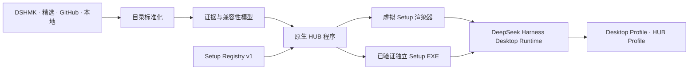

<p align="center">
  
</p>

<h1 align="center">DeepSeek Harness HUB</h1>

<p align="center">
  <strong>Everything is a Setup，一切皆安装。</strong><br />
  用一个原生桌面控制中心发现、理解、安装、更新、修复并组合 DeepSeek Harness 生态。
</p>

<p align="center">
  <a href="README.md">English</a> ·
  <a href="https://github.com/Iraryi/deepseek-harness-hub/releases">下载</a> ·
  <a href="docs/hub/setup-package-spec.md">Setup 规范</a> ·
  <a href="CONTRIBUTING.md">参与贡献</a>
</p>

> [!IMPORTANT]
> 这是独立的社区发行与生态项目。DeepSeek Harness 本体由上游 [`deepseek-ai/deepseek-harness`](https://github.com/deepseek-ai/deepseek-harness) 开发。

## 一个 HUB，三层职责

| 层级 | 用户看到的东西 | 实际职责 |
| --- | --- | --- |
| **HUB 程序** | 原生桌面市场与组件管理器 | 汇总 DSHMK、精选源、GitHub、STAR、本地包、已安装组件、更新、修复和重启流程 |
| **Setup Registry** | 统一的 Setup 式安装页面 | 安装前展示来源、许可、发布者、证书/签名状态、权限、联网行为、安装证据、选项、回滚和兼容性 |
| **HUB 发行层** | HUB Setup、HUB Runtime、开发构建 | 提供独立 Windows WebView2 宿主、HUB CONFIG、私有 Node.js 与离线修复 |

HUB **不会**宣称任意 GitHub 源码都能直接变成可靠 EXE。在线项目会以可检查配方驱动的**虚拟 Setup 界面**呈现；独立 Setup EXE 属于经过验证的精选库，至少要通过安装、启动、更新和卸载回归。

## 下载选择

Windows 成品统一发布在 [Releases](https://github.com/Iraryi/deepseek-harness-hub/releases)。

| 资产 | 适合人群 | 网络要求 |
| --- | --- | --- |
| **Full Setup** | 电脑小白、首次安装、网络不稳定 | 可离线安装内置 Runtime 与 WebView2 |
| **Lite Setup** | 希望先下载较小安装器 | 在线下载并校验 Runtime，也能导入手动下载的 Runtime ZIP |
| **Portable ZIP** | 试用、移动硬盘、免安装场景 | 电脑需已有 WebView2 |
| **Runtime ZIP** | 修复、离线搬运、Lite Setup 导入 | 自身不带安装向导 |

## 体验原则

- **HUB 独立进程**：与主程序拥有不同任务栏身份、图标、窗口和生命周期。
- **证据完整**：详情页显示来源、版本/提交、许可证、证书状态、验证结果、安装参考、权限、依赖和预期文件变更。
- **能一键就一键**：识别明确的项目使用确定性配方；网络不可靠时始终保留手动下载与导入。
- **不假装成功**：不支持或安装方式模糊的项目进入辅助 Setup 流程，而不是转圈后留下半成品目录。
- **集合分离**：已安装、待安装、离线、STAR、本地构建包各自管理，互不污染。
- **便于二次开发**：组件暴露编辑路径和清单，便于交给 AI 或开发者定制，而不把“编辑”和“发现”混在一起。

## 架构



详细说明见[架构文档](docs/architecture.md)与[桌面发行边界](docs/desktop-distribution.md)。

## 仓库定位

```text
.
├─ apps/                     DSH 命令与应用入口
├─ packages/                 HUB Web UI、Setup 协议、目录和共享 DSH 包
├─ windows/                  原生 HUB 宿主、Runtime、Setup 构建器和发行组装
├─ registry/                 第一方 Setup 目录与 JSON Schema
├─ examples/setup-package/   最小构建示例
├─ examples/setup-workspace/ 可编辑的源码、构建与组件工作区示例
├─ snapshots/                中英文全屏开发快照
├─ docs/                     架构、目录、发布和包规范
├─ scripts/                  零依赖仓库校验
└─ .github/                  CI、Issue 表单、PR 与 Release 规则
```

HUB 的实现就是本仓库根项目。原生宿主、Runtime、Setup 构建器、Web UI、Setup 协议、目录适配器、测试和全部共享 DSH 包都可以直接在这里修改；准确位置见[源码地图](docs/hub/source-layout.md)。`deepseek-harness-desktop` 是独立的 Desktop 发行项目，不是 HUB 的源码仓库或发布中心。

## 从源码构建 HUB

```powershell
npm run build:hub
```

构建脚本会检查 Node.js、pnpm 和 WebView2 SDK 等前置条件，并把结果写入仓库根目录的 `dist/`。开发者可以直接在根目录 pnpm 工作区修改 Web UI、原生宿主、Runtime、目录同步或 Setup 引擎。

## 发布一个 Setup

1. 阅读 [Setup 包规范](docs/hub/setup-package-spec.md)。
2. 从 [`examples/setup-package/manifest.json`](examples/setup-package/manifest.json) 开始。
   如果需要本地或 AI 辅助编辑构建，继续阅读 [Custom Setup Workspaces](docs/hub/custom-workspaces.md)，并从 [`examples/setup-workspace/manifest.json`](examples/setup-workspace/manifest.json) 开始。
3. 本地执行 `npm run validate`。
4. 创建 **Setup submission** Issue 并附安装证据。
5. 安装与卸载行为稳定后提交 PR。

独立 EXE 还必须提供哈希、发布者、提权声明、干净系统安装日志、启动证据、更新行为和卸载残留说明。

## 开源许可

本仓库代码与第一方规范使用最宽松的 [MIT License](LICENSE)。第三方包继续遵循各自许可证；进入目录不改变原作者、所有权或许可关系。
