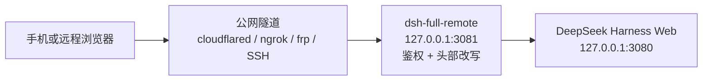

# dsh-full-remote

[](https://github.com/awesome-dsh-plugin/awesome-dsh-plugin)
[](https://www.npmjs.com/package/dsh-full-remote)
[](https://github.com/JUANWANG-BUAA/dsh-full-remote/actions)
[](./LICENSE)
[](https://github.com/JUANWANG-BUAA/dsh-full-remote/stargazers)
[](https://github.com/JUANWANG-BUAA/dsh-full-remote/commits/main)
[](./package.json)
[](https://github.com/deepseek-ai/deepseek-harness)
[](https://github.com/JUANWANG-BUAA/dsh-full-remote/pulls)

**已收录进 [awesome-dsh-plugin](https://github.com/awesome-dsh-plugin/awesome-dsh-plugin)** · DeepSeek Harness 插件

[English](./README.md) | **中文**

`dsh-full-remote` 是 [DeepSeek Harness](https://github.com/deepseek-ai/deepseek-harness) 的一个插件：它在 Harness Web 服务前放置一层带鉴权的反向代理，使 Web 界面可以通过公网隧道或局域网设备访问，同时保持设置、凭据、目录浏览等特权接口可用。

## 60 秒快速开始

```sh
dsh plugin --profile web add dsh-full-remote
dsh --profile web
```

在 **设置 → 反向代理** 中点击「启动代理」，再点击「启动 Cloudflare
快速隧道」，用手机扫描面板生成的二维码。邀请链接只可使用一次，且不包含长期访问令牌。
如果使用受控网络，也可以把现有的 SSH、frp、ngrok、Tailscale 或 cloudflared
隧道指向面板显示的代理地址。

快速隧道是可选的临时通道，不等同于正式运维的公网部署；对外暴露前请先阅读[安全模型](#安全模型)，组合其他插件时请查看[兼容性说明](./docs/compatibility.md)。

| 桌面控制面板 | 手机工作区 |
|---|---|
|  |  |

| 手机端选项确认 | 远程桌面确认卡片 |
|---|---|
|  |  |

## 问题

DeepSeek Harness 的 Web 服务只绑定回环地址，且仅当请求的 `Host`、`Origin` 头指向回环地址时才放行特权接口。经通用隧道访问时，这两个头携带的是公网域名，无法通过信任校验。页面可以加载，但以下接口返回 403：

- `settings.*`
- `credentials.*`
- `host.listDirectory`

| 已有做法 | 结果 |
|---|---|
| 通用隧道（SSH 端口转发、Caddy、绑定 `0.0.0.0`） | 页面可加载；`settings.*` / `credentials.*` / `host.listDirectory` 返回 403 |
| 仅限局域网的插件，无鉴权 | 局域网内可用，不适合公网暴露 |
| 只有密码校验，不改写请求头 | 请求通过了鉴权，但特权接口仍然被拦截 |

## 解决方案

插件在隧道与 Harness Web 服务之间插入一层反向代理：

- 转发前将 `Host`、`Origin` 改写为 `127.0.0.1`，使特权接口通过 Harness 的信任校验；
- 任何请求都须先通过访问令牌或设备会话校验；
- 转发 HTTP、SSE、WebSocket 流量；
- 提供设置页（**设置 → 反向代理**），用于启停代理、修改监听地址、轮换令牌、管理设备会话。

改写使 Harness 原本对远程客户端的信任校验失效，因此插件提供自己的访问控制层作为替代，见[安全模型](#安全模型)。

插件可以一键启动临时 Cloudflare 快速隧道；也支持把受控的 cloudflared、ngrok、frp、SSH、Tailscale 等现有隧道指向插件发布的本地地址。

## 工作原理



1. 远程浏览器连接公网隧道，流量转发到插件的监听地址（默认 `127.0.0.1:3081`）。
2. 请求只有携带访问令牌、有效的一次性邀请或已有的设备会话才会被接受；未通过鉴权的请求不会到达后端。
3. 代理将 `Host`/`Origin` 改写为回环地址，移除不可信头部，再转发到 `127.0.0.1:3080` 上的 Harness Web 服务。

## 功能

### 特权接口

- `settings.describe` / `update` / `replace` / `mutate`
- `credentials.describe` / `set` / `unset`
- `host.listDirectory` / `pickDirectory` / `openPath`
- `agentPreset.*`、`llm.discoverModels`

### 访问控制

- 192 位访问令牌，状态文件权限 `0600`，在本地面板查看与轮换
- 按设备会话：每次登录生成独立的设备凭据，持久化时只保存其哈希；可在面板中重命名或撤销设备，并查看每台设备的来源 IP（登录时与最近活跃）
- 可选首访审批：新设备停留在等待页，直至本机批准
- 手机邀请：二维码或一次性链接（单次有效、15 分钟过期）。同 IP 60 秒内的浏览器自动重试会沿用同一台设备会话，避免隧道抖动丢响应时把手机卡进令牌页，也不会在设备列表里多出一条。链接中不含长期令牌
- 登录失败计入固定延时，并按 IP 累计锁定
- 可选 CIDR 白名单，限制远程 IP
- 可选 `trustForwardedFor`：在可信本地隧道后使用真实客户端 IP 进行 CIDR / 限流 / 审计；只有另行开启 `trustCloudflareConnectingIp` 才会读取 Cloudflare 的 `CF-Connecting-IP`，否则取 `X-Forwarded-For` 最右值；回环或非法的转发值一律不信任

### 一键公网隧道（Cloudflare 快速隧道）

- 面板内一键启动 cloudflared 快速隧道（免费、免账号），自动给出 `https://…trycloudflare.com` 地址，免公网 IP、免端口映射
- 二进制三级获取：`cloudflaredPath` → PATH 探测 → 钉版本（2026.8.2）+ 内嵌 SHA256 校验的按需下载缓存；校验失败即丢弃
- 隧道在线期间转发头信任动态生效（限流 / CIDR / 审计按真实客户端 IP），隧道关闭立即还原；隧道指向代理监听端口，令牌门 / 审批 / 审计全部照旧生效
- 邀请自动使用隧道地址：开隧道 → 生成邀请 → 手机扫码直入（面板显示且可手动覆盖 Origin）
- 与本地 TLS 互斥（Cloudflare 边缘已提供 HTTPS）；快速隧道地址每次启动随机变化，定位是临时分享 / 救急

### 设备主页（可选落点）

- 登录页第二个按钮「设备主页」进入 `/_dsh_reverse_proxy/home`：查看本设备信息（名称 / 登录 IP / 登录时间 / 会话到期 / 安全状态）
- 给自己设备改名（主人审批列表里看到「小王的 iPhone」而非「Safari on iOS」）、自助登出（只吊销本设备会话）
- 登录默认落点仍为 `/`，原有流程不变

### 运维

- 栅栏自检：使用与代理相同的 Host/Origin 改写探测 `settings.describe`
- 结构化 JSONL 审计日志（登录、审批、撤销、令牌轮换、启动、停止、WebSocket 打开/拒绝），并支持在面板内查看最近事件与导出 JSON；超过 8 MB 自动轮转，保留上一代
- 监听地址可在运行时修改，绑定失败自动回滚
- 可选本地 TLS（`tlsCertFile` / `tlsKeyFile`）
- 健康检查接口 `/_dsh_reverse_proxy/healthz`
- WebSocket 升级限流：同一远程 IP 反复升级失败后会进入锁定
- 请求体大小在流层面受限；剥离逐跳与可伪造头部；清除上游 `set-cookie`

### 移动端

- 通过隧道域名打开设置页时，改动正常持久化
- 「添加工作区」使用应用内目录浏览，不会在宿主机显示器上弹出系统对话框
- 工具审批、`ask_user_question` 选项确认、计划评审会在远程页面弹出确认浮层：手机为底部抽屉，较宽屏为居中卡片。可直接点选提交，不必回到宿主机。官方输入框接管仍只出现在当前会话底部
- 想要手机友好的布局（会话区全宽、目录改抽屉、弹窗适配），建议搭配移动端布局插件使用，例如 [dsh-web-mobile](https://github.com/mexiaosqwq/dsh-web-mobile)

## 环境要求

- Node.js `^22.19.0 || >=24`
- DeepSeek Harness 的 **web** profile。插件依赖 `webServer`，不适用于 headless profile。

## 安装

```sh
dsh plugin --profile web add dsh-full-remote
dsh --profile web
```

1. 打开 `http://127.0.0.1:3080`。
2. 打开 **设置 → 反向代理**（左侧导航最后一项）。
3. 点击 **启动代理**，复制本地目标地址。
4. 将隧道指向该地址：

```sh
# 仅为示例，插件不会执行这些命令
cloudflared tunnel --url http://127.0.0.1:3081
ngrok http 3081
```

同一网络内的设备无需隧道，把监听地址设为局域网 IP 即可。

本包原名 `dsh-reverse-proxy`，现已改名为 `dsh-full-remote`。

## 使用

### 启动与停止

在设置页点击 **启动代理** 开始监听，点击 **停止代理** 停止。

### 监听地址

| 绑定 | 用途 |
|---|---|
| `127.0.0.1`（默认） | 隧道与 Harness 在同一台机器 |
| `192.168.x.x` | 同一网络内的设备直连，不走隧道 |
| `0.0.0.0` / `::` | 绑定全部网卡。这不是要打开的地址，面板会另外给出可达地址。 |

监听地址可在运行时修改，并在重启后保持。新地址绑定失败时，代理自动回滚到上一个可用地址。

面板里可复制的 **隧道目标**（以及列出的其他可达地址）才是远程端要打开的 URL。绑定 `0.0.0.0` 只表示监听，不是可打开的地址。

`backendHost` 是代理连接的后端地址，不是监听地址，保持 `127.0.0.1`。

### 手机邀请

二维码是一次性登录 URL。**公网 / 可达 Origin** 填的是**扫码设备**能访问的地址：隧道的 `https://…`，或面板给出的局域网 URL。仅当上方隧道目标已经是该地址时才可留空。

不要把 `127.0.0.1` 写入 Origin。那是运行 Harness 的机器；手机扫码后会访问手机自己的回环地址，连不上本机代理。

然后点击 **生成邀请**。扫码或打开链接后，登录页会自动提交。链接单次有效、15 分钟过期；同 IP 60 秒内的自动重试会沿用同一台设备会话。不含长期令牌。只有代理运行时才能生成邀请。

### 升级

`dsh plugin` 只是把参数转给 pnpm。若当初用 `add dsh-full-remote@0.2.4` 这类精确版本安装，裸 `update dsh-full-remote` 会显示 Already up to date，实际停在旧版。要无痛升到 npm 最新版：

```sh
dsh plugin --profile web update --latest dsh-full-remote
```

然后重启 `dsh web`。`--latest` 会忽略现有版本范围，装上最新版并改写 `package.json`。指定某一版用 `dsh plugin --profile web update dsh-full-remote@0.3.3`。

## 截图

截图画廊保留在 GitHub 仓库中；npm 包只携带运行所需文件并链接回这里，
因此安装包更小。

### 桌面端

完整设置页一图览：运行状态与栅栏自检、发布地址、推荐用法、隧道目标、
一键快速隧道、一次性邀请二维码、访问令牌、带来源 IP 的已连接设备
（行内改名），以及审计查看器。


| 一次性手机邀请（二维码） | 行内改名的已连接设备 |
|---|---|
|  |  |

### 移动端

| 手机登录页 | 移动控制面板 | 手机添加工作区 |
|---|---|---|
|  |  |  |

### 远程确认

模型发起选项确认、工具审批或计划评审时，远程浏览器自己弹出浮层，无需回到宿主机显示器。

| 手机底部抽屉 | 远程桌面居中卡片 |
|---|---|
|  |  |

### 门面页

令牌登录（带可选的 **设备主页** 按钮）、设备主页本身，以及首次访问的审批等待页。

| 设备主页 | 等待审批 |
|---|---|
|  |  |

## 常用配置

```yaml
- id: reverse-proxy
  name: dsh-full-remote
  config:
    listenHost: 127.0.0.1
    listenPort: 3081
    approvalMode: false          # true：新设备需要本机批准
    allowedCidrs: []             # 例如 ["192.168.1.0/24"]；留空 = 登录后不限 IP
    trustForwardedFor: false     # true：信任可信本地隧道传来的 X-Forwarded-For 最右值
    trustCloudflareConnectingIp: false # 仅在 Cloudflare 边缘明确可信时开启
    upgradeMaxAttempts: 10       # WebSocket 升级失败多少次后锁定
    upgradeLockoutSeconds: 300   # WebSocket 升级频繁失败的锁定秒数
    headersTimeoutMs: 15000      # 请求头超时
    requestTimeoutMs: 120000     # 完整请求超时；实际值不会小于 headersTimeoutMs
    sessionIdleSeconds: 0        # 0 = 关闭；否则按空闲秒数过期
    auditLog: true
    allowTokenRead: false        # 更安全的默认值；仅本机工具需要重读时开启
    cloudflaredPath: ""          # 可选：一键隧道用的 cloudflared 路径
    tlsCertFile: ""              # 可选本地 HTTPS
    tlsKeyFile: ""
```

完整选项、默认值与校验规则定义在包内 `Config` schema（`src/config.ts`）及
`src/config-validation.ts`；发布包不包含源码目录。

两点说明：

- 安装插件会钉住应用内目录选择器，使手机可以添加工作区。默认禁用官方自适应选择器并启用 browse 双面；只有明确需要宿主原生选择器、且不需要远程目录浏览时，才在启动前设置 `DSH_FULL_REMOTE_USE_NATIVE_PICKER=1`。
- `backendHost` 必须是回环地址，通配地址或非回环地址在加载时会被拒绝。

## 安全模型

Host/Origin 改写恢复了特权接口，同时也使 Harness 对远程客户端原有的保护失效。插件提供的访问控制层包括：

- 192 位访问令牌，本地存储，文件权限 `0600`；
- 按设备的 `HttpOnly`、`SameSite=Strict` 会话 Cookie，携带按设备秘密，存储时只保存其哈希；
- 登录失败计入固定延时，并按 IP 返回 `429` 锁定；
- 控制接口（`/dsh-reverse-proxy/*`）仅限回环地址访问，需要控制头，且永远不会被公网代理转发；
- 剥离可伪造的转发头与逐跳头，代理自身的 Cookie 不会到达后端；
- 可选 `trustForwardedFor`：开启后仅信任回环对端传来的转发头，用于 CIDR / 限流 / 审计，使本地隧道能识别真实客户端 IP。只有额外开启 `trustCloudflareConnectingIp` 才读取 Cloudflare 的 `CF-Connecting-IP`，否则取 `X-Forwarded-For` 最右值；回环或非法的转发值一律不信任。局域网直连请保持关闭。

访问令牌须按机密保管。公网侧应终止 TLS。局域网直连可配置 `tlsCertFile` / `tlsKeyFile`（例如用 [mkcert](https://github.com/FiloSottile/mkcert) 生成）。

## 局限

- 控制操作（启动、停止、查看令牌、修改监听地址）仅可在本机 Harness 窗口执行，隧道地址下无效。
- 远程页面上的设置持久化依赖临时的信任注入，待 Harness 提供正式的部署信任字段后可以移除。手机上的「在宿主机打开」作用于运行 Harness 的机器。
- `allowTokenRead` 默认 `false`。显式开启时，`GET /token` 会通过回环 HTTP 提供，任何能发送控制头的本机进程均可读取；轮换令牌始终会返回新令牌。
- 默认情况下，运行在本机的隧道会让所有远程客户端在代理看来都是 `127.0.0.1`。因此 `allowedCidrs` 与按 IP 登录锁定只对“隧道整体”生效；如需按真实客户端 IP 生效，请在可信本地边缘后设置 `trustForwardedFor: true`。
- 插件以自身的访问控制层替代 Harness 的远程信任校验，该层若存在缺陷，影响严重。若 Harness 未来提供官方远程访问能力，应重新评估本插件的定位。
- 一键快速隧道：URL 每次启动随机变化（旧邀请与登录失效）、官方定位是临时/测试用途，非 HTML 大流量内容受 Cloudflare 条款限制；首次使用需按需下载 cloudflared（18–52 MB，取决于平台），Windows ARM64 没有官方构建（可自行安装后填 `cloudflaredPath`）。日常稳定入口仍建议自备 frp / ngrok / 命名隧道。

## 开发

### 从源码构建

```sh
pnpm pack
dsh plugin --profile web add ./dsh-full-remote-0.3.3.tgz
```

git 安装会执行 `prepare` 构建，pnpm ≥ 10 需要放行：

```yaml
allowBuilds:
  dsh-full-remote: true
```

### 检查与 CI

```sh
pnpm install
pnpm run check:ci
```

`check:ci` 包含 lint、类型检查、单元与客户端测试、构建；CI 另含一次针对真实 Harness 组合的 `dsh plugin add` 冒烟测试。`.github/workflows/canary.yml` 每周针对 harness 默认分支 tip 运行一次冒烟测试。

本机控制面 API 位于 `/dsh-reverse-proxy/*`，不会被公网代理转发。设置页是预期入口，一般无需直接调用这些接口。例如可用 `GET /dsh-reverse-proxy/audit?limit=50&event=login.ok` 在本机读取最近的审计事件。

## 贡献 · 安全 · 许可证

- [CONTRIBUTING.md](./CONTRIBUTING.md)
- [SECURITY.md](./SECURITY.md)
- [MIT](./LICENSE) © 2026 [JUANWANG-BUAA](https://github.com/JUANWANG-BUAA)
