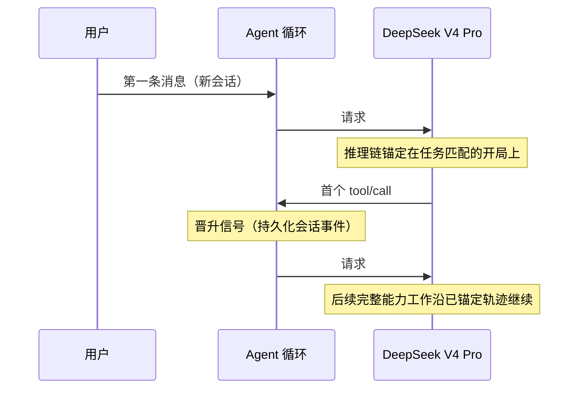

# dsh-anchored-standard

<div align="center">

**锚定首轮请求，解锁全部工具。**

面向 [DeepSeek Harness](https://github.com/deepseek-ai/deepseek-harness) 的两阶段 agent 预设：用 Minimal 对齐的开局（一句 prompt + 两个工具）启动 DeepSeek V4 Pro，首个持久化工具调用或回复后，自动展开 Standard 预设的完整工具目录。


[](./LICENSE)
[](https://github.com/Jungod1121/dsh-anchored-standard/stargazers)
[](https://github.com/topics/dsh-plugin)

[English](./README.md) · [介绍页](https://jungod1121.github.io/dsh-anchored-standard/) · [设计原型](https://github.com/xiaobright/dsh-anchored-standard)

</div>

---

## 一句话原理

V4 Pro 的能力上限并不低——但它走哪套推理策略，是由**第一次 API 请求**给它看到的东西决定的。社区评测 [`xiaobright/modeltest`](https://github.com/xiaobright/modeltest) 实测：

| 预设 | 首轮看到 | 全程可用 | Project2 V4.1b（max） |
|---|---:|---:|---:|
| Standard | 25 工具 + 长 prompt | 25 工具 | **91 / 92** |
| Minimal | 一句话 prompt + 2 工具 | 只有 2 工具 | **99 / 96** —— 但干不了完整开发 |
| **锚定标准** | 一句话 prompt + 2 工具 | **全部 25 工具** | **98 / 99** |

增益来自**首轮轨迹锚定**，而不是全程限制工具数量。这个预设给 V4 Pro 保留了
Minimal 的"脑子"（开局策略），同时还它 Standard 的"手脚"（完整能力）。

## 工作机制



1. 会话的**第一条用户消息**决定锚的类型：

   | 任务 | Persona | 首轮工具 |
   |---|---|---|
   | **spec** — 修复 / 维护 / 调试 | Minimal 原句 | `bash` + `read` + `edit` |
   | **react** — 从零构建 / 新项目 | 实干者句（少废话、直接产出） | `bash` + `read` + `write` |
   | **weak** — 语义模糊 | 模型自分类（Pro：分类指令版） | `bash` + `read` |

   `glob`/`grep` 不进任何 bootstrap 目录——实测是 V4 Pro 的轨迹分界；
   `edit`/`write` 均锚定安全。
2. 请求 #1 时 persona 是**唯一** prompt section，运行时上下文清空——最干净的开局；
3. 会话产生首个持久化 `tool/call` 后，之后所有请求看到完整 Standard 目录，
   所选 persona 保持恒定，其余 section（plan-mode 等）恢复。首轮之后不再
   注入任何引导（实测：事后引导对 Pro 有害）。

分类与晋升状态都来自持久化会话事件，刷新页面、恢复会话都不会回退。

## 安装

### 方式 A：安装器 bundle（推荐）

```sh
dsh plugin --profile web add github:Jungod1121/dsh-anchored-standard
```

重启 DeepSeek Harness。bundle 会把预设幂等复制到
`$DSH_HOME/.agent-presets/anchored-standard/`（本地修改绝不覆盖），随后新建
空白会话并选择「锚定标准模式」。想设为新会话默认预设：

```yaml
# $DSH_HOME/settings.yaml
agent-presets:
  default: anchored-standard
```

### 方式 B：手动预设目录

```sh
dsh_home="${DSH_HOME:-$HOME/.dsh}"
mkdir -p "$dsh_home/.agent-presets"
cp -R preset "$dsh_home/.agent-presets/anchored-standard"
```

## 验证

导出会话 JSONL，检查 `request/header` 事件——第一个 header 只含
`bash/read`，之后的 header 都是完整目录：

```
seq 18  -> 2 个工具  ['bash', 'read']                    # 请求 #1
seq 137 -> 25 个工具 ['ask_user_question', 'bash', ...]  # 请求 #2（已晋升）
```

## 得到什么 / 付出什么

| | 得到 | 代价 |
|---|---|---|
| 相对 Minimal | 多 23 个工具：glob/grep/edit/write/web_search/子代理/工作流/技能/目标/todo… | 开局多一轮推理 |
| 相对 Standard | 任务匹配的轨迹锚定（参考评测 98/99 vs 91/92）+ 比 Standard 更干净的首轮 | 首轮目录由关键词分类决定；模糊任务回落到 weak 锚交给模型自选 |

## 证据与边界（诚实声明）

- 机制（任务匹配 bootstrap 目录 → 完整目录）已在 harness `0.1.0-rc.6` 上于
  wire 层验证；分类器与锚表有单元测试；
- 98/99 的能力分来自 `xiaobright/modeltest` Project2 V4.1b——**同一冻结题面
  n=2**。它是该题面的可复现证据，不构成跨模型、跨任务的通用保证。spec/react/weak
  三锚设计融合了 `yjh051108/dsh-router-standard`（P1-P24）的实测与 xiaobright
  的轨迹分界探针；
- V4 Flash 不需要这套：它跨 harness 泛化更稳（风格会变、分数不变）。本预设
  面向 **Pro** + `reasoningEffort: max`。

## 卸载

```sh
dsh plugin --profile web remove dsh-anchored-standard
rm -rf "${DSH_HOME:-$HOME/.dsh}/.agent-presets/anchored-standard"
```

## 兼容性

基于 DeepSeek Harness `0.1.0-rc.6` 开发与验证。harness 处于 developer
preview 阶段并明确允许破坏性变更，升级前请先核对上游改动。

## 社区与许可证

社区项目：非 DeepSeek 官方预设，与 DeepSeek 无隶属或背书关系。设计灵感源自
[`xiaobright/dsh-anchored-standard`](https://github.com/xiaobright/dsh-anchored-standard)
（见 [NOTICE](./NOTICE)）。MIT —— [LICENSE](./LICENSE)。
