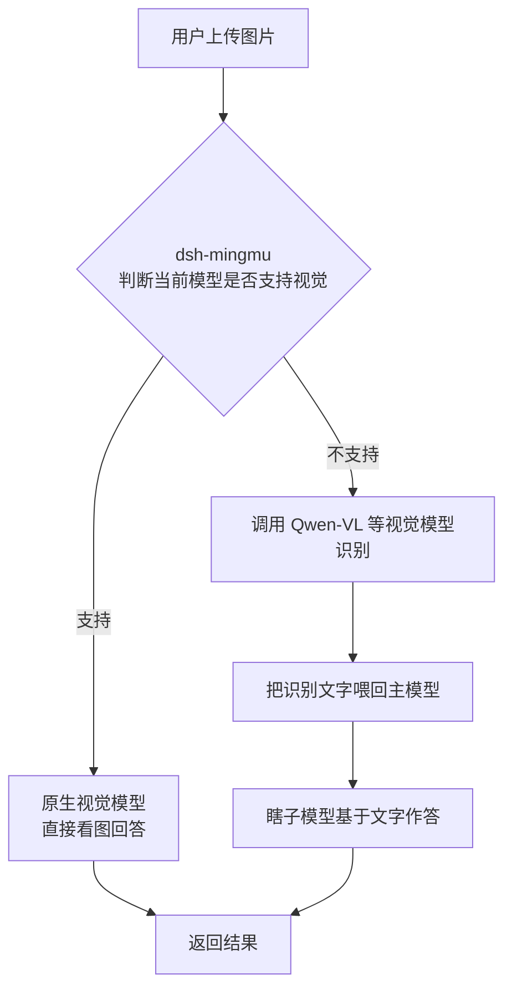

# 明眸 Mingmu（dsh-mingmu）

[English](#english-intro) | 中文

给 [DeepSeek Harness](https://github.com/deepseek-ai/deepseek-harness)（dsh）的纯文本模型装上「外挂眼睛」：上传图片时，若当前模型不支持视觉（瞎子模型），自动调用视觉模型识别，把识别文字喂回主模型继续处理——全程无感；真视觉模型则保持原生看图，不拦截。

纯 ESM 插件，零源码改动，卸载即还原。已在 dsh `0.1.0-rc.6` 实测。

## English Intro

**Mingmu** is a dsh plugin that gives text-only models the ability to "see". When you attach an image, it automatically calls a vision-capable model to describe the image and feeds the result back to the main model as text. Vision-native models are left untouched. Configuration is done through the dsh Web UI or environment variables.

## ⚠️ Privacy / Data Notice

By default, images are sent to a third-party vision API endpoint (`https://api.siliconflow.cn/v1` by default). Your API key is stored in the dsh credential vault (`~/.dsh/.credentials.yaml`), not in the plugin configuration. You can change the endpoint to any OpenAI-compatible vision provider. Please review the provider's privacy policy before use.

## 特性

- **按模型能力触发**：只有真实不支持图片的模型才走桥接；真视觉模型原生直连看图。

- **全球视觉模型启发式识别**：按模型名自动识别 OpenAI、Anthropic、Google、Qwen、MiniMax、Kimi、GLM、DeepSeek-VL 等 20+ 视觉模型家族，对 pi-ai 官方 catalog 中约 98% 的视觉模型有效；拿不准的自动走桥接。

- **自动升级（默认）**：先用首选识别模型，失败或结果为空时自动切换备选模型；高级用户可用 `DSH_VISION_STRATEGY=race` 开启并发赛跑。

- **设置页可视化配置**：注册 `vision-bridge` 设置命名空间 + 浏览器端设置卡片，在 dsh Web 的「设置 → 插件」里直接改提供商、模型、策略，保存即时生效（applies: live）。

- **失败不静默**：`annotate`（失败原因作为文字喂给主模型）/ `error`（严格报错）。

- **凭据安全**：API Key 走 dsh 官方凭据服务，不落盘到配置。

- **环境变量兜底**：不写设置页也能用环境变量配置。

## 界面预览

安装后，在 dsh Web 的「设置 → 明眸 Mingmu」中可视化配置：


插件已正确注册到 dsh 设置侧边栏：


## 安装

### 从 GitHub 安装（推荐）

```bash
# web  profile
dsh plugin --profile web add github:Lab-sku/dsh-mingmu
# headless profile（可选）
dsh plugin --profile headless add github:Lab-sku/dsh-mingmu
```

首次从 git 安装时，pnpm 可能要求你在 `~/.dsh/profiles/<name>/pnpm-workspace.yaml` 中授权构建：

```yaml
allowBuilds:
  dsh-mingmu: true
```

因为本插件是原生 JS，无需 `prepare` 构建脚本；`lib/` 目录已包含在仓库中。

### 从 npm 安装

```bash
dsh plugin --profile web add dsh-mingmu
```

### 本地 link 安装（开发调试）

```bash
dsh plugin --profile web add link:/path/to/dsh-mingmu
```

重启 `dsh web` 生效：

```bash
dsh web
```

## 卸载

```bash
dsh plugin --profile web remove dsh-mingmu
```

## 配置

### 方式一：Web 设置页（推荐）

打开 **设置 → 插件 → 明眸 Mingmu（视觉桥）**，改完点保存，即时生效。

rc.6 的「设置 → 模型」页会同时出现一张由可配置提供方注册产生的同名占位卡，浏览器半已自动隐藏，属正常现象。

### 方式二：环境变量

| 变量 | 默认 | 说明 |

|---|---|---|

| `DSH_VISION_ENABLED` | `true` | 总开关 |

| `DSH_VISION_PROVIDERS` | 空（全部） | 生效的主模型 provider 列表，逗号分隔 |

| `DSH_VISION_STRATEGY` | `cascade` | `cascade`（自动升级，默认）/ `race`（并发赛跑，高级） |

| `DSH_VISION_BASE_URL` | `https://api.siliconflow.cn/v1` | 视觉 API 端点 |

| `DSH_VISION_MODEL` | `Qwen/Qwen3-VL-8B-Instruct` | 首选识别模型 |

| `DSH_VISION_MODEL_UPGRADE` | `Qwen/Qwen3-VL-32B-Instruct` | 备选识别模型（首选失败/为空时自动切换） |

| `DSH_VISION_API_KEY_ENV` | `SILICONFLOW_API_KEY` | API Key 环境变量引用 |

| `DSH_VISION_FAILURE_MODE` | `annotate` | `annotate` / `error` |

| `DSH_VISION_MAX_TOKENS` | `4096` | 识别最大 token |

| `DSH_VISION_TIMEOUT_MS` | `180000` | 识别超时（毫秒） |

| `DSH_VISION_PROMPT` | 见源码 | 识别提示词 |

| `DSH_VISION_VISION_MODELS` | 空 | 额外强制视为视觉模型的 provider/model 或 model 列表，逗号分隔；用于启发式规则漏识别的模型 |

| `DSH_VISION_DEBUG` | 关 | `1` 开启调试日志 |

### 方式三：API Key（二选一）

- **推荐：设置卡片直接粘贴** —— 设置 → 插件 → 明眸 Mingmu，在「视觉 API Key」框粘贴 Key 并点「保存 Key」，写入 dsh 官方凭据库（不落盘到配置），卡片实时显示「已配置 ✓」。

- 或手动写入 `~/.dsh/.credentials.yaml`：

```yaml
SILICONFLOW_API_KEY: sk-xxx
```

### 方式四：内置视觉模型白名单（可选）

quchiai 等自定义 provider 中的部分视觉模型（如 `MiniMax/MiniMax-M3`、`moonshotai/Kimi-K2.7-Code`）可能被 dsh 标记为纯文本。本插件会在运行时自动给这些 adapter 追加 `image` input，无需再手动修改 `~/.dsh/settings.yaml`。

如果你使用的视觉模型不在内置白名单，或想额外扩展，可通过设置页、环境变量 `DSH_VISION_VISION_MODELS` 或 `vision-bridge.visionModels` 追加：

```yaml
vision-bridge:
  visionModels:
    - quchiai/MiniMax/MiniMax-M3
    - quchiai/moonshotai/Kimi-K2.7-Code
```

内置默认白名单会自动与你的自定义列表合并。

### 错误处理

- 空识别结果 → 自动切换备选模型重试；

- Key 缺失/无效（401/403）、限流（429）、服务异常（5xx）、超时、空结果 → 以中文可读的提示标注给主模型（`annotate` 模式），绝不静默丢图；

- 可切 `error` 模式严格报错。

## 分流流程



### 插件生态与发现

明眸已加入 [GitHub dsh-plugin topic](https://github.com/topics/dsh-plugin)，并被收录目标：

- [awesome-dsh-plugin](https://github.com/awesome-dsh-plugin/awesome-dsh-plugin) 社区插件索引（仓库需满 1 天且 10+ commits 方可提交）。
- 也可通过未来的 [dsh-market](https://github.com/dsh-market/dsh-market) 一键安装。

## 工作原理

1. **闸门放行**：运行时包装 `ctx.llm.resolveModelInfo`。瞎子模型被追加 `image` 模态放行；真视觉模型原样返回。

2. **pre-step 桥接**：`agent/pre-step` 钩子发现消息含图，并检测到当前 `agent.options` 对应的模型真实不支持图片 → 读取附件 → 视觉模型识别 → 图片块替换为视觉证据文字块。

3. **主模型作答**：替换后的纯文本请求发给主模型，它基于识别结果回答。

详细设计见源码注释。

## 兼容性

- Node.js >= 22.19.0（跟随 dsh 最低版本）

- dsh >= 0.1.0-rc.6（接口仍在 rc 阶段，后续版本可能需要适配）

## 已知限制

- **dsh 接口仍在 rc 阶段**：本插件基于 dsh `0.1.0-rc.6` 实测，上游接口可能变化，版本升级后可能需要适配。

- **视觉判断需要一次额外查询**：含图消息的每个 step 会调用一次未包装的 `resolveModelInfo` 来判断当前模型真实能力，对延迟敏感的场景请留意。

- **图片会离开本机**：默认发送到 SiliconFlow；你可替换为任意 OpenAI 兼容端点，但请自行评估该端点的隐私与可用性。

- **并发策略为单会话内生效**：`race` / `cascade` 只影响当前消息的视觉识别调用，不改变 dsh 本身的并发模型。

## 验证

- 68 项单元/集成测试全部通过（`node --test tests/**/*.test.mjs`）；

- quchiai `deepseek-ai/DeepSeek-V4-Flash`（瞎子模型）+ 截图 → 自动桥接；

- quchiai `MiniMax/MiniMax-M3`（视觉模型）+ 截图 → 原生看图，不桥接；

- quchiai `moonshotai/Kimi-K2.7-Code`（视觉模型）+ 截图 → 原生看图，不桥接；

- 同一实例中瞎子模型与视觉模型并发对话不会互相污染状态。

## 许可

[MIT](LICENSE)。DeepSeek Harness 为 rc 阶段，插件接口可能随上游变化。

