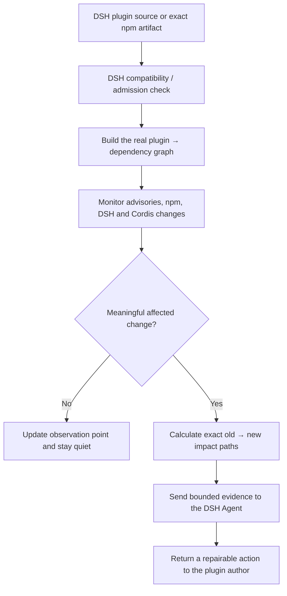

# Upstream Radar

[](https://github.com/MicroMilo/upstream-radar/actions)
[](https://www.npmjs.com/package/upstream-radar)
[](LICENSE)

**The upstream dependency radar built into [DeepSeek Harness (DSH)](https://github.com/deepseek-ai/deepseek-harness) plugins.**

Upstream Radar is not another package-name vulnerability scanner. It follows one DSH plugin from admission to maintenance:

| Product job | What Radar establishes |
| --- | --- |
| **DSH compatibility / admission** | Whether the exact published bundle can be registered and loaded by the DSH releases you care about. |
| **Real dependency graph** | Which exact package versions and physical paths the plugin brings into the DSH profile, including unresolved edges. |
| **Continuous upstream monitoring** | Whether an advisory, npm release, DSH/Cordis change, or breaking signal changes the old → new situation. |
| **Author-facing repair** | Which plugin, dependency path, version, lockfile, or DSH declaration gives the author a concrete next fix. |

The deterministic scanner establishes package, graph, advisory, and compatibility facts. Only a meaningful affected change is handed to the DSH Agent for read-only, project-specific analysis; the model does not guess version matches or replace the evidence.

## The product loop



This is the boundary: Radar decides **what changed and which exact path is involved**; DSH decides **what that means for the project**. A later website can visualize the saved graph, but the evidence and impact index are already useful without one.

## The upstream/downstream alignment IR

Every observer snapshot now carries a small, machine-readable alignment record:

```text
upstream:   Git commit + package.json coordinate
downstream: npm coordinate + lockfile graph root + graph coverage
result:     aligned | mismatch | unknown
```

This catches a class of problems that a vulnerability scanner cannot: the source
package, published package, and dependency graph may no longer describe the
same thing. For example, the public DSH/Feishu target currently reports:

```text
source:    dsh-lark-bot@0.15.8
published: dsh-feishu-bot@0.15.8
graph root: dsh-lark-bot@0.15.8
result:    mismatch
```

That is not a claim of malware or runtime incompatibility. It is an evidence
gap: Radar cannot safely say that the source it watched produced the artifact
users install. The IR is stored in `observations.json`, rendered in the first
baseline report, and defined in [`schemas/upstream-downstream-ir.schema.json`](schemas/upstream-downstream-ir.schema.json).

## Try it in 60 seconds

```bash
# No DSH profile, API key, or network state required
npx --yes upstream-radar@0.36.0 demo

# Scan a public DSH plugin repository without installing it
npx --yes upstream-radar@0.36.0 scan \
  https://github.com/PlutoKeating/dsh-lark-bot \
  --fail-on never

# Review a real browser plugin users would install, then check two DSH releases
npx --yes upstream-radar@0.36.0 review dsh-plugin dsh-cloudflare-browser-run@0.1.1 \
  --dsh-version 0.1.0-rc.6,0.1.0-rc.7
```

The important output is evidence, not a green badge: exact package identity, dependency paths, unresolved edges, install-time scripts, npm integrity/signature/provenance, advisory matches, and DSH load results.

## What we have already found

These are real, reproducible cases in this repository—not synthetic “vulnerable package” demos.

| Case | Finding | Why it matters |
| --- | --- | --- |
| [`dsh-cloudflare-browser-run@0.1.1`](examples/reports/dsh-cloudflare-browser-run-0.1.1.txt) | 18 resolved packages, 2 unresolved optional Cordis edges, 0 known vulnerabilities, and DSH rc.6/rc.7 both loaded the bundle | A real browser plugin demonstrates the DSH admission boundary and why incomplete edges stay visible. |
| [50-plugin batch](examples/dsh/reports/dsh-batch-50-2026-08-17.md) | 0 confirmed runtime dependency vulnerabilities; 3 lockfile root-version mismatches | Monitoring can be wrong even when the vulnerability count is zero. |
| [`dsh-feishu-bot@0.15.8`](examples/dsh/reports/dsh-feishu-bot-0.15.8-review-2026-08-18.md) | 89-package graph, 12 unresolved optional edges, reachable `protobufjs` `postinstall`, DSH rc.6/rc.7 compatible | “No known CVE” is not the same as “no installation trust boundary.” |
| [DSH-TUI source vs npm](examples/dsh/reports/dsh-tui-source-vs-npm-2026-08-18.md) | Source has `prepare`; published artifact does not | Source-only and artifact-only reviews answer different questions. |
| [dsh-composer-expand](examples/dsh/reports/dsh-composer-expand-lockfile-feedback.md) | Committed lockfile root says `0.1.0` while source says `0.1.2` | A small author-fix can restore the identity of the monitored graph. |

We report a confirmed vulnerability only when the affected exact version and runtime path are supported by the available evidence. Development-only hits, missing data, and advisory-source outages remain visibly different states.

## The dependency graph behind every alert

```text
plugin@1.0.0
├── framework@2.4.7
│   ├── parser@3.2.1
│   └── archive@1.8.0
└── logger@4.0.2
    └── parser@2.9.0  ← the affected physical node
```

Two copies of `parser` are different nodes. An alert names the exact version and path that entered the DSH profile; it does not page every plugin that happens to use the same package name.

For a collection of saved reports, build the reverse index that turns an upstream package update into affected plugins:

```bash
npx --yes upstream-radar@0.36.0 graph reverse ./reports \
  --output reverse-dependency-index.json

# Ask: which plugins currently depend on this exact package?
npx --yes upstream-radar@0.36.0 graph reverse ./reports \
  --package parser@2.9.0
```

The generated JSON preserves exact paths such as:

```text
plugin@1.0.0 → logger@4.0.2 → parser@2.9.0
```

It also preserves whether the graph is complete or has unresolved optional/peer edges. A later website can visualize this index; the index and evidence remain the product foundation.

To route an upstream old → new change to that index, pass it to the always-on
observer:

```bash
npx --yes upstream-radar@0.36.0 observe ./targets.yml \
  --reverse-index ./reverse-dependency-index.json \
  --state ./observations.json \
  --report ./upstream-radar-observer.md
```

The observer matches by package name, not only by the new exact version. If
`parser@1.0.0` becomes `parser@2.0.0` upstream while a downstream plugin still
uses `parser@1.0.0`, the report names that plugin and its path as a possible
impact. `complete` or `incomplete` coverage stays attached to the result; this
is an evidence-based routing signal, not a claim that the plugin is already
broken. See the persisted index definition in
[`schemas/reverse-dependency-index.schema.json`](schemas/reverse-dependency-index.schema.json).

## GitHub Action

The repository already contains a reusable, composite Action in [`action.yml`](action.yml). It runs the same frozen Radar check in CI and writes a short Job Summary.

```yaml
- uses: MicroMilo/upstream-radar@v0.36.0
  with:
    config: upstream-radar.config.json
    fail-on: high
```

See the [consumer workflow](examples/github-actions/consumer/README.md) for config and lockfile examples. The GitHub Marketplace prompt is a distribution opportunity, not a separate scanning engine: the Action listing should follow a reviewed stable release, while exact tags remain copyable and auditable.

## What it does—and does not do

| It does | It does not claim |
| --- | --- |
| Reconstruct exact npm/pnpm dependency paths | An empty finding list is a safety certificate |
| Query OSV and GitHub Advisory evidence for exact versions | A missing provenance statement proves maliciousness |
| Compare source and published artifact evidence | Static review replaces sandboxing or runtime testing |
| Check DSH bundle/profile compatibility without business execution | “Compatible” means the plugin is secure |
| Monitor old → new upstream observations | An LLM can repair evidence that was never collected |

## Install and connect to DSH

```bash
pnpm add upstream-radar

# Generate a reviewable DSH profile inventory from the installed profile
npx --yes upstream-radar@0.36.0 setup
```

For Feishu/webhook routing, DSH Agent handoff, observer state, report schemas, and troubleshooting, use the [full Chinese guide](docs/README.zh-CN.md). The [architecture notes](docs/architecture.md) explain the boundaries and evidence model.

## Development

```bash
pnpm install
pnpm test
pnpm run release:check
```

The project is Apache-2.0 licensed. Contributions that improve a real DSH plugin report, dependency resolution, advisory matching, or reproducible author feedback are especially welcome.
