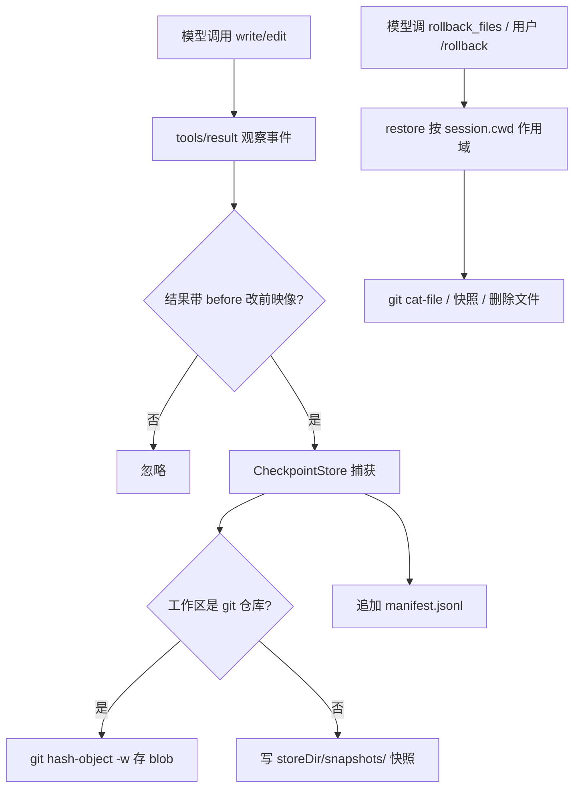

# dsh-rollback

[](https://www.npmjs.com/package/dsh-rollback)
[](LICENSE)

[English](README.md) | 中文

[DeepSeek Harness](https://github.com/deepseek-ai/deepseek-harness) 的文件变更回滚插件：观察每次成功工具结果中 `write`/`edit` 变更报告的改前映像，将其记录到工作区 git 对象库或快照存储，并通过面向模型的 `rollback_files` 工具和面向人的 `/rollback` 命令提供还原。它不注册任何服务，也不改动循环代码——捕获搭在 `tools/result` 观察事件上，还原直接写文件（绝不经过 fs 策略 seam 或沙箱，因为撤销一次变更不应被该变更当初通过的策略所门控）。

## 安装

本包是可安装的 **bundle**（声明了 `dsh.bundle`），直接接入 profile，无需改动 harness。你只需要一个 `dsh` CLI；运行时 peer 包（`@deepseek-ai/dsh-tools`、`@deepseek-ai/cordis` 等）从 dsh 安装本身解析，无需额外安装任何东西。

### 前置条件

- 机器上有 `dsh` CLI（`dsh plugin` 内部调用 `pnpm`，所以 `pnpm` 需在 `PATH` 中）。
- 一个要安装进去的 profile——下面的 `demo` 首次使用时自动初始化，可换成任意名字。

### 从 npm 安装（推荐）

```sh
dsh plugin --profile demo add dsh-rollback
```

其他来源用法相同：

```sh
# 直接从 git 安装（源码由 prepare 脚本构建；建议锁定 commit）
dsh plugin --profile demo add github:you/dsh-rollback#<sha>

# 或从本地 tarball
dsh plugin --profile demo add ./dsh-rollback-0.1.0.tgz
```

### 验证安装

1. `$DSH_HOME/profiles/demo/`（`$DSH_HOME` 默认为 `~/.dsh`）下的 profile manifest 中，`dependencies` **和** `dsh.profile.bundles` 都会出现 `dsh-rollback`——因为包声明了 `dsh.bundle`，reconciler 会自动加入。等价的手动补丁层行：

```yaml
- id: rollback
  name: dsh-rollback
  config:
    mode: auto          # auto | git | snapshot
    storeDir: ''        # '' = <harness home>/rollback
    maxRecords: 200
    gitPath: git
```

2. 启动一个会话。以下任一现象都说明插件已生效：
   - 模型的工具列表里能看到 `rollback_files`；
   - 在还没发生任何变更时输入 `/rollback`，得到 `rollback: nothing to restore`（而不是"未知命令"报错）。

## 使用教程

### 30 秒快速上手

1. 打开一个工作目录在 git 仓库内的会话。
2. `write` 一个文件 `notes.md`，内容为 `hello`。
3. 再次 `write` 它为 `goodbye`——第一次的内容已被静默记录。
4. 对模型说"把你刚覆盖的文件还原"（它会调用 `rollback_files`），或自己输入 `/rollback`。
5. 查看 `notes.md`：内容又变回 `hello`。

### 面向人 — `/rollback [count]`

在聊天输入框输入（base `web` 与 `headless` profile 挂载了命令所需命令注册表）：

- `/rollback` —— 撤销本会话工作目录中最近一条被捕获的变更；
- `/rollback 3` —— 撤销最近三条。

输出逐文件列出还原动作：

```text
rollback: restored 2 file mutation(s):
  restored  /ws/src/lib/parse.ts
  deleted   /ws/src/lib/generated.ts
```

### 面向模型 — `rollback_files`

新增一个面向模型的工具 `rollback_files {count}`（无提示词章节）。它用于让模型撤销自己犯下的 `write`/`edit` 错误，而不是回头麻烦用户。还原限定在调用方会话的工作目录内，输出为逐文件摘要——不会回显还原后的文件内容。

### 捕获范围

只捕获携带 `before` 改前映像的成功 `write`/`edit` 工具结果。通过 `bash`、`str_replace_editor` 或裸子进程产生的变更不带改前映像，不会被捕获（见[已知限制](#已知限制与延后工作)）。会话只能还原位于自身工作目录下或其自身的记录。

## 效果演示（前后对比）

一次 `write` 覆盖、一次撤销。同一个文件，四种状态：

| 步骤 | 动作 | `notes.md` |
|---|---|---|
| 1 | 初始状态 | `hello` |
| 2 | 模型 `write` 写入错误编辑——改前映像被捕获 | `goodbye` |
| 3 | 模型调用 `rollback_files {"count": 1}` | （透明） |
| 4 | 逐字节还原 | `hello` |

完整 transcript：

```text
# 1. 初始状态
$ cat /ws/notes.md
hello

# 2. 模型覆盖文件；tools/result 携带改前映像 "hello"，
#    捕获监听器将其记录进 git 对象库
> tool/call   write {"path": "/ws/notes.md", "content": "goodbye"}
> tool/result {"path": "/ws/notes.md", "before": "hello", ...}

# 3. 模型意识到写错了，撤销该变更
> tool/call   rollback_files {"count": 1}
> tool/result "rollback: restored 1 file mutation(s):
               restored  /ws/notes.md"

# 4. 还原为变更前内容
$ cat /ws/notes.md
hello
```

底层实现：`git hash-object -w` 将改前映像写入 git 对象库（零索引/分支/工作树污染），同时向持久化 `manifest.jsonl` 追加一行——因此重启后同一撤销依然可用。

## 工作原理



上图的完整示例与前后对比 transcript 见[效果演示](#效果演示前后对比)。

## 插件（namespace: `rollback`）

函数/命名空间插件（`name` / `inject` / `Config` / `apply`），不是服务。它与 `dsh-tool-call-timeout-policy` 同属循环卫生 guard 家族：在文档化的 `tools/*` 扩展点之上叠加安全网，而非触碰 agent 循环。

### Config

| 键 | 类型 | 默认值 | 含义 |
|---|---|---|---|
| `mode` | `'auto' \| 'git' \| 'snapshot'` | `'auto'` | `git` 将每个改前映像记录为 git blob（需要仓库；非仓库路径大声失败且不捕获任何内容）；`snapshot` 始终将改前映像复制到 `storeDir/snapshots/` 下；`auto` 在工作区是仓库时按文件选用 git，否则用快照。 |
| `storeDir` | string | `''` | 持有持久化 `manifest.jsonl` 与 `snapshots/` 的根目录。为空时解析为 Harness home 下的 `rollback`。 |
| `maxRecords` | number | `200` | 每个 store 内存记录的上限；超出后丢弃最旧的（持久化 manifest 保留全部）。 |
| `gitPath` | string | `'git'` | Git 可执行文件名或绝对路径。 |

### 行为

**捕获。** `tools/result` 监听器将成功的 `write`/`edit` 结果转换为检查点：结果的 `before` 字段即改前内容（`null` 记录文件原本不存在）。`blob` 改前映像通过 `git hash-object -w --stdin` 写入文件所在仓库（向上探测 `.git` 发现仓库根，按目录缓存）——零索引/分支/工作树污染，由 git 自身内容寻址并去重。每条记录以一行 JSONL 追加到 `manifest.jsonl`；插件加载时的 store 回放恢复内存列表，因此还原在重启后依然可用。只捕获绝对本地展示路径；相对或远程展示路径（非本地文件系统后端）被忽略。

**还原。** `restore(count, under)` 重新物化最近的 `count` 条路径位于 `under`（调用方 agent 的会话工作目录）之下或其自身的记录：`blob` 通过 `git cat-file blob <hash>`，`snapshot` 从 `storeDir/snapshots/<ref>`，`absent` 则删除文件。写入是原子的（临时文件 + rename）并创建父目录。被还原的记录从内存列表移除；manifest 保持只追加，因此重启会回放同样的记录，后续还原会重新应用完全相同的改前映像（幂等，不会双重撤销）。

**暴露。**

- `rollback_files` 工具——面向模型的还原，参数 `count`（整数，默认 1）。注册在 `ctx.tools` 上；非并发安全。当调用执行没有会话工作目录时拒绝执行。
- `/rollback [count]` 命令——对接收方 agent 的会话执行同样的还原；命令子组件仅在组合了命令注册表时激活（base `web` 与 `headless` profile 挂载 `dsh-commands`）。

### 为什么用 git，为什么直接 spawn

Git blob 与 ccAgent 使用同一机制：`hash-object -w` 写入改前映像而不触碰索引、引用或工作树；`cat-file` 原样还原字节；未被引用的 blob 由 git 自身的 gc 回收。Git 通过 `node:child_process` 直接 spawn（绝不经过 `ctx.shell` 或 `ctx.subprocess`）：还原是刻意的系统级撤销，因此不能被它所撤销的沙箱或 shell 策略所限制。

## 模型体验

### 面向模型的还原工具

#### 模型所见

本插件新增一个面向模型的工具 `rollback_files`（整数参数 `count`，字符串输出），无提示词章节。它不改变任何其他工具的 schema 或系统提示词。`/rollback` 命令属于人的命令平面入口，永远不会到达模型。

#### Token 影响

正常运行零 token。一次 `rollback_files` 调用会加入其小型的工具/结果对；还原后的文件内容不回显（仅一行摘要）。捕获本身对模型不可见。

#### KV Cache 影响

只追加；新增的工具 schema 与结果跟随可复用请求前缀，不使现有 KV-cache 条目失效。

## 已知限制与延后工作

- **只记录 `write`/`edit` 变更** —— 通过 `bash`、`str_replace_editor` 或裸子进程产生的变更，其结果不带 `before` 改前映像，不会被捕获。plan 范围批量备份（执行前捕获 plan 触碰的每个文件）是对应的泛化方向，已延后。
- **仅 UTF-8 文本** —— 改前映像以字符串传输；二进制内容不在范围内（与 fs 工具的纯文本契约一致）。
- **还原限定工作区** —— 调用方 agent 会话工作目录之外的记录永不被该调用方还原；没有跨目录或全局还原入口。
- **只追加 manifest，无修剪** —— 被还原的记录仍留在 `manifest.jsonl` 中并在回放时重新出现（幂等重复还原，不会双重撤销），但长期运行的 harness home 会无压缩地增长。
- **git gc 可能回收长期 blob** —— 默认 gc 在保留窗口后回收未被引用的对象；早于该窗口的检查点可能无法还原。保活 ref 命名空间已延后。
- **失败时不自动还原** —— `restoreOnFailure` 在 v1 中刻意不提供；自动还原需先将失败归因到具体变更。

## 开发

```sh
pnpm install     # peer 包从 npm 发布版解析
pnpm run build   # tsdown -> lib/（ESM + d.mts），自包含构建
pnpm test        # vitest，9 个 store 级测试
```

## 许可证

MIT
