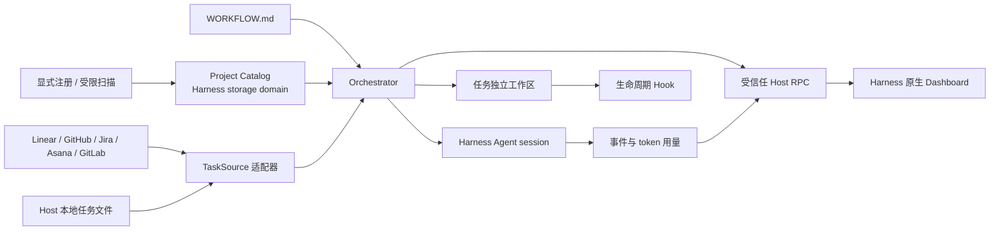

# dsh-dashboard

[English](./README.md) | 简体中文

`dsh-dashboard` 是一个面向 [DeepSeek Harness](https://github.com/deepseek-ai/deepseek-harness) 的 Symphony 兼容任务编排器与运行看板。它可以把 Linear、GitHub、Jira、Asana、GitLab 或 Host 本地任务转换为相互隔离的 Harness Agent 运行，同时保留 Harness 原生外壳、侧栏、会话、工具、模型选择和权限系统。


## 主要能力

- 读取包含 YAML frontmatter 和 Liquid prompt 的 `WORKFLOW.md`；无效热更新会被拒绝，最后一个有效定义继续生效。
- 支持 Linear、GitHub Issues、Jira Cloud、Asana 项目、GitLab 项目 Issue，以及不需要凭据的本地任务。
- 执行确定性的优先级排序、必需标签、全局并发限制和按状态并发限制。
- 为每个任务创建持久工作区，并执行可配置的 `after_create`、`before_run`、`after_run` 和 `before_remove` 生命周期 Hook。
- 通过 Harness 原生 Agent 执行任务，并在配置的 turn 上限内续跑同一个 Harness session。
- 对失败运行执行有上限的指数退避，并在每次派发前重新核对任务源状态。
- 在 Harness 原生侧栏中增加 **Dashboard** 入口；Board、Runtime、Projects 和 Configuration 视图展示任务状态、session、workspace、turn、token、Agent 事件、重试、阻塞原因、已注册项目和凭据健康状态。
- 使用 Harness 存储维护持久化 Project Catalog。项目既可显式注册，也可在受限根目录内扫描发现；扫描候选未经确认绝不会写入 Catalog。
- 分别建模 Project 与 Git Repository。Git 项目使用 worktree 工作区策略，非 Git 项目使用受控目录；自动任务领取始终关闭。
- 当任务源为 **Local** 时，在各看板列显示 Linear 风格的 `+` 控件；用户可以创建、编辑、切换状态、设置优先级与描述，并删除由 Host 原子 JSON 文件保存的本地任务。
- 所有外部凭据始终留在受信任 Host 侧；凭据值不会进入 Dashboard RPC payload 或浏览器状态。

Dashboard 标题旁的 `Provider · Project` 控件是动态上下文，例如 `Linear · ENG`、`GitHub · openai/example` 和 `Local · Personal`。

## Provider 支持

| Provider | 任务范围 | Dashboard 状态来源 | Host 凭据 | Agent 工具 |
| --- | --- | --- | --- | --- |
| Linear | 一个项目中的 Issue | Linear 原生工作流状态 | API Key | `linear_graphql` |
| GitHub | 一个仓库的 Issue；会排除 Pull Request | 配置的状态标签；缺失时按 open/closed 回退 | Fine-grained 或 classic token | `github_api` |
| Jira Cloud | 通过增强型 JQL 搜索选择的项目 Issue | Jira 原生 status | 账号邮箱 + API token | `jira_api` |
| Asana | 一个项目中的 Task | 项目 Section；已完成任务使用终态 | Personal access token | `asana_api` |
| GitLab | 一个项目中的 Issue | 配置的状态标签；缺失时按 opened/closed 回退 | Personal/project access token | `gitlab_api` |
| Local | 一个具名本地项目中的任务 | `WORKFLOW.md` 声明的状态 | 无 | `local_task` |

每份 `WORKFLOW.md` 只激活一个任务源。修改 `tracker.kind` 后，只有新的工作流通过完整校验并热更新成功，看板上下文和调度来源才会切换。

## 工作原理



Host 插件负责 Provider 访问、调度、workspace、Hook、Agent session、Project Catalog 持久化、本地任务持久化与运行状态。浏览器只接收受约束的状态投影，并只提供 Pause/Resume、Stop、Refresh、Catalog 操作和 Local 任务维护操作。

## 环境要求

- Node.js `22.19+` 或 `24+`
- 从源码构建时使用 pnpm `11.19+`
- DeepSeek Harness Web profile `0.1.0-rc.6`
- 一个已经存在的 Harness permission preset；随包配置使用 `workspace-write`
- 选定远程 Provider 的凭据；Local 任务不需要凭据

本仓库使用 npm 发布的 Harness `0.1.0-rc.6` 包进行编译和测试。已审核的接口边界见[兼容性说明](./docs/compatibility.md)。

## 安装

### 从 npm 安装

```powershell
dsh plugin --profile web add dsh-dashboard@0.7.0
dsh web --dump-config
dsh web
```

如果没有全局安装 CLI：

```powershell
npx --yes @deepseek-ai/dsh@0.1.0-rc.6 plugin --profile web add dsh-dashboard@0.7.0
npx --yes @deepseek-ai/dsh@0.1.0-rc.6 web --dump-config
npx --yes @deepseek-ai/dsh@0.1.0-rc.6 web
```

npm 包已经包含预构建的 Host 与浏览器入口，不需要授予安装时构建权限。

### 从源码或 tarball 安装

```powershell
pnpm install --ignore-scripts
pnpm run typecheck
pnpm test
pnpm run build
Copy-Item -LiteralPath WORKFLOW.example.md -Destination WORKFLOW.md
pnpm pack
dsh plugin --profile web add ./dsh-dashboard-0.7.0.tgz
dsh web
```

打开 `dsh web` 输出的地址，然后从 Harness 原生侧栏选择 **Dashboard**。

卸载插件：

```powershell
dsh plugin --profile web remove dsh-dashboard
```

## 插件配置

插件包提供标准 `dsh.bundle.patch`，默认值位于 [cordis.patch.yml](./cordis.patch.yml)。

| 配置项 | 用途 |
| --- | --- |
| `currentProject.root` | Harness 选中的项目根目录；相对路径从 Harness 进程工作目录解析。 |
| `currentProject.policyPath` | 项目 `WORKFLOW.md`，从 `currentProject.root` 解析。 |
| `currentProject.registerInCatalog` | 启动时把当前工作区注册到 Project Catalog。 |
| `agentProfile.id` | 项目策略中 `project.agent_profile` 引用的稳定 Profile id。 |
| `agentProfile.permissionPreset` | 应用于编排 Agent 的显式 Harness permission preset；必填。 |
| `agentProfile.agentPreset` | 可选 Harness Agent preset；省略时使用可用的 roster 默认值。 |
| `agentProfile.workerHost` | Runtime 观测信息中显示的 Host 标签，默认为 `local`。 |
| `policyDefaults.*` | 轮询、workspace root、Hook 超时、并发、turn 和重试退避的全局默认值；项目 `policy` 可覆盖。 |
| `discovery.roots` | 启动时写入 Catalog 的受限扫描根目录；每项包含绝对 `path` 与 1 到 8 的 `maxDepth`。 |
| `linear.endpoint` / `linear.apiKeyRef` | Linear GraphQL 地址与 API Key 凭据引用。 |
| `github.endpoint` / `github.tokenRef` | GitHub REST 地址与 token 引用；可改为 GitHub Enterprise 地址。 |
| `jira.emailRef` / `jira.apiTokenRef` | Jira Cloud 账号邮箱与 API token 引用；站点地址写在 `WORKFLOW.md`。 |
| `asana.endpoint` / `asana.tokenRef` | Asana REST 基础地址与 token 引用。 |
| `gitlab.endpoint` / `gitlab.tokenRef` | GitLab API v4 地址与 token 引用；自建 GitLab 需要覆盖 endpoint。 |
| `local.storePath` | Host 本地 JSON 任务文件，默认为 `~/.dsh-dashboard/tasks.json`。 |

Web profile 覆盖示例：

```yaml
- id: dsh-dashboard
  config:
    currentProject:
      root: C:\work\my-project
      policyPath: WORKFLOW.md
      registerInCatalog: true
    agentProfile:
      id: default
      permissionPreset: workspace-write
      workerHost: workstation-01
    policyDefaults:
      pollingIntervalMs: 5000
      workspaceRoot: .dsh-dashboard/workspaces
      hookTimeoutMs: 60000
      maxConcurrentAgents: 10
      maxTurns: 20
      maxRetryBackoffMs: 300000
    discovery:
      roots:
        - path: C:\work
          maxDepth: 4
    github:
      tokenRef: GITHUB_TOKEN
      endpoint: https://api.github.com
    jira:
      emailRef: JIRA_EMAIL
      apiTokenRef: JIRA_API_TOKEN
    gitlab:
      tokenRef: GITLAB_TOKEN
      endpoint: https://gitlab.example.com/api/v4
    local:
      storePath: C:\work\dsh-dashboard\tasks.json
```

`agentProfile.permissionPreset` 被设计为显式必填项：无人值守编排不能静默选择或提升 sandbox/approval policy。项目发现不代表执行授权；每个持久化 Project 的自动任务领取都保持关闭。

## 凭据

只需设置当前 Provider 使用的引用：

```powershell
$env:LINEAR_API_KEY = 'lin_api_replace_me'
$env:GITHUB_TOKEN = 'github_pat_replace_me'
$env:JIRA_EMAIL = 'user@example.com'
$env:JIRA_API_TOKEN = 'replace_me'
$env:ASANA_ACCESS_TOKEN = 'replace_me'
$env:GITLAB_TOKEN = 'glpat-replace_me'
dsh web
```

也可以把同名引用写入 `$DSH_HOME/.credentials.yaml`：

```yaml
LINEAR_API_KEY: lin_api_replace_me
GITHUB_TOKEN: github_pat_replace_me
JIRA_EMAIL: user@example.com
JIRA_API_TOKEN: replace_me
ASANA_ACCESS_TOKEN: replace_me
GITLAB_TOKEN: glpat_replace_me
```

不要提交该文件、真实 token 或包含凭据的日志。每个 Provider 都会在操作时解析凭据；Configuration 视图只显示引用名称、是否已配置以及凭据来源。

## WORKFLOW.md

可以从面向 Linear 的 [WORKFLOW.example.md](./WORKFLOW.example.md) 或对应 Provider 的完整示例开始：

- [GitHub](./examples/WORKFLOW.github.md)
- [Jira](./examples/WORKFLOW.jira.md)
- [Asana](./examples/WORKFLOW.asana.md)
- [GitLab](./examples/WORKFLOW.gitlab.md)
- [Local 任务](./examples/WORKFLOW.local.md)

通用字段：

| 字段 | 说明 |
| --- | --- |
| `version` | 策略格式版本；当前格式必须为 `1`。 |
| `project.name` | Configuration 中显示的人类可读 Project 名称。 |
| `project.agent_profile` | Agent Profile id，必须与插件配置中的 `agentProfile.id` 完全一致。 |
| `tracker.kind` | `linear`、`github`、`jira`、`asana`、`gitlab` 或 `local`。 |
| `tracker.provider.context_label` | Dashboard 标题旁显示的可选项目短标签。 |
| `tracker.required_labels` | 任务派发前必须全部存在的标签。 |
| `tracker.active_states` | 可以运行 Agent 的任务状态。 |
| `tracker.terminal_states` | 停止运行并触发安全 workspace 清理的状态。 |
| `policy.polling.interval_ms` | 项目对全局轮询间隔的覆盖。 |
| `policy.workspace.root` | 存放各任务持久工作区的父目录；相对路径从策略文件所在目录解析。 |
| `policy.hooks.timeout_ms` | 每个生命周期 Hook 独立使用的超时时间。 |
| `policy.agent.max_concurrent_agents` | 项目的 Agent 并发上限。 |
| `policy.agent.max_concurrent_agents_by_state` | 各任务源状态可选的独立并发上限。 |
| `policy.agent.max_turns` | 同一个 Harness session 中允许续跑的最大 turn 数。 |
| `policy.agent.max_retry_backoff_ms` | 重试退避时间上限。 |
| `policy.dashboard.visible_states` | 在 Hidden columns 分组之前显示的看板列。 |

Provider 路由字段：

| Provider | 必填字段 | 可选路由 |
| --- | --- | --- |
| Linear | `project_slug` | `assignee: me` 或 Linear assignee id |
| GitHub | `owner`、`repo` | `assignee`、`state_labels` |
| Jira | `site_url`、`project_key` | `assignee: me` 或 account id、附加 `jql` |
| Asana | `project_gid` | `assignee: me` 或 user gid |
| GitLab | 数字 id 或 namespace path 形式的 `project_id` | `assignee`、`state_labels` |
| Local | `project_id` 默认为 `local` | `context_label` |

GitHub 与 GitLab 的 `state_labels` 是“工作流状态名 → Provider 标签”的映射。名称与某个已声明状态完全相同的标签也会自动识别。没有匹配标签的打开 Issue 会回退到第一个 active state；没有匹配终态标签的关闭 Issue 会回退到第一个 terminal state。

Jira 直接使用原生 status 名称。Asana 使用任务在当前项目中的 Section；已完成的 Asana 任务使用第一个终态。

Liquid prompt 可以引用 `issue.identifier`、`issue.title`、`issue.description`、`issue.state`、`issue.labels`、`issue.url` 和当前重试次数 `attempt`。

### Local 任务控件

当 `tracker.kind` 为 `local` 时，每个可见列标题都会显示 `+`。新任务会直接创建到所选列。打开任务卡片后可以编辑或删除，并可修改标题、描述、状态和优先级。

Local 任务由 Host 持久化，不使用浏览器 `localStorage`。所有写入都会串行执行，通过同目录临时文件和原子 rename 提交。Dashboard 编辑会携带打开任务时的版本；如果 Agent 或其他编辑器已更新该任务，Host 会拒绝覆盖。格式损坏或版本不兼容的任务文件会被拒绝，而不会被静默覆盖。Dashboard 删除只移除任务记录；已经存在的 Agent workspace 会被保留。

### 生命周期 Hook

- `after_create` 只在新任务工作区创建后执行。
- `before_run` 在每次 Agent 尝试前执行。
- `after_run` 在 Agent 尝试结束后、工作区仍然存在时执行。
- `before_remove` 在终态 workspace 清理前执行。

Hook 会在任务工作区内作为受信任的本地命令运行，应当像审核构建或部署脚本一样审核这些命令。

当前项目属于 Git 仓库时，`after_create` 运行前该工作区已经是所选仓库的 detached worktree，不要在 Hook 中再次 clone。当前项目不是 Git 仓库时，插件会提供一个受控空目录，`after_create` 可以显式初始化它。

## 调度与工作区安全

- 符合条件的任务按优先级、创建时间和标识符排序。
- 可用时，Linear `blocks` 关系和 Jira “is blocked by” 链接会投影为 blocker。
- 查询结果中缺失的任务会停止运行，但不会被视为终态，避免暂时的查询或 Provider 变化删除 workspace。
- 文件系统变更前会规范化任务标识符并检查路径包含关系。
- Workspace root 和任务目录必须是真实目录，不能是符号链接。
- `before_remove` 结束后会再次解析删除目标；如果 Hook 运行期间 root 或目标发生变化，清理会被拒绝。
- `after_create` 失败会删除不完整的 workspace，使后续尝试能够重新初始化。
- 运行 claim 与 workspace 名称包含 Provider 项目作用域，因此不同仓库或项目中的相同任务编号不会互相复用。
- Hook stdout 和 stderr 只保留有上限的尾部内容。
- 远程 Agent 工具把 endpoint 与凭据留在 Host，并在 Provider API 允许的范围内把操作限制到当前仓库、项目或 Issue 命名空间。

完整信任模型和组件边界见[安全说明](./docs/security.md)与[架构说明](./docs/architecture.md)。

## Dashboard

插件通过 Harness 原生 UI slot 注册：

- `sidebar.footer.action` 在现有 Harness 侧栏中提供 Dashboard 入口。
- `shell.overlay` 在 Harness 主内容区域渲染 Dashboard。

插件不会替换或复制 Harness 侧栏。

Dashboard 文案接入 Harness 原生本地化服务。简体中文和英文资源由同一组类型安全的键约束，当前语言跟随 Harness 中持久化的**设置 → 语言**偏好；若宿主尚未保存语言偏好，则由 Harness 根据浏览器语言确定初始语言。任务标题、工作流状态名和 Agent 消息等由 Tracker 或用户提供的内容保持原始语言，不会被插件擅自翻译。

在 DeepSeek Harness 中实际运行的简体中文 Dashboard：


- **Board**：任务源原生列、隐藏状态、筛选、Local 任务维护与任务详情。
- **Runtime**：运行中、重试中和被阻塞的记录，以及 turn、token、worker host 和更新时间。
- **Projects**：持久化的 Project 与独立 Repository 元数据、工作区策略、当前工作区标记、发现根目录、受限扫描和候选显式确认。
- **Configuration**：最后有效 workflow、Provider 上下文、每个凭据引用的健康状态、workspace root、轮询间隔、permission preset 和 Agent 限制。

执行面仍绑定到 Harness 选中的 `currentProject`。注册或发现其他 Project 只会把它写入 Catalog，不会启用跨项目自动任务领取。

通过 Harness 原生 Dashboard 入口加载的持久化 Project Catalog：


受限扫描发现的候选必须经过显式确认：


通过 Harness 原生 Dashboard 入口加载的组合式 Local 任务看板。它使用一个当前 Project 演示跨业务域的规划、执行、人工审核、返工/合并和终态节点，但不暗示系统会自主领取多个 Project 的任务：


任务详情在同一看板上下文中集中呈现选中任务、来源状态、工作区、Agent 动态、令牌和最近事件：


无需外部 Tracker，直接创建和编辑 Local 任务：


## 开发与验证

```powershell
pnpm run typecheck
pnpm test
pnpm run build
```

确定性组件开发：

```powershell
pnpm run dev:dashboard
```

`http://127.0.0.1:4173/dev/` 使用本地 fixture 数据并默认以中文渲染界面，适合组件级视觉与交互检查，但不能证明打包插件已经在 Harness 中正确加载。

集成验证必须构建或打包插件，把该构件安装到 Harness Web profile，在专用工作区启动 `dsh web`，从原生侧栏进入 Dashboard，并检查 Provider 数据、Local 任务维护、浏览器控制台和 Host 日志。

设计参考保存在 [docs/design](./docs/design/README.md)。

## 上游 API 参考

- [GitHub Issues REST API](https://docs.github.com/en/rest/issues/issues)
- [Jira Cloud REST v3 增强型 Issue 搜索](https://developer.atlassian.com/cloud/jira/platform/rest/v3/api-group-issue-search/)
- [Asana 项目任务接口](https://developers.asana.com/reference/gettasksforproject)
- [GitLab Issues API](https://docs.gitlab.com/api/issues/)

## 与 Symphony 的关系

本项目复刻 Symphony 的编排契约，而不是嵌入其 Elixir/OTP 实现：

- `TaskSource` 提供 Provider 边界。
- `HarnessAgentRunner` 将执行和续跑映射到 Harness 原生 session。
- 持久任务 workspace 与生命周期 Hook 遵循 Symphony 兼容语义，并增加 fail-closed 文件系统检查。
- 受信任 Host RPC 将可观察状态和有边界的控制投影到浏览器。
- UI 将 Symphony 的运行观测信号与 Linear 风格看板结合，并运行在 Harness 原生外壳中。

上游参考：[openai/symphony](https://github.com/openai/symphony)。

## 许可证

[MIT](./LICENSE)
