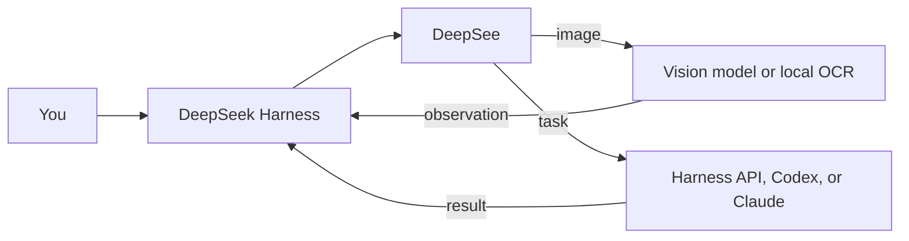

<h1 align="center">DeepSee</h1>

<p align="center"><strong>Give DeepSeek Harness eyes — and the right model for the job.</strong></p>

<p align="center">
  <a href="README.md">English</a> ·
  <a href="README.zh-CN.md">简体中文</a>
</p>

<p align="center">
  
  
  
</p>

DeepSee is a lightweight plugin for [DeepSeek Harness](https://github.com/deepseek-ai/DeepSeek-Harness). It gives a text-first DeepSeek model a practical visual route, turns the models already available on your computer into a usable directory, and helps Harness choose a suitable executor for Workflow tasks.

It stays inside the product you already use: the same Web UI, the same model settings, and the same Harness Loop, Goal, Plan, and Workflow. There is no second dashboard, no companion service, and no need to enter the same API key twice.

> [!IMPORTANT]
> DeepSee is currently an alpha release and targets DeepSeek Harness `0.1.0-rc.6`. The core visual route, model directory, Codex/Claude Desktop and CLI adapters, installer, and update flow are implemented; runtime support is intentionally conservative and listed below.

## Install in one command

You need [Node.js 24 or newer](https://nodejs.org/). In PowerShell or a terminal, run:

```powershell
npx --yes github:WUBING2023/deepsee install
```

Then start the Harness Web UI:

```powershell
npx --yes github:WUBING2023/deepsee web
```

Open [http://127.0.0.1:3080/](http://127.0.0.1:3080/). DeepSee appears as a native sidebar panel.

Already have DeepSeek Harness configured? DeepSee reuses its providers, model IDs, and credential references. Add or edit API models on the native Harness **Settings → Models** page; DeepSee never asks you to copy the key into a separate store.

[First-run setup →](docs/GETTING_STARTED.md) · [中文上手指南 →](docs/GETTING_STARTED.zh-CN.md)

## What DeepSee adds

| Capability | What it feels like |
| --- | --- |
| **Vision that actually runs** | Attach an image and DeepSee sends it to a selected multimodal model, MinerU, PaddleOCR, or RapidOCR, then returns the observation to DeepSeek. |
| **One model directory** | The directory stays visible and groups models by API provider, Harness provider, local CLI, or desktop runtime. A verified subscription starts with one model; users can add, replace, disable, or remove additional model instances under the same source. |
| **Fast initialization** | The first ready visual model is selected automatically; Harness loads project instructions natively, while global Claude/Codex `AGENTS.md`, `CLAUDE.md`, or `agent.md` files are inherited read-only by base sessions and Workflow. |
| **Native configuration** | The plugin lives in the Harness sidebar and uses same-origin routes. Models and credentials remain owned by Harness. |

### Vision: model or OCR

Choose one reader in DeepSee preferences:

- **Model** — any Harness model whose adapter confirms image input support.
- **OCR** — choose an isolated, installable, and removable local engine. MinerU targets complex PDFs, tables, and formulas; PaddleOCR targets multilingual images and scans; RapidOCR targets screenshots, receipts, and low-resource CPUs. A one-line comparison appears while a download is active. DeepSee never removes system-managed installs.

The base DeepSeek model receives the visual observation and continues the conversation normally. A text-only model is never presented as if it had read the image itself.

### Model directory and local runtimes

DeepSee scans the machine at startup, verifies what can really run, and keeps unavailable routes disabled. Defaults come from actual Harness modalities and the structured [Models.dev](https://models.dev/) catalog, then a short model request adds relative strengths. User corrections always win. [Capability initialization and data sources →](docs/MODEL_CAPABILITIES.md)

| Route | Discovered | Executable from DeepSee | Notes |
| --- | :---: | :---: | --- |
| Harness / API models | Yes | Yes | Uses native providers, model settings, and subagents. |
| Codex Desktop / CLI | Yes | Yes | Reuses the verified bundled App Server or CLI; several supported variants can be enabled as independent base/Workflow routes. |
| Claude Desktop + Claude Code | Yes | Yes when CLI is verified | Sonnet, Opus, Haiku, or Fable can be managed independently under one verified subscription; automatic Workflow execution still requires Claude Code CLI. |
| Gemini CLI | Yes; install from the model-directory `+` when missing | Yes after install and restart | Pick an isolated install path. DeepSee tries the official stable npm package, then Google's GitHub Release bundle. One model starts enabled; Auto, Pro, Flash, and Flash-Lite can be added independently. |
| Kimi CLI, OpenCode, Ollama | Yes | Not yet | Shown for honest discovery, but not exposed as runnable routes without a stable Harness adapter. |
| MinerU / PaddleOCR / RapidOCR | Yes | OCR only | Visual tools in Preferences, not general-purpose models in the matrix. |

### Workflow and Prime

- `/workflow <task>` explicitly starts a visible Harness Workflow.
- Prime leaves small tasks in the normal Loop and selects Workflow for genuinely independent workstreams, cross-capability roles, or an approved Workflow plan.
- Harness/API models run through native `spawn` subagents. Codex, Claude Code, and Gemini CLI run through their verified CLI providers.
- The `opends_list_models` tool lets the main model inspect available routes by vision, coding, writing, reasoning, document, or review capability.



## Designed to stay small

- Installs as a standard DSH bundle in both `web` and `headless` profiles.
- Mounts its configuration API at the same-origin `/api/deepsee` route; there is no port `3091` or second Node.js process.
- Stores mutable state under `$DSH_HOME/deepsee`, outside the package directory, so upgrades and uninstall preserve user choices.
- Generates the `prime` preset from the installed Harness standard preset instead of patching an official preset.
- Reads provider metadata and credential references, never raw API keys.
- Reads global instructions only from conventional locations; their text never enters browser state, bounded per-file and total limits apply, and the current explicit request always wins.

[Architecture and extension points →](docs/ARCHITECTURE.md)

## Common commands

```powershell
npx --yes github:WUBING2023/deepsee install    # Install or safely resume Web + Headless
npx --yes github:WUBING2023/deepsee web        # Start the Harness Web UI
npx --yes github:WUBING2023/deepsee doctor     # Check bundle, runtimes, and configuration
npx --yes github:WUBING2023/deepsee uninstall  # Remove the plugin and preserve user state
```

Update checks are cached and automatic; installing an update always requires a click in the DeepSee panel. The updater pins an immutable Git commit, verifies the package before installation, and can resume a partially completed two-profile upgrade. Restart Harness when the panel shows **Restart to apply**.

If the one-line install times out, use the [ZIP fallback](docs/GETTING_STARTED.md#zip-fallback). For runtime, visual, or update failures, see [Troubleshooting](docs/TROUBLESHOOTING.md).

## Documentation

| Guide | English | 简体中文 |
| --- | --- | --- |
| Install and first run | [Getting started](docs/GETTING_STARTED.md) | [快速上手](docs/GETTING_STARTED.zh-CN.md) |
| Architecture and extension | [Architecture](docs/ARCHITECTURE.md) | [架构说明](docs/ARCHITECTURE.zh-CN.md) |
| Diagnosis and recovery | [Troubleshooting](docs/TROUBLESHOOTING.md) | [排障指南](docs/TROUBLESHOOTING.zh-CN.md) |
| Local development | [Contributing](CONTRIBUTING.md) | [参与开发](CONTRIBUTING.zh-CN.md) |

## Develop locally

```powershell
pnpm install
pnpm run typecheck
pnpm test
pnpm run build:plugin
pnpm run install:plugin
pnpm run start:web
```

DeepSee uses some internal `opends-*` / `OPENDS_*` identifiers so early installations can migrate without losing state. The public product, repository, package, and command are DeepSee, `WUBING2023/deepsee`, `@wubing2023/deepsee`, and `deepsee`.

## License

[MIT](LICENSE) © 2026 [WUBING2023](https://github.com/WUBING2023)
