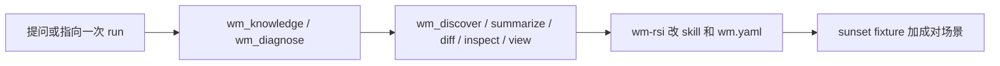

# DSH-WM

[MIT](LICENSE)
[DSH](cordis.patch.yml)
[Node](package.json)

**给 DeepSeek Harness 用的可玩世界模型工具箱——看条带、认路线、给 run 打分、迭代研究闭环。**

把 agent 指到一次 rollout（或直接 `fixtures/sunset`）再问：后半段是不是融化了、Sora 算不算世界模拟器、哪种 memory 配方才有资格赢。

🚀 一行命令安装 ｜ 不用 GPU 就能玩 sunset ｜ 内置 WM 地图 ｜ 对 skill / eval 做 RSI

🌐 [English](README.md) | **中文**

在 DeepSeek Harness 里做世界模型，最好玩的状态是：agent 能*看见*条带、*叫出*路线、*量到*声称。DSH-WM 就是这块 profile bundle：接触图看帧、对照页（并排 / 滑杆 / 差异热力 + action HUD）、三条路线知识（3D 显示 / Pixel Video Gen / Latent Prediction）、run 打分，以及作用在 skill 和 `wm.yaml` 上的 RSI。

```sh
dsh plugin --profile wm add github:WayneJin0918/dsh-wm
dsh --profile wm
```

然后试一句：*分诊 `fixtures/sunset`。看 first / mid / last。是后半段崩了吗？*

**运行时：** [deepseek-ai/deepseek-harness](https://github.com/deepseek-ai/deepseek-harness)

目录

- [30 秒就能玩](#30-秒就能玩)
- [亮点](#亮点)
- [三条路线](#三条路线)
- [适合谁用](#适合谁用)
- [快速开始：三步完成](#快速开始三步完成)
- [常见任务](#常见任务)
- [工具一览](#工具一览)
- [用 Harness 做 RSI](#用-harness-做-rsi)
- [致谢](#致谢)

## 30 秒就能玩

`fixtures/sunset` 是 8 帧玩具条带。前半 pred 还是暖色、贴近 GT；后半被抹成冷蓝，late-horizon collapse 一眼能看出来。不需要 checkpoint、集群或 GPU。

```sh
node cli.js inspect fixtures/sunset --indices first,mid,last
node cli.js view fixtures/sunset
node cli.js diff --pred fixtures/sunset/pred --gt fixtures/sunset/gt
node cli.js diagnose "Sora 算世界模型吗"
node cli.js knowledge --id wm-routes
```

`wm_inspect` 会打出终端里就能读的亮度草图：

```text
pred #0  luma=148.7  low contrast, warm / orange
    ****************
    **##************
pred #7  luma=62    near-uniform, cool / blue
    ::::::::::::::::
gt   #7  luma=160.4  low contrast, warm / orange
    ***#############
```

同一条带上的 `wm_rollout_diff` 会报后半段 SSIM 下降，并把 4–6 帧标成最差窗口。需要自己拖 pred vs GT 时用 `wm_view`。先看、再打分、再打开一张卡片。

## 亮点

- **装上就能玩。** 官方 DSH bundle，纯 JavaScript，没有 `prepare` / `allowBuilds`。没开 Harness 也能用 `node cli.js` 跑 sunset。
- **看图就在本仓库里。** `wm_inspect` 抽 first / mid / last（或指定下标），写出接触图，并返回亮度草图和颜色 / 对比度 look。
- **对照页自己拖。** `wm_view` 写出一份自包含 HTML：并排、滑杆叠图、差异热力图、SSIM 时间轴；有 `actions.json` 时还有 action HUD。
- **先认路线。** 3D 显示、Pixel / Video Gen WM、Latent Prediction 是三场不同的考试。`wm-routes` 再进 `display-3d` / `pixel-wm` / `latent-wm`。
- **一次 run 是一个目录。** 可选 `wm.yaml` 声明 pred / gt / log / metrics / actions；没有清单就启发式；认不出就返回候选和警告，不编路径。
- **有 run 就测量。** `wm_discover` → `wm_summarize` → `wm_rollout_diff` → `wm_inspect` → `wm_view` 给出 layout、log、数字、观感和一张能拖的页。
- **内置 WM 知识。** chunk-AR、memory、KV、exposure bias、revisit、消融、action following、cache eviction、Harness 上的 RSI。先 `wm_knowledge` / `wm_diagnose`，再谈新结构。
- **RSI 作用在 harness 层。** skill `wm-rsi` 用 DSH trajectory、fork、Creator 和 sunset 去演化 skill、`wm.yaml` 和评测备注。
- **Skill 把游戏规则说清楚。** 分诊、知识、RSI、公平消融、revisit。
- **起步不需要 GPU。** rollout 分数是纯 JS 亮度 SSIM + MSE。视频要 `ffmpeg`；PNG/PPM 目录可以完全离线。

## 三条路线

「世界模型」这个词其实是三场研究游戏。卡片对照 [Awesome World Models](https://github.com/knightnemo/Awesome-World-Models) 的地图。设计 backbone 之前先打开 `wm-routes`。


| 路线                       | 卡片           | 在预测什么                               | 「好」长什么样     | 场上常说的梗                                        |
| ------------------------ | ------------ | ----------------------------------- | ----------- | --------------------------------------------- |
| **3D 显示**                | `display-3d` | 能飞进去的几何（mesh、Gaussian、occupancy、4D） | 空间一致、可探索的场景 | 一致性是买来的；fly-through 在摇杆生效前只是展示                |
| **Pixel / Video Gen WM** | `pixel-wm`   | 下一帧像素（常带 action）                    | 还听摇杆的交互条带   | 「Sora 是世界模拟器吗？」；好看片 + 不听杆；Self-Forcing / 后半融化 |
| **Latent Prediction**    | `latent-wm`  | 下一个紧凑状态（RSSM、JEPA、DINO）             | 在梦里做规划和控制   | 别给每个像素付 loss；解码出来的视频只是投影                      |


回程忘了房间：像素条带上是 `revisit-eval`，3D 场景上是 pose / occupancy，JEPA / Dreamer 上是 latent mismatch。先认路线，再测量。

```sh
node cli.js knowledge --id display-3d
node cli.js knowledge --id pixel-wm
node cli.js knowledge --id latent-wm
node cli.js diagnose "Gaussian 可探索 3D"
node cli.js diagnose "JEPA latent Dreamer"
```

## 适合谁用


| 你想做的事                   | DSH-WM 给你的                                              |
| ----------------------- | ------------------------------------------------------- |
| **没有集群也想玩一次 rollout**   | sunset + 笔记本上的 `wm_inspect` / `wm_rollout_diff`         |
| **看清这次 run 目录里有什么**     | `wm_discover`：layout、路径、帧数、警告                           |
| **把 log 尾变成下一步实验**      | `wm_summarize`：last loss / NaN / 早停 + 3 条假设             |
| **给「看起来更差」一个数字**        | `wm_rollout_diff`：mean/min SSIM、曲线、最差帧、诊断               |
| **看那些最差帧**              | `wm_inspect`：接触图、亮度草图、每块 look                           |
| **自己拖 pred vs GT，看杆有没有跟上** | `wm_view`：并排 / 滑杆 / 热力、action 箭头、followed / dropped |
| **把论文放到地图上**            | `wm-routes` → `display-3d` / `pixel-wm` / `latent-wm`   |
| **消融说得过去**              | `wm-ablation`：先成对 `(scene, protocol, seed)` 和 failure 率 |
| **讨论「有没有回家」**           | `wm-revisit`：几何 vs 帧相似度代理                               |
| **让 agent 更会 debug WM** | `wm-rsi`：一条声称、一张卡片、一次测量、一处 skill / `wm.yaml` 改动         |


## 快速开始：三步完成

### 1. 安装

装进专用研究 profile：

```sh
dsh plugin --profile wm add github:WayneJin0918/dsh-wm
```

Web / Headless 也可以：

```sh
dsh plugin --profile web add github:WayneJin0918/dsh-wm
dsh plugin --profile headless add github:WayneJin0918/dsh-wm
```

本地 checkout（路径安装不需要 GitHub 权限）：

```sh
dsh plugin --profile wm add /path/to/dsh-wm
```

包是纯 JS。从 git 安装不需要 pnpm `allowBuilds`。想钉死版本就写：`github:WayneJin0918/dsh-wm#<sha>`。

### 2. 重启并确认

```sh
dsh --profile wm --dump-config    # 应出现 "# == dsh-wm"
dsh --profile wm
```

Web profile 加完 bundle 后请重启，并开一个新 session，让 skill 目录重新加载。

### 3. 问一句你会真的问出口的话

```text
分诊 fixtures/sunset。失败点是什么，是不是后半段崩了？
看 first / mid / last——后半段像素在干什么？
Sora 是世界模拟器，还是还得过摇杆考试的 Pixel WM？
回程忘了房间——哪种 memory 配方才有资格上？
这两个 run 说 memory 赢了——scene/protocol/seed 对齐了吗？
用 Harness RSI 收紧 revisit skill；sunset 当门禁。
```

## 常见任务


| 任务                     | 推荐工作流                                                                  |
| ---------------------- | ---------------------------------------------------------------------- |
| 前五分钟 / 没有 GPU          | `inspect` sunset → `diff` → `diagnose` 一个你在意的问题                        |
| 训练或评测 run 看起来不对        | `wm-run-triage` → discover → summarize → diff → inspect → view         |
| 这篇论文是哪条 WM 路线？         | `wm-routes` → `display-3d` / `pixel-wm` / `latent-wm`                  |
| 「该用哪种 memory？」         | `wm-knowledge` → `chunk-ar` / `memory-types` / `kv-memory` → 再测量       |
| 后半段融化，train loss 还很健康  | `wm_diagnose` → `exposure-bias` → scheduled sampling                   |
| 哪个 cache / memory 配置赢了 | `wm-ablation` → 成对 n 和 failure 率 → 均值差                                 |
| 相机有没有回来                | `wm-revisit` → 整段 diff → 没有 pose 才用首尾帧                                 |
| 改进研究闭环本身               | `wm-rsi` → Creator / trajectory → 改一处 skill 或 `wm.yaml` → sunset 门禁    |
| 离线 CI / 没有 API key     | `node cli.js knowledge` / `diagnose` / `discover` / `diff` / `inspect` / `view` |


## 工具一览

三类可以在同一次 session 里组合：


| 类别     | 工具                                                                       | 职责                      |
| ------ | ------------------------------------------------------------------------ | ----------------------- |
| **测量** | `wm_discover`、`wm_summarize`、`wm_rollout_diff`、`wm_inspect`、`wm_view` | 目录、log、pred vs GT 数字、看帧、对照页 |
| **知识** | `wm_knowledge`、`wm_diagnose`                                             | 路线 + 技术卡片，症状 → 下一步      |
| **迭代** | skill `wm-run-triage`、`wm-knowledge`、`wm-rsi`、`wm-ablation`、`wm-revisit` | 诚实评测和 harness 层 RSI     |


| 工具                | 最适合解决的问题                          | 主要结果                             |
| ----------------- | --------------------------------- | -------------------------------- |
| `wm_discover`     | 「这个 run 目录里有什么？」                  | layout、pred/gt/log/metrics、帧数、警告 |
| `wm_summarize`    | 「训练真的跑完了吗，下一步测什么？」                | last loss / NaN / 早停、指标键、3 条假设   |
| `wm_rollout_diff` | 「pred 相对 GT 漂在哪？」                 | mean/min SSIM、曲线、最差 3 帧、诊断       |
| `wm_inspect`      | 「first / mid / last / 最差帧长什么样？」   | 接触图、亮度草图、颜色 / 对比度 look           |
| `wm_view`         | 「让我自己拖 pred vs GT，看 action 跟没跟上。」 | HTML 对照页 + pred / gt / 热力接触图 |
| `wm_knowledge`    | 「哪条路线 / chunk-AR / KV / RSI 是什么？」 | 目录或一整张技术卡片                       |
| `wm_diagnose`     | 「一回来就忘了——然后呢？」                    | 卡片 id + 下一步工具 / skill            |


rollout 分数是 **亮度 SSIM + MSE**。看条带用内置的 `wm_inspect`；对照和 action 用 `wm_view`。

### 知识卡片

**路线：** `wm-routes` · `display-3d` · `pixel-wm` · `latent-wm`

**技术：** `chunk-ar` · `memory-types` · `kv-memory` · `exposure-bias` · `revisit-eval` · `ablation-protocol` · `action-following` · `cache-eviction` · `rsi-harness` · `diagnosis-map`

```sh
node cli.js knowledge
node cli.js knowledge --id wm-routes
node cli.js knowledge kv memory
node cli.js knowledge --id rsi-harness
node cli.js diagnose "Sora 算世界模型吗"
node cli.js diagnose "第一个 chunk 之后后半段崩了"
```

### Skills

- **wm-run-triage** — 走完一次 run：discover → summarize → diff → inspect → view，再给失败点起名
- **wm-knowledge** — 设计前先打开路线或技术卡片
- **wm-rsi** — 一条声称、一张卡片、一次测量、一处 skill / `wm.yaml` 改动、sunset 门禁
- **wm-ablation** — 先成对 scene / protocol / seed 再报均值
- **wm-revisit** — 几何回环 vs 帧相似度代理

## 用 Harness 做 RSI

DeepSeek Harness 已经提供 append-only trajectory、fork/replay，以及 Creator mode（查看正在跑的插件树）。DSH-WM 把这套能力对准世界模型的*过程*：

1. 写下一条可证伪的声称。
2. 打开 `wm_knowledge`（`rsi-harness` + 对应技术；路线不清时先 `wm-routes`）。
3. 测量（`wm_summarize` / `wm_rollout_diff`）并看图（`wm_inspect` / `wm_view`）。
4. 只改 **一处** skill、`wm.yaml` 字段或评测备注。
5. 用 `fixtures/sunset`（必须仍报 late-horizon drop）和用户的成对场景做门禁。
6. 固化或回滚；保留 session。

可重复的核心是数字和卡片。

## `wm.yaml`

```yaml
name: sunset-revisit
pred: outputs/pred          # 帧目录或 mp4
gt: outputs/gt
log: logs/train.log
metrics: metrics.json       # 任意 JSON；只做 key 摘要，不校验 schema
actions: actions.json       # 可选；给 wm_view 画每帧控制
```

没有这份文件时，插件会找 `pred|preds|recon`、`gt|target|ref`、`train.log` / `logs/*.log`、`metrics.json` / `*eval*.json`，以及 `actions.json`。

## 工作原理




三层，一次 session：

1. **知识** — 先认路线，再打开技术卡片。
2. **测量** — 读文件系统的工具，加上 `wm_inspect` 和 `wm_view`。
3. **RSI** — 演化研究闭环，并通过 sunset 门禁。

## 离线 fixture

`fixtures/sunset` 是内置游乐场。pred 的 0–3 接近 GT，4–7 被抹掉，所以后半段 SSIM 下降。

```sh
npm test
npm run check
node scripts/generate-fixtures.js    # 改完画图逻辑后重新生成
```

## 配置与限制

### 运行要求

- DeepSeek Harness `0.1.0-rc.6` 或兼容版本；`dsh plugin` 需要 PATH 上有 `pnpm`。
- Node.js 18+。
- JPEG / 视频需要可选的 `ffmpeg`。PNG/PPM 帧目录可以完全离线。

### 安装、升级、禁用和卸载

```sh
dsh plugin --profile wm update github:WayneJin0918/dsh-wm
dsh plugin --profile wm remove dsh-wm
```

临时禁用时，在 profile patch 里写：

```yaml
- id: dsh-wm
  disabled: true
```

启用或升级后请重启 profile。

## 常见问题


| 问题                                | 处理方式                                                                                         |
| --------------------------------- | -------------------------------------------------------------------------------------------- |
| `--dump-config` 里没有 `# == dsh-wm` | 从 checkout 或 `github:WayneJin0918/dsh-wm` 重新 `dsh plugin --profile wm add`；确认 PATH 上有 `pnpm` |
| git 安装 404 或要登录                   | 确认仓库已公开：`github:WayneJin0918/dsh-wm`；或改用本地路径安装                                               |
| 提示 `pred not found`               | 补一份 `wm.yaml`，或给 `wm_rollout_diff` 显式传 pred / gt                                             |
| 视频 / JPEG 被拒绝                     | 安装 `ffmpeg`，或先抽成 PNG 帧                                                                       |
| agent 不调工具就下结论                    | 先加载 `wm-run-triage` 或 `wm-knowledge`；没有 layout / 没有卡片就没有结论                                   |
| agent 对着聊天发明 KV 方案                | `wm_knowledge --id kv-memory` 再走 `wm-rsi`；先打开卡片                                              |
| 把首尾 SSIM 当成 loop closure          | 加载 `wm-revisit`；没有 pose 时那个数字只是代理                                                            |
| 「RSI」开始改训练代码                      | 先停一下。`wm-rsi` 改的是 skill / `wm.yaml` / 评测备注，除非用户打开了训练任务                                       |


## 开发

```sh
npm test
npm run check
```

- 版本变化见 [CHANGELOG.md](CHANGELOG.md)。
- Bug 和功能请求请开本仓库的 GitHub Issues。

## 致谢

DSH-WM 建立在这些上游之上。感谢作者，以及他们让插件和地图可以复用的格式。

- **[DeepSeek Harness](https://github.com/deepseek-ai/deepseek-harness)**（`dsh`）——本 bundle 安装进去的官方运行时。文档：[deepseek.com/harness](https://deepseek.com/harness/en/)。
- **[DSH Vision Toolkit](https://github.com/Anionex/dsh-vision-toolkit)**，作者 [Anionex](https://anionex.me/)，以及 [agent-vision-toolkit](https://github.com/Anionex/agent-vision-toolkit)——感谢开源插件，以及本页写作时参考的 [主页](https://agent-vision.anionex.me)。
- **[Awesome World Models](https://github.com/knightnemo/Awesome-World-Models)**——内置三条路线卡片所对照的 3D / pixel / latent 地图。

## 许可证

[MIT](LICENSE)