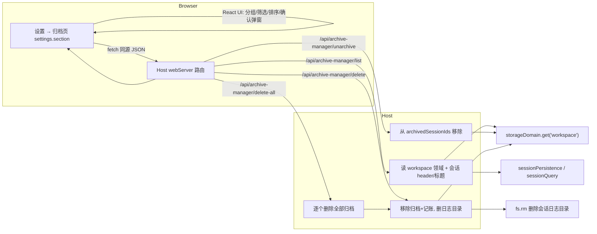

[English](README_en.md) · [简体中文](README.md)

# dsh-archive-manager

DeepSeek Harness（DSH）Web 界面的归档会话管理插件。它在 DSH 的**设置窗口新增一个「归档」页面**，让你查看、筛选、排序、取消归档以及彻底删除已归档的 DSH 会话。

## 界面预览

### 归档会话页


设置 → 「归档」页：按工作区分组展示已归档会话；顶部提供筛选、排序与「删除全部」，每个会话可「取消归档」或「删除」（二次确认）。

## 功能特性

- **查看已归档会话**：设置窗口新增「归档」页，列出所有已归档的 DSH 会话，并按工作区（workspace）分组；不属于任何工作区的会话归入「(未分组)」。
- **筛选**：按「全部工作区」或某个具体工作区过滤归档会话。
- **排序**：按会话**名称**（字母序升 / 降）、按会话**创建时间**（升 / 降）两种维度排序。
- **取消归档**：点击某一归档会话的「取消归档」，会话会从归档集合中移除，并**重新出现在左侧边栏对应工作区分组**中，可点击打开聊天窗口。
- **删除（二次确认）**：可对单个会话「删除」，或一次「删除全部」已归档会话；所有删除操作都会弹出**二次确认弹窗**，仅点击「确认删除」才真正执行，避免误删。
- **彻底删除**：删除会移除该会话的日志文件（`session.jsonl.zstd`）、归档标记及工作区记账，不可恢复。

## 目录

- [界面预览](#界面预览)
- [功能特性](#功能特性)
- [工作原理](#工作原理)
- [安装](#安装)
- [使用方法](#使用方法)
- [技术说明与限制](#技术说明与限制)
- [配置说明](#配置说明)
- [如何获取帮助](#如何获取帮助)
- [如何贡献](#如何贡献)
- [许可证](#许可证)

## 工作原理

### 归档在 DSH 中的底层存储

DSH 的会话归档状态持久化在 `~/.dsh/storages/workspace.json`（workspace 领域）：

```jsonc
{
  "global": {
    "initialized": true,
    "workspaceIds": ["..."],
    "archivedSessionIds": ["session-xxx", "..."],
  },
  "tables": {
    "workspaces": {
      "<workspaceId>": {
        "path": "/abs/path",
        "title": "工作区名",
        "sessionIds": ["..."],
        "createdAt": "...",
        "updatedAt": "..."
      }
    }
  }
}
```

`archivedSessionIds` 是全局归档集合。归档只把会话从各分区视图隐藏，**不删除**日志、不改变工作区记账，因此取消归档后可恢复到原工作区位置。

### 数据流



主机端写入 `workspace` 领域 global 后，DSH 启动时会校验领域状态（fail-loud）。写入严格保持 `workspace.json` 的 schema 结构不变（数组整体替换后写回），不会破坏 DSH 启动。

## 安装

### 前提

- 已安装 `dsh`，且本机 `pnpm` 的版本与 profile 的 store 主版本匹配（见 `.dsh/AGENTS.md`「pnpm 版本匹配」，可通过 `ls ~/Library/pnpm/` 与 `pnpm --version` 对比确认）。
- 安装目标是常态运行的 profile（如 `web`）。

### 安装步骤

```bash
# 从 GitHub 安装：
dsh plugin --profile web add github:Ycet/dsh-archive-manager

# 在插件源码根目录（含 package.json）执行（file: 快照安装）
dsh plugin --profile web add dsh-archive-manager@file:<本插件绝对路径>
```

例如：

```bash
dsh plugin --profile web add \
  dsh-archive-manager@file:<absolute-path-to-dsh-archive-manager>
```

安装为 `file:` 快照（拷贝），修改源码后需**重新执行安装命令**同步 profile 内的快照，再重启 DSH web 生效（bundle 层变更必须重启 DSH，不热加载）。

### 卸载

```bash
dsh plugin --profile web remove dsh-archive-manager
```

## 使用方法

1. 安装并重启 DSH。
2. 点击左侧边栏底部的 **设置**。
3. 在设置窗口左侧选择 **归档** 页面。
4. 页面上方工具条：
   - **筛选**下拉：默认「全部工作区」，可选某个具体工作区。
   - **排序**下拉：按名称或创建时间升/降序。
   - **删除全部**按钮：删除当前筛选下全部已归档会话（需二次确认）。
5. 会话按工作区分组展示，每组含会话标题与创建时间：
   - **取消归档**：会话恢复到左侧边栏对应工作区分组，可点击打开。
   - **删除**：二次确认后彻底删除该会话。

## 技术说明与限制

- **无官方 unarchive / 删除会话 API**：DSH 主机端 `workspaceRegistry` 只暴露 `archiveSession`，没有 `unarchiveSession`，也没「删除会话」接口。本插件直接读写 `storageDomain.get('workspace')` 领域存储（`~/.dsh/storages/workspace.json`），严格保持其 schema。
- **删除为彻底删除**：删除会话会删掉 `~/.dsh/sessions/<项目目录>/<sessionId>/` 下的日志文件，不可恢复。DSH 的 SQLite 搜索索引会在下一次 reconciliation 自动清理该会话。
- **删除先删文件、后清记录**：删除时先用官方 `sessionPersistence.locate(header)` 定位会话日志目录（不可用时回退 header.cwd / 工作区记账路径），**确认日志文件删除成功后**才移除归档标记与工作区记账；若日志删除失败（无法定位、仍存在、IO 错误），返回错误且**不改动归档状态**——会话保持隐藏，不会"复活"到侧边栏。
- **运行中即时生效**：写入 global 会触发 `domain/changed`，DSH 会向浏览器推送 `host/archived-sessions-changed`，侧边栏与归档页即时刷新。
- **内存缓存一致性（已修复）**：DSH 的 `WorkspaceRegistry` 是单一写入者，其 `archivedSessionIds` getter 直接读内存 `state`。本插件改写存储时会**同步更新 `registry.state.archivedSessionIds`**，并用官方 `WorkspaceEntity.detachSession` 移除工作区记账（同时更新 entity.record 缓存）；因此取消归档后再归档、硬刷新重建基线都不会出现会话消失/不显示的问题。
- **仅支持归档会话**：删除/取消归档前会校验该会话确实存在于 `archivedSessionIds`，对未归档会话不会操作。
- **live 会话处理（已修复）**：agent 结束后的会话仍会作为 live Session 留在 DSH 内存（`ctx.sessions`），仅删文件不会让前端移除它（`session.list` 的 live 部分仍返回，侧边栏显示"复活"）。删除时若会话是 live：**仅当 agent 真正运行中（`agent.status === "running"`）才拒绝删除**；空闲 live（agent idle 或没有 agent）→ 先调用 `sessions.detachEntered` 将其从内存移除（触发 `session/disposed` → DSH 推送 `host/session-removed` → 前端侧边栏立即移除，agent-loop 也会自动清理关联的 idle agent），**再**删文件与清记录（避免 DSH 后续 flush 把日志写回磁盘）。

## 配置说明

本插件无需任何环境变量或配置文件，开箱即用。它不新增 DSH 公共 RPC、不挂载新 Service，仅注册 4 条包内同源 HTTP 路由：

| 方法 | 路径 | 用途 |
| --- | --- | --- |
| `GET` | `/api/archive-manager/list` | 返回归档会话 + 工作区清单 |
| `POST` | `/api/archive-manager/unarchive` | 取消归档单个会话 |
| `POST` | `/api/archive-manager/delete` | 彻底删除单个归档会话 |
| `POST` | `/api/archive-manager/delete-all` | 彻底删除全部归档会话 |

## 如何获取帮助

- 提交 [GitHub Issue](https://github.com/Ycet/dsh-archive-manager/issues)（说明 DSH 版本与本插件版本、复现步骤与日志）。
- 查看 DSH 官方文档（见 DeepSeek Harness 仓库 README）。

## 如何贡献

1. Fork 本仓库。
2. 创建功能分支，修改 `index.js`（主机端）与 `client.js`（浏览器端）。
3. 提交 PR 并描述改动与测试结果。

## 许可证

[MIT](./LICENSE)
