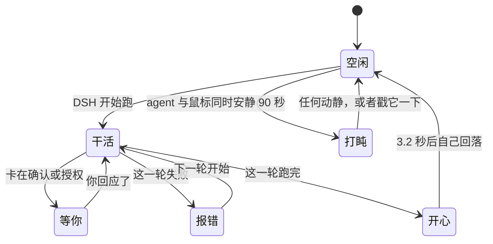

# DSH Desk Pet

<p align="center"><a href="README_EN.md">English</a> · <b>简体中文</b></p>

<p align="center">
  <b>一只能看出 agent 在干什么的桌宠。<br>
  它可以是你自己的猫。</b>
</p>

<p align="center">
  
</p>
<p align="center">
  <sub>进去一张照片，出来六个状态——空闲、干活、等你、报错、开心、睡着。<br>
  用你自己的画图工具、你自己的额度生成，我们不往任何地方传东西。</sub>
</p>

<p align="center">
  <a href="https://www.npmjs.com/package/deepseek-desk-pet"></a>
  <a href="LICENSE"></a>
  
  
  <a href="https://github.com/topics/dsh-plugin"></a>
</p>

<p align="center">
  
</p>
<p align="center">
  <sub>一个真的 macOS 窗口，不是塞进 DSH 页面里的挂件。它盖在你正在用的一切之上，<br>
  全屏 Space 也盖得住，并且不用你告诉它，自己跟着 agent 换表情。</sub>
</p>

---

## 安装

已有 DSH，一条命令：

```bash
dsh plugin --profile web add deepseek-desk-pet
dsh web
```

**从旧版本升级要带 `@latest`：**

```bash
dsh plugin --profile web add deepseek-desk-pet@latest
```

不带的话写进去的是 `^0.x` 范围，而 caret 作用在 `0.x` 上会锁住次版本号，所以 `^0.1.0` 永远不接受 `0.2.0`，裸命令会报「Already up to date」然后把旧版本留在原地。

宠物会浮在桌面上，盖在你正在用的任何窗口之上。DSH 页面本身不会被塞任何东西。

不要 DSH、只开宠物：克隆后执行 `./bin/dsh-desk-pet`。

想跟 main 分支而不是已发布版本：

```bash
dsh plugin --profile web add github:anneheartrecord/dsh-desk-pet#main
```

> npm 包名是 **deepseek-desk-pet**，仓库名是 **dsh-desk-pet**：npm 认为
> `dsh-desk-pet` 和一个无关的 `dsh-deskpet` 太像，拒绝发布。


**零依赖。** 跑在系统自带的 `/usr/bin/python3` 上，靠 `ctypes` 直接调 AppKit。不装任何东西，也不用编译，连 `ffmpeg` 都不需要，解码、抠图、缩放全部是标准库。

## 使用

| | |
|---|---|
| **拖** | 按住身体任意处。放在哪，下次就从哪开始。 |
| **点一下** | 打开会话清单，列出有哪些 DSH 会话、哪个活着、在干什么。再点一下收起。 |
| **免打扰** | 让宠物安静下来，直到你自己关掉。agent 照常干活，宠物不再反应。摸它还是会弹一下。 |
| **右键** | 打开菜单：免打扰、会话清单、皮肤、宠物出现在哪、检查更新、退出。 |
| **停止** | `./bin/dsh-desk-pet --stop`，或者停掉 `dsh web`。 |

它以后台进程启动、脱离终端，所以启动它的那个窗口可以直接关掉。

## 状态

<p align="center">
  
</p>

跟着本地 DSH 自动变，不用管。



| 状态 | 什么时候 |
| --- | --- |
| **空闲** | 没事干，会呼吸、偶尔眨眼 |
| **干活** | DSH 正在跑 |
| **等你** | 卡在确认、授权、要你输入 |
| **报错** | 跑挂了 |
| **开心** | 刚跑完一轮，几秒后自己回到空闲 |
| **睡着** | agent 闲着**且**你的鼠标也不动了才打盹；一有动静或者你戳它就醒 |

最后一条特意用了两个时钟：agent 没事干，和桌前没人，不是一回事。

## 皮肤

<p align="center">
  
</p>

在菜单的皮肤子菜单里挑，或者用 `--skin <id>` 指定启动皮肤。每套皮肤六个状态齐全，每个状态三帧。

| 皮肤 | 动起来 |
|---|---|
| **深索鲸（默认）** |  |
| **蓝鲸** |  |
| **线核** |  |
| **鹦鹉螺** |  |
| **水母** |  |

> 动图按 `manifest.json` 里的真实时间轴播放：空闲是 2.4 秒的静止，然后一次几十毫秒的眨眼。
> 三帧均分的话，宠物看起来是在抽搐，而不是在呼吸。

### 每套皮肤的六个状态

顺序：空闲 · 干活 · 等你 · 报错 · 开心 · 睡着

<p align="center">
  
</p>
<p align="center"><sub>深索鲸（默认）</sub></p>

<p align="center">
  
</p>
<p align="center"><sub>蓝鲸</sub></p>

<p align="center">
  
</p>
<p align="center"><sub>线核</sub></p>

<p align="center">
  
</p>
<p align="center"><sub>鹦鹉螺</sub></p>

<p align="center">
  
</p>
<p align="center"><sub>水母</sub></p>

**用一张图做你自己的皮肤。** 把一张图交给你的 agent，让它做一套桌宠皮肤。插件里带了一个 skill，负责把一张图扩写成一套皮肤需要的十八个姿势（六个状态，每个三帧）。真正生图的是你自己的工具、烧的是你自己的额度，我们不往任何地方发送东西。做好的皮肤放在 `~/.dsh-desk-pet/skins/`，在安装包之外，所以升级插件不会把它们删掉。

这个 skill 中途会停两次：第一次在基准姿势之后，让你在多花十七张之前先看看要不要；第二次在第二帧之后，确认角色重画之后还是同一个。半路失败会告诉你缺哪几个姿势，已经花钱生出来的那些会留着。

**做好之后可以拿出来给人看。** 一条命令把六个状态拼成一张图：

```bash
./bin/dsh-desk-pet --skin-sheet <你的皮肤id>
```

做好的皮肤欢迎投进 [皮肤画廊](SKINS.md)——只交那一张预览图，帧素材留在你自己机器上。

## 参数

```bash
./bin/dsh-desk-pet --scale 0.5      # 更小（默认 0.7）
./bin/dsh-desk-pet --skin jellyfish # 指定启动时的皮肤
./bin/dsh-desk-pet --reset          # 忘掉已保存的位置、大小、皮肤
./bin/dsh-desk-pet --stop           # 停掉正在跑的宠物
./bin/dsh-desk-pet --foreground     # 前台运行，日志打到当前终端
./bin/dsh-desk-pet --probe          # 自检，不开窗
./bin/dsh-desk-pet --inventory      # 每套皮肤每个状态有几帧
```

## 原理

宠物盯着 `~/.dsh` 的进程、会话活动和一个可选的提示文件，把看到的映射成六个状态。想手动驱动：

```bash
echo '{"kind":"working"}' > ~/.dsh/pet-activity.json
rm ~/.dsh/pet-activity.json          # 交还给自动检测
```

宠物把看到的写进 `~/.dsh-desk-pet/state.json`，第二次启动靠它判断是不是已经有一只在跑，`--stop` 也靠它找进程。

页面里曾经还有一只镜像，已经删了：一个屏幕上两只宠物看着像 bug，而且出问题的一直是那只镜像。真正值得留的是浮在所有窗口之上的那个窗口。

### 为什么是 AppKit 不是 Tk

macOS 自带的是 2010 年发布的 Tcl/Tk 8.5.9，在 macOS 26 上它的绘制路径已经到不了屏幕：窗口能映射，画布自报已映射、可见、尺寸正确、图元在正确坐标上。屏幕上是一个空的灰方块。

所以窗口改成用 `ctypes` 直接建在 AppKit 上。代码是多了，但换来三件 Tk 根本给不了的东西：真 alpha（不再是 GIF 的一位遮罩）、能跨全屏 Space 的窗口层级、以及作为子窗口跟着宠物一起走的会话面板。

## 开发

```bash
/usr/bin/python3 -m unittest discover -t . -s tests -v     # 148 个测试，不需要显示器
DSH_PET_ART_CHECK=1 /usr/bin/python3 -m unittest discover -t . -s tests   # 加上逐像素素材闸门
node tests/plugin_smoke.mjs                                 # 插件的 HTTP 路由
```

### 素材流水线

```bash
./scripts/generate_frames.py    # 补齐缺的姿势
./scripts/build_frames.py       # 抠底、对齐、缩放，产出两套帧
./scripts/check_frames.py       # 逐像素体检
./scripts/contact_sheet.py      # 拼一张总览图，不开窗也能看效果
```

新素材的**背景一律用品红 `#FF00FF`**，装饰不能用品红。底色必须是画面里绝不出现的颜色：第一批素材生在粉彩底上（水母是薄荷绿），和角色自身颜色太近，抠图阈值怎么调都会误伤，那批水母的眼睛就是这么被抠没的。

**generate_frames** 从不凭空重画角色：每次请求都是拿一张已有的图做 image-to-image，因为文生图跨次调用锁不住身份。状态的第一帧参考本套皮肤的 idle 姿势，第二帧参考**它自己的第一帧**，因为循环要的是同一个姿势差一瞬间，不是两个不同姿势。

**check_frames** 是唯一会看像素的测试。其余测试只能比较文件名。某套皮肤曾经带着一脸窟窿通过了全部测试。

### 自定义皮肤

皮肤就是一个装帧的目录。只要 `assets/web/<id>/<状态>/*.png` 存在，它就会自动进入换肤循环，不用改代码。

## 已知限制

- 窗口是矩形，所以落在宠物周围透明边距上的点击不会穿透到后面。逐像素点击穿透代码写好了，但还没接上。
- 这一版没有设置窗口，也没有贴边的 mini 模式。
- 生成皮肤的过程宠物这边不显示进度，十八张图期间只能看你自己 agent 的输出。

接下来做什么、以及明确不做什么：[docs/ROADMAP.md](docs/ROADMAP.md）。

## 许可

MIT。
