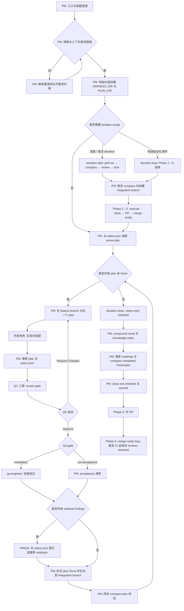

<div align="center">


# [Morning Star (启明星)](https://github.com/btspoony/mstar-harness)

Harness Workflow Engine · Agent Plugin

[English](README.md) / 中文

<a href="https://github.com/btspoony/mstar-harness">GitHub</a> · <a href="https://github.com/btspoony/mstar-harness/issues">Issues</a>

[](https://github.com/btspoony/mstar-harness/actions/workflows/ci.yml)
[](LICENSE)
[](https://github.com/btspoony/mstar-harness/releases)
[](https://github.com/btspoony/mstar-harness/commits/main)
[](https://dshfind.com/zh/plugins/btspoony/mstar-harness?ref=badge)
[](https://whyihaveyou.github.io/dsh-suite/)

</div>

**Morning Star / 启明星** 是面向 harness 工程工作流的 Agent Plugin：TypeScript **Harness Workflow Engine**（`@mstar-harness/engine`）强制执行确定性工作流门禁，`mstar-*` 判断型 skills 驱动多智能体代码交付。

- **确定性门禁，由 TS 引擎强制执行** —— path/status/lease/dispatch/sdd/iteration/lint 门禁运行在 `@mstar-harness/engine` 中，而非仅靠 prompt 建议
- **判断留在 `mstar-*` skills** —— skills 仍是角色、门禁与工作流判断的唯一事实来源（SSOT）
- **一个引擎跨宿主** —— 同一引擎 + skills 驱动 dsh（DeepSeek Harness）、omp、OpenCode、Cursor、Kimi Code、ZCode、Codex
- **Agent Plugin 打包** —— 一条命令安装；可移植到任意 Agent Plugins v1.0.0 客户端
- **推荐宿主**（最佳 → 可用）：**dsh = omp ≥ OpenCode ≥ Cursor > Kimi = ZCode > Codex**

**交付内容**

| 组件 | 说明 |
|------|------|
| Harness Workflow Engine | `@mstar-harness/engine` —— 确定性工作流门禁的 TS 强制执行层 |
| mstar CLI | `@mstar-harness/cli` —— 安装引导 + `mstar` 工作流动词 |
| `mstar-*` skills | 角色、门禁与工作流判断（唯一事实来源） |
| 宿主适配 | dsh、omp、OpenCode、Cursor、Kimi Code、ZCode、Codex |

更新说明：[CHANGELOG.md](CHANGELOG.md) / [CHANGELOG_CN.md](CHANGELOG_CN.md)。

## 安装

| 宿主 | 命令 |
|------|------|
| dsh（DeepSeek Harness） | `npx @mstar-harness/cli init --target dsh`<br>（一条 CLI 命令编排两条**独立** `dsh plugin --profile web add` 安装：<br>`@mstar-harness/dsh` + `dsh-llm-fallbacks`；`--no-fallbacks` 可跳过后者）<br>或 `dsh plugin --profile web add @mstar-harness/dsh`<br>+ `dsh plugin --profile web add dsh-llm-fallbacks` |
| omp | `npx @mstar-harness/cli init --target omp`<br>（链接 `~/.mstar/harness`）<br>或 `omp plugin install github:btspoony/mstar-harness` |
| OpenCode | `npx @mstar-harness/cli init --target opencode` |
| Cursor | `npx @mstar-harness/cli init --target cursor` |
| Kimi | Kimi TUI：`/plugins install https://github.com/btspoony/mstar-harness`<br>→ `/plugins reload` |
| ZCode | `npx @mstar-harness/cli init --target zcode`<br>然后在 ZCode → 设置 → 插件管理安装 **morning-star-harness** |
| Codex | `npx @mstar-harness/cli init --target codex`<br>然后 `codex plugin add morning-star-harness --marketplace personal` |
| Generic（Agent Plugins v1） | 任意 Agent Plugins v1.0.0 兼容客户端直接指向本仓库根<br>（`plugin.json` + `skills/` 即便携包） |

### 引擎门禁校验（可选）

```bash
npm i -g @mstar-harness/cli
```

将 `mstar-harness` 二进制（短别名 `mstar`）装上 PATH，技能文本引用的引擎校验命令（`mstar status validate`、`mstar dispatch validate`、`mstar iteration gate` 等）才真正可运行。

不全局安装时 harness 照常工作，这些校验保持 advisory。在迭代 compass 里设 `enforcement: hard` 可让派发预检 fail-fast。

> **注意**：`mstar` 是短别名，且属于**共享 bin 命名空间**——名为 `mstar` 的无关第三方 npm 包也声明了同名命令。该别名仅在安装了 `@mstar-harness/cli` 的环境中存在：未安装该包时裸 `npx mstar …` 会经 registry 解析到那个第三方工具；两者全局共存时，后安装者会静默覆盖 `mstar` shim。规范调用名保持 `mstar-harness`——冲突时请使用长名。

### 校验

`npx @mstar-harness/cli doctor --target <opencode\|cursor\|codex\|zcode\|omp\|dsh>`。

仓库根提供便携式 **Agent Plugins v1.0.0** manifest（`plugin.json`），`skills/` 为 Agent Skills 组件——可用 `npx @mstar-harness/cli plugin validate` 校验。

手动安装 / 路径布局：[`INSTALL.md`](INSTALL.md)。CLI 参数：[`docs/cli.md`](docs/cli.md)。


## 使用

三种入口：**不跑迭代**（单 plan / hotfix）、**跑迭代**（多 plan Phase 1–5）、或 **代码库审计**（发现该做什么）。

### 通用（不跑迭代）

进入 PM，然后走 per-plan 循环：`Prepare → Execute → QC → QA gate → Done`。

| 宿主 | 进入 PM |
|------|---------|
| dsh（DeepSeek Harness） | `pm` skill（经 mstar skill 提供者；无自动加载） |
| omp | 每会话 `/skill:pm`（无自动加载） |
| OpenCode | `agent.project-manager`（`agents/project-manager.md`） |
| Cursor | `/pm` |
| Kimi | 新会话自动加载 `pm`；或 `/skill:pm` |
| ZCode | 每会话 `/morning-star-harness:pm`（无自动加载） |
| Codex | `/pm` |

### 迭代

| 命令 | 何时 |
|------|------|
| `/iteration-start [direction] [pause]` | 开始新迭代：Phase 1（交互式 grill-me），然后自动推进 Phase 2→5。<br>`direction` — 可选提示（仍走交互）。<br>`pause` — 止于 Phase 1；之后用 `/iteration-drive` 恢复。 |
| `/iteration-drive` | 在已锁定的迭代上恢复 / 继续推进 Phase 2→5。 |
| `/iteration-loop [direction] [scale]` | Phase 1→5 全自动（无 grill-me）。<br>`direction` — 可选自由文本。<br>`scale` — `S` / `M` / `L` / `XL`（默认 `M`）。 |

### 代码库审计

| 命令 | 何时 |
|------|------|
| `/codebase-audit [关键词]` | 只读扫描 → 向 `{PLAN_DIR}/audit-<date>/` 写入优先级排序、自包含的改进计划。<br>不改源码。产出可喂给 `/iteration-start` Research 或常规 Prepare → Execute。<br>深度：`quick` / `deep`（默认 `standard`）。<br>范围：按类别聚焦（`security`、`perf`、`tests`、…）；`branch`（仅当前分支变更）；`next` / `roadmap`（仅方向候选）；`simplify`（聚焦技术债的深扫）。<br>SSOT → `mstar-audit`。 |

### 命令加载

| 宿主 | 命令加载 |
|------|----------|
| dsh（DeepSeek Harness） | `/iteration-start` · `/iteration-drive` · `/iteration-loop` · `/codebase-audit`（打包的 `harness-commands/`，经 `ctx.commands`） |
| omp | `/iteration-start` · `/iteration-drive` · `/iteration-loop` · `/codebase-audit`（插件 `commands/` 文件名命令） |
| OpenCode / Cursor | 从 `commands/` 打包（OpenCode：插件 `harness-commands/`） |
| Kimi / ZCode | 插件 manifest：`/morning-star-harness:iteration-start` · `:codebase-audit` 等 |
| Codex project | `.agents/skills/<name>/SKILL.md`（CLI 从 `commands/` 软链） |
| Codex global | **不**装 project 命令 — 用 `--scope project` |

Phase 2 默认：每 plan worktree + lease，`Findings cleanup: zero-residual`。仅显式 `Worktree mode: waived` / `Findings cleanup: allow-residual` 可覆写。SSOT → `mstar-iteration`、`mstar-branch-worktree`、`mstar-plan-artifacts`。

项目知识脚手架：`mstar-compound-refresh` → `references/project-knowledge-bootstrap.md`。

## Harness Workflow（统一流程）



不跑迭代：同一套 per-plan gate，无 `iteration-start` / `iteration-close` 外层。

## 角色与技能

| Agent ID | 职责 |
|----------|------|
| `project-manager` | 路由、分派、阶段推进 |
| `product-manager` | 需求、产品规划、研究 |
| `architect` | 架构与技术契约 |
| `fullstack-dev` / `fullstack-dev-2` | 后端主导实现 / 第二并行轨 |
| `frontend-dev` | UI、交互、前端性能 |
| `qa-engineer` | `QA gate: mandatory` 时验收 |
| `code-reviewer` | SDD per-task 快速验证；codebase audit（`audit` 类） |
| `qc-specialist` / `-2` / `-3` | QC 三审 |
| `ops-engineer` | 部署、监控、基础设施 |
| `writing-specialist` | 文档、小说、文案、脚本 |
| `prompt-engineer` | prompt / skill / rule |

先读 **`mstar-harness-core`**，再按需加载专题 skill（见 `mstar-roles`）。

| Skill | 作用 |
|-------|------|
| `mstar-harness-core` | 入口、状态机、Task category、skill 索引 |
| `mstar-phase-gates` | Prepare/Execute、clarify、hotfix |
| `mstar-iteration` | Phase 1–5 迭代生命周期 |
| `mstar-dispatch-gates` | 派发、Delegation、反递归 |
| `mstar-sdd` | 子代理驱动开发 |
| `mstar-branch-worktree` | 分支、worktree、QC/QA 检出 |
| `mstar-plan-conventions` | `{HARNESS_DIR}` 发现 / 初始化 |
| `mstar-plan-artifacts` | plan、`status.json`、residual、Findings cleanup |
| `mstar-design-md` | UI plan 的 DESIGN.md 门禁 |
| `mstar-review-qc` | PM QC tri 编排 |
| `mstar-coding-behavior` | RCA、测试优先、审查反馈、证据 |
| `mstar-compound` / `mstar-compound-refresh` | 知识结晶 / 维护 |
| `mstar-strategy` | `STRATEGY.md` 对齐 |
| `mstar-skill-authoring` | 通用 skill 撰写契约（SkillsBench 门控） |
| `mstar-audit` | 只读代码库审计 → 优先级改进计划 |
| `mstar-roles` | 角色提示词 + 加载清单 |
| `mstar-host` | 宿主适配（dsh / omp / OpenCode / Cursor / Kimi / ZCode / Codex） |
| `pm` | `/pm` / `/skill:pm` / 宿主 PM 入口 |

消费方 plan 默认 **`.mstar/`**。进程产物（`plans/`、`iterations/`、`status.json`、`sdd/` 等）gitignored；跟踪结果：`{HARNESS_DIR}/AGENTS.md`、`knowledge/`、`specs/`。Specs 解析：`.mstar/specs/` → `docs/specs/` → 仓库根 `specs/`。细则 → `mstar-plan-conventions`。

维护者：[`AGENTS.md`](AGENTS.md)。

## 许可

MIT，见 [LICENSE](./LICENSE)。
