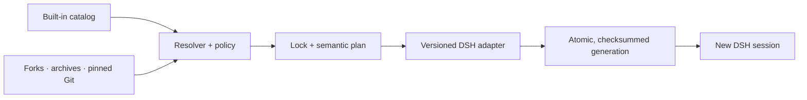

# oh-my-dsh

<p align="center"><strong>Curated agent presets for DeepSeek Harness.</strong><br />Discover, switch, fork, and share focused agents without hand-editing DSH configuration.</p>

<p align="center">
  <a href="https://github.com/byhongyu/oh-my-dsh/actions/workflows/ci.yml"></a>
  <a href="https://github.com/byhongyu/oh-my-dsh/releases/latest"></a>
  <a href="LICENSE"></a>
  
  
</p>

<p align="center">
  <a href="docs/assets/oh-my-dsh-demo.mp4">
    
  </a>
</p>

<p align="center"><sub>Discover → switch → fork. Click the demo for the full-quality MP4.</sub></p>

`oh-my-dsh` is an independent Agent Setup layer for [DeepSeek Harness (`dsh`)](https://github.com/deepseek-ai/deepseek-harness). Install three opinionated agents once, switch new sessions in seconds, and keep every change inspectable and reversible.

## Quick start

Requires Node.js 24 or newer. The current adapter targets DSH `0.1.0-rc.5` and `0.1.0-rc.6`.

Try the public release without installing it:

```bash
npx --yes --package \
  https://github.com/byhongyu/oh-my-dsh/releases/download/v0.1.0/oh-my-dsh-0.1.0.tgz \
  oh-my-dsh list
```

Install and initialize the curated setups:

```bash
npm install --global \
  https://github.com/byhongyu/oh-my-dsh/releases/download/v0.1.0/oh-my-dsh-0.1.0.tgz

oh-my-dsh init
oh-my-dsh use research --default
oh-my-dsh doctor
```

`init` publishes Coding, Research, and Investing atomically. Changing the default affects new sessions only; existing sessions keep their original setup.

## Why oh-my-dsh?

DeepSeek Harness provides the plugin runtime. `oh-my-dsh` adds a versioned, security-conscious preset layer for repeatable agent behavior.

| Goal      | Command                                               | What you get                                                                 |
| --------- | ----------------------------------------------------- | ---------------------------------------------------------------------------- |
| Discover  | `oh-my-dsh list`                                      | A small, maintained catalog instead of an unbounded marketplace              |
| Inspect   | `oh-my-dsh plan coding`                               | Files, permissions, workflows, warnings, and normalized hash before mutation |
| Switch    | `oh-my-dsh use research --default`                    | A new default without rewriting existing sessions                            |
| Customize | `oh-my-dsh agent fork investing --as my-investing`    | A minimal local override that preserves its parent identity                  |
| Share     | `agent export`, `agent import`, or pinned Git sources | Portable setups with validation, locks, and provenance                       |
| Recover   | `oh-my-dsh rollback` and `oh-my-dsh doctor`           | Atomic generations, integrity checks, and a bootable previous state          |

## Built-in agent setups

| Setup         | Designed for                                                   | Policy posture                                                          |
| ------------- | -------------------------------------------------------------- | ----------------------------------------------------------------------- |
| **Coding**    | Inspecting, changing, testing, and reviewing a repository      | Workspace writes, shell access, network by approval                     |
| **Research**  | Source-grounded research with evidence quality and uncertainty | No secrets or data export; unavailable host tools are reported honestly |
| **Investing** | Company, filing, valuation-scenario, and thesis-risk analysis  | Brokerage, trading, secrets, and data export denied                     |

The catalog stays deliberately small. Each setup selects a distinct workflow and capability subset rather than presenting the same general-purpose agent under a different prompt.

## Make a setup yours

Fork a built-in, edit its generated `agent.yaml`, validate and lock it, then export a portable archive:

```bash
oh-my-dsh agent fork investing --as my-investing
oh-my-dsh agent save my-investing
oh-my-dsh agent export my-investing
```

Import a reviewed archive or pin a setup to an exact Git commit:

```bash
oh-my-dsh agent import my-investing-0.1.0.omdsh-agent --yes
oh-my-dsh agent add github:owner/repo/path --rev <full-commit-sha>
oh-my-dsh apply
```

## Safety and portability

- Plans, imports, and Git-source inspection parse data without loading third-party plugin modules.
- Archives reject traversal, links, nested archives, executables, credentials, absolute machine paths, and integrity mismatches.
- Git sources require an exact commit, isolated Git configuration, bounded archives, portable paths, and content locks.
- Setup resolution rejects permission/tool contradictions and never permits setup-level data export.
- DSH publication uses locked, checksummed generations with rollback and interrupted-operation recovery.
- `oh-my-dsh` emits no telemetry and does not handle provider credentials.

Agent presets ultimately have the authority of the DSH plugins they load. A DSH `user` trust marker is descriptive, not a sandbox, and setup selection does not create operating-system isolation. See the [architecture](docs/architecture.md) and [threat model](docs/threat-model.md).

## How it works



No network resolution, package installation, or host restart occurs when starting a session.

## CLI reference

```text
oh-my-dsh init
oh-my-dsh list [--json]
oh-my-dsh use research --default
oh-my-dsh plan [setup] [--json]
oh-my-dsh apply
oh-my-dsh update [--apply]
oh-my-dsh rollback
oh-my-dsh doctor [--json]

oh-my-dsh agent fork investing --as my-investing
oh-my-dsh agent save my-investing
oh-my-dsh agent export my-investing [--output file.omdsh-agent]
oh-my-dsh agent import file.omdsh-agent --yes
oh-my-dsh agent add github:owner/repo/path --rev <full-commit-sha>
```

Use `--dsh-home <path>` for an isolated home during testing. Production otherwise uses `$DSH_HOME`, then `~/.dsh`.

## Status and roadmap

This repository is a developer preview. DSH is iterating rapidly and may make compatibility-breaking changes. The adapter emits only capabilities verified in stock rc.5/rc.6; unavailable document, spreadsheet, citation-capture, and market-data capabilities remain explicit warnings rather than silent claims.

See the [roadmap](ROADMAP.md) for the planned second adapter, fork reconciliation, curated community channel, provenance work, and stable v1 schemas.

## Development

Requirements: Node.js 24 or newer and pnpm 11.

```bash
pnpm install --frozen-lockfile
pnpm format:check
pnpm lint
pnpm typecheck
pnpm test:coverage
pnpm build
```

Run the workspace CLI:

```bash
node packages/cli/dist/bin.cjs list
node packages/cli/dist/bin.cjs plan coding
```

## Community

- Ask questions, share setups, and propose ideas in [Discussions](https://github.com/byhongyu/oh-my-dsh/discussions).
- Report reproducible bugs or request focused features through [Issues](https://github.com/byhongyu/oh-my-dsh/issues).
- Read [CONTRIBUTING.md](CONTRIBUTING.md) before opening a pull request.
- Report suspected vulnerabilities through [private vulnerability reporting](https://github.com/byhongyu/oh-my-dsh/security/advisories/new), not a public issue.

If `oh-my-dsh` makes your DSH workflow easier, starring the repository helps other DSH users discover it.

## Independence and naming

This project is independent and is not affiliated with or endorsed by DeepSeek AI, oh-my-zsh, or Oh-DSH-Desktop contributors. It uses no upstream logos or trade dress. The project name or positioning may be revised if future clearance requires it.

## License

MIT. Interoperation does not redistribute DSH or oh-dsh source. See [LICENSE](LICENSE).
