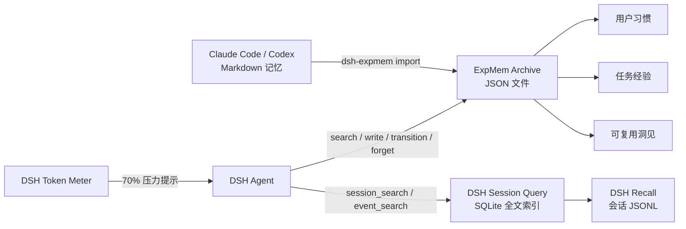

# DSH ExpMem

[English](README.md) | 简体中文

**面向 DeepSeek Harness 的经验记忆。**

DSH ExpMem 是社区插件，并非 DeepSeek 官方项目。它为 DSH Agent 提供文件型 Archive，用于沉淀用户习惯、任务经验和可复用洞见，同时复用 DSH 已有的会话历史作为 Recall。

## 架构



- **Recall** 是过往会话的原始记录。DSH 已通过 JSONL 持久化，并由 `dsh-session-query` 提供检索。
- **Archive** 是 Agent 主动提炼的知识。每个 JSON 记录都包含可信状态、作者和证据。
- **压力晋升** 会在 DSH 压缩上下文前，要求当前 Agent 保存高价值经验。
- ExpMem 不复制会话事件，也不修改 Agent Loop。

## 安装

```sh
dsh plugin --profile web add @creative-dswork/dsh-expmem
```

该 bundle 会：

1. 在首次搜索时启用 DSH 已有的 session-query SQLite 后端；
2. 加载 DSH 的 `session_search`、`session_event_search`、追踪和读取工具；
3. 加载 `expmem_search`、`expmem_write`、`expmem_transition` 和 `expmem_forget`；
4. 每个 DSH 压缩周期启用一次 ExpMem 晋升提示。

按正常方式启动 DSH：

```sh
dsh web
```

## 导入 Claude Code 与 Codex 记忆

先预览，再一次导入两种 Agent 生成的 Markdown 记忆：

```sh
pnpm dlx @creative-dswork/dsh-expmem import all --dry-run
pnpm dlx @creative-dswork/dsh-expmem import all
```

Claude Code 默认扫描 `~/.claude/projects/**/memory/*.md`；Codex 默认扫描
`$CODEX_HOME/memories/**/*.md`，未设置 `CODEX_HOME` 时使用
`~/.codex/memories/**/*.md`。自定义目录可显式指定：

```sh
pnpm dlx @creative-dswork/dsh-expmem import claude --claude-dir /path/to/memory
pnpm dlx @creative-dswork/dsh-expmem import codex --codex-dir /path/to/memories
```

每个源文件会成为一条 candidate `experience` 记录。它的 imported-file evidence 保存
来源 Agent、源文件绝对路径、SHA-256 和观测时间。重复执行时，未变化的文件会跳过；
candidate 内容变化时原位更新；verified、disputed 或 superseded 内容变化时创建新的
candidate，并保留原记录。

ExpMem 不修改或删除源文件。可通过 `--workspace /path/to/project` 显式设置项目范围；
使用 Claude 默认目录结构时，ExpMem 会在映射唯一的情况下自动恢复源 workspace。

## 存储

默认文件布局：

```text
$DSH_HOME/
├── sessions/                         # DSH 持有的 Recall JSONL
└── expmem/
    ├── recall-index.sqlite           # DSH 派生的全文索引
    └── archive/
        ├── habit/<uuid>.json
        ├── experience/<uuid>.json
        ├── insight/<uuid>.json
        └── tombstones/<uuid>.json
```

Schema v1 记录包含 claim、`candidate|verified|disputed|superseded` 状态、作者、证据、
时间戳、可选 workspace 和记录关系。ExpMem 会在内存中把 0.2.x 记录读取为 v1
candidate，并在下次更新时写成 v1。损坏文件或未知未来版本会产生扫描告警，不会让
同目录的有效记录消失。

每次写入都会在目标目录创建临时文件，再进行原子重命名。搜索只读取最终 `.json`
文件，因此中断留下的临时文件不会被当成不完整记录。

## 可信生命周期

新记录和导入记忆默认是 `candidate`。只有 verification 引用了以下合格证据时，
`expmem_transition` 才允许将 candidate 升级为 `verified`：

- 用户确认，并绑定完整的 DSH Session 事件范围；
- 工具复现结果，并绑定完整事件范围；
- 通过 external URI evidence 回查独立来源。

candidate 或 verified 可以转为 `disputed`。新的 verified 记录可以声明单向
`supersedes`，ExpMem 在读取时反向计算 `supersededBy`。disputed 记录可以声明记录级
`conflictsWith`。旧 claim 会继续保留，不会被新结论覆盖。

外部 review-report 只是不透明 evidence。ExpMem 保存报告 Schema、ID、位置、报告
SHA-256，以及被评审 claim 的 SHA-256。ExpMem 不打开报告位置、不解析 verdict、
不运行评审模型，也不会仅凭 review-report 授予 `verified`。

## 工具

| 工具 | 用途 |
|---|---|
| `session_search` | 在当前 workspace 中查找相关历史会话。 |
| `session_event_search` | 在指定历史会话内搜索事件。 |
| `expmem_search` | 跨项目或按精确 workspace 搜索提炼后的经验。 |
| `expmem_write` | 创建或更新 candidate 记录。 |
| `expmem_transition` | 用证据验证或质疑记录，并添加冲突或替代关系。 |
| `expmem_forget` | 删除 candidate，并留下最小 tombstone。 |

默认搜索 candidate、verified 和 disputed；检查历史时需要显式请求 superseded。
ExpMem 要求 Agent 把 candidate 和 disputed 视为未验证信息，不保存密钥、临时进度或
原始日志。

## 确认删除

Agent 工具只允许删除 candidate。verified、disputed 或 superseded 必须通过 CLI 删除：

```sh
pnpm dlx @creative-dswork/dsh-expmem forget insight <uuid> \
  --reason-code incorrect
```

命令会显示记录的 ID、分类、状态和标题，再等待显式确认。已经完成外部确认的非交互
操作可使用 `--yes`，机器读取结果可增加 `--json`。tombstone 只包含 Schema 版本、
ID、分类、删除时间和枚举 reason code。

## 压力晋升

每个模型 step 开始前，ExpMem 复用 DSH Token Meter 测量当前上下文。默认达到 70% 时，
它会注入一条 synthetic user notice，要求 Agent 先搜索已有 ExpMem 记录，最多保存三条
高价值 candidate，然后继续原任务。

该提示会进入 DSH Session 日志，因此每个成功压缩周期只触发一次。如果 DSH 在提示送达前
已经完成压缩，ExpMem 会改为提供被压缩事件的范围，要求 Agent 从 Recall 读取原始消息后
补做晋升。整个过程不需要后台 Worker 或独立的 LLM 总结器。

## 配置

在 profile 的 `cordis.patch.yml` 中覆盖 `expmem`：

```yaml
- id: expmem
  config:
    rootDir: /absolute/path/to/expmem
    maxEntryChars: 20000
    maxPreviewChars: 1000
    maxSearchResults: 20
    promotionEnabled: true
    warningRatio: 0.7
    maxPromotionsPerCycle: 3
    recoveryAfterCompaction: true
```

`rootDir` 必须是绝对路径。搜索采用不区分大小写的字面 AND 匹配，空白分隔的关键词必须全部出现；空查询会列出最新记录。
压力晋升只会在当前 DSH 组合同时提供 Token Meter 和模型上下文窗口元数据时启用。

如需修改 Recall 索引位置，可覆盖 bundle 中已有的配置行：

```yaml
- id: session-query-sqlite
  config:
    path: /absolute/path/to/recall-index.sqlite
    openAt: first-search
```

## 开发

```sh
pnpm install
pnpm run check
pnpm run pack:dry-run
```

将当前 checkout 安装到 profile：

```sh
dsh plugin --profile web add .
dsh --profile web --dump-config
```

## 当前范围

- Archive 搜索采用透明的线性扫描；只有实际数据规模证明需要时才增加索引。
- 晋升采用 Agent 协作模式：由当前 Agent 判断哪些记录符合条件，也可以不写入任何记录。
- 暂不包含向量检索、后台 LLM 总结器、语义去重模型或保留周期调度。
- ExpMem 保存外部 review-report 链接，但不运行或解析审计管线。
- Recall 的删除与保留策略继续由 DSH 会话持久化负责。

## 许可证

[MIT](LICENSE)
