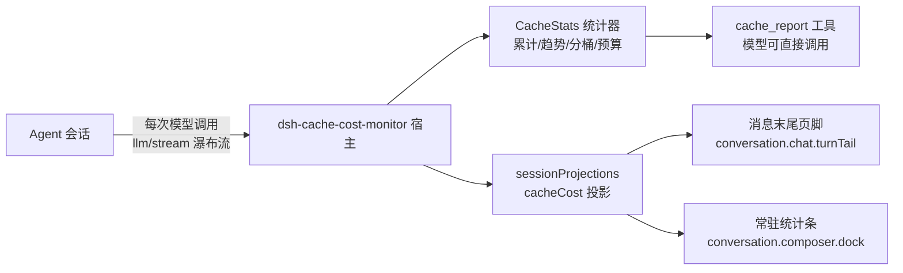

# 🧮 dsh-cache-cost-monitor

> 让 DeepSeek 的每一分钱都花在刀刃上 —— **前缀缓存命中率、费用与健康度，一眼看穿。**

DSH（DeepSeek Harness）v0.1.x 的 Cordis 插件：自动监听每一轮 Agent 的模型 API 调用，提取 `prompt_cache_hit_tokens` / `prompt_cache_miss_tokens` / `completion_tokens`，实时统计缓存命中率与按官方定价（**含峰谷时段**）预估的 API 费用，并给出**缓存健康度评级**与**趋势火花线**。

[](LICENSE)


---

## ✨ 它为什么值得收藏

| | 特性 | 说明 |
| --- | --- | --- |
| 📊 | **`cache_report` 工具** | 一行摘要（命中率/费用/健康度）+ 趋势**火花线** + 成本明细 + 3 条针对性优化建议 |
| 🏆 | **缓存健康度评级** | 累计命中率一键换算 S/A/B/C/D + 🟢🟡🟠🔴，像游戏评分一样直观 |
| 🖥️ | **常驻统计条** | 输入框下方实时显示 `⌀ 1.2M tokens · ¥2.01 · 命中 68% ▂▅▇█`，低头即见 |
| 📝 | **消息末尾页脚** | 每条助手回复末尾低调显示 `本轮 12.3K tokens · ¥0.0123`，hover 看明细 |
| ⏱️ | **峰谷计价** | 官方 PEAK/OFF-PEAK 时段自动判定（UTC 00:30–16:30），费用按实际时段计算 |
| 💰 | **费用预算** | 设置 `budgetUsd`，超支自动告警 + 报表标注 ⚠️，心里有底 |
| 🚨 | **阈值告警** | 单轮/累计命中率低于阈值即输出 warn 日志，状态翻转防刷屏 |
| 🛡️ | **优雅降级** | 字段缺失、无定价、服务不可用……任何异常都只记日志，绝不拖垮主程序 |

---

## 🏗️ 架构一览



宿主侧（Node）负责监听与统计；浏览器侧（React）只读投影快照渲染 UI。两者通过 DSH 官方能力缝连接，**无任何私有 API**。

---

## 🎬 效果预览

**输入框下方的常驻统计条**（实时，随每轮更新）：

```
⌀ 1.2M tokens · ¥2.01 · 命中 68% ▂▅▇█
```

**每条助手消息末尾的页脚**（低调，hover 可看命中/未命中/输出明细）：

```
本轮 12.3K tokens · ¥0.0123
```

**启动日志 banner**（一眼确认插件状态）：

```
╔══════════════════════════════════════════════════════════╗
║   dsh-cache-cost-monitor  v0.3.0                         ║
║   缓存命中率 · 费用预估 · 峰谷计价 · 健康度评级          ║
╚══════════════════════════════════════════════════════════╝
```

**`cache_report` 报表开头**（模型一句话即可召唤）：

```
# 缓存命中率与成本报告（cache_report）

> 📊 **摘要**：命中率 68.4% · 费用 $0.0312（¥0.2122）· 12 轮 · 健康度 B 🟡

## 累计统计
- 模型调用次数：12
- 累计缓存命中率：68.4%
...

## 命中率趋势（最近 5 轮，右为最新）
> 火花线：▂▅▇█▅
| 轮次 | 模型 | ... | 单轮命中率 | 单轮费用 |
| --- | --- | --- | --- | --- |
...
```

---

## 📦 安装

### 前置

- Node.js >= 18
- pnpm（`corepack enable` 或 `npm i -g pnpm`）
- DSH v0.1.x

### 方式一：一键脚本（本地开发）

```powershell
cd dsh-cache-cost-monitor
npm install && npm run build && npm test
powershell -ExecutionPolicy Bypass -File scripts\install-profile.ps1
```

### 方式二：从 GitHub 安装（仓库即发布源）

```powershell
# 固定版本（推荐）
dsh plugin --profile web add https://github.com/eurt-nano/dsh-cache-cost-monitor.git#v0.3.0 --config.node-linker=isolated

# 或最新 main
dsh plugin --profile web add https://github.com/eurt-nano/dsh-cache-cost-monitor.git#main --config.node-linker=isolated
```

### 方式三：Release 附件

从 [Releases](https://github.com/eurt-nano/dsh-cache-cost-monitor/releases) 下载 `dsh-cache-cost-monitor-0.3.0.tgz`，本地解压后按方式一安装。

> **Windows 说明**：pnpm workspace 对盘符绝对路径创建链接存在 bug，安装/移除命令请保留
> `--config.node-linker=isolated`；git 安装时若 pnpm 拦截构建脚本，把
> `dsh-cache-cost-monitor` 加入 profile 的 `pnpm-workspace.yaml` 的 `allowBuilds` 列表。

安装后 **重启 DSH**（`dsh web`），页脚与统计条需刷新浏览器页面。

---

## 🎮 使用

1. **召唤报表**：对 Agent 说「调用 cache_report」，或让它「看看缓存命中率和花了多少钱」。
   可选参数：`{ "detail": true, "limit": 10 }` 输出逐轮明细（含计价档位、实际单价、时间戳）。
2. **看常驻统计条**：输入框下方实时累计消耗，无需任何操作。
3. **看页脚**：每条助手回复末尾的灰字小标。
4. **看日志**：`[cache-monitor]` 前缀的 warn/info 输出告警与启动信息。

---

## ⚙️ 配置参考（`cordis.patch.yml`）

| 字段 | 默认 | 说明 |
| --- | --- | --- |
| `threshold` | `0.3` | 单轮缓存命中率告警阈值（0~1） |
| `cumulativeThreshold` | `0.3` | 累计命中率告警阈值（0~1），状态翻转时提示一次 |
| `historySize` | `20` | 趋势窗口轮数（>= 2） |
| `warnOnMissingUsage` | `true` | 响应缺 usage 字段时是否输出 debug 日志 |
| `timeBilling` | `auto` | 峰谷计价：`auto`（高峰 UTC 00:30–16:30）/ `peak` / `off-peak` |
| `currency` | `both` | 费用显示：`USD` / `CNY` / `both` |
| `usdCnyRate` | `6.8` | 美元→人民币汇率 |
| `budgetUsd` | 未设置 | 累计费用预算（USD）：超出后 warn 告警并在报表标注 ⚠️ |
| `pricing` | 官方定价 | 按模型 ID 的定价表（USD / 每百万 tokens） |

内置定价（cacheHit / cacheMiss / output）：

| 模型 | OFF-PEAK | PEAK |
| --- | --- | --- |
| deepseek-v4-flash | 0.007 / 0.22 / 0.66 | 0.014 / 0.44 / 1.32 |
| deepseek-v4-pro | 0.022 / 0.66 / 1.98 | 0.044 / 1.32 / 3.96 |
| deepseek-chat | 0.028 / 0.28 / 0.42 | — |
| deepseek-reasoner | 0.14 / 0.55 / 2.19 | — |

未配置的模型按 0 计费并在报表中标注；`deepseek-v4-*` 变体按前缀回退。

---

## 📈 健康度评级规则

| 评级 | 累计命中率 | 表情 | 含义 |
| --- | --- | --- | --- |
| S | ≥ 85% | 🟢 | 缓存利用极佳，成本控制优秀 |
| A | ≥ 70% | 🟢 | 良好 |
| B | ≥ 50% | 🟡 | 中等，有优化空间 |
| C | ≥ 30% | 🟠 | 偏低，缓存频繁失效 |
| D | < 30% | 🔴 | 几乎无命中，费用偏高 |

---

## ❓ FAQ

**Q：数据存在哪？重启后还在吗？**
`cache_report` 的进程内累计统计随 DSH 重启归零；每条消息的页脚数据来自会话投影（随会话落库，重启后历史轮次仍可显示）。

**Q：为什么我的消息末尾没有页脚？**
页脚只显示插件安装**之后**、且 API 响应携带 usage 的轮次；产出了文件的轮次会让位给官方 "Produced" 行。tokens 直接读会话快照（引擎自带每轮 usage），人民币费用经 `cacheCost` 投影（v0.3.1 起宿主注入 `sessionProjections`，保证投影注册）；升级后请重启 DSH 并刷新页面。

**Q：费用是精确的吗？**
按「配置定价 × 实际 token 数」估算，不含折扣、重试与网关加价；未配置定价的模型按 0 计。官方调价后在 `config.pricing` 覆盖即可。

**Q：页脚不显眼，我想更醒目/更隐蔽？**
样式是 CSS 变量 + 透明度控制，可在浏览器端自行调整；也欢迎提 issue 增加配置项。

---

## 🗺️ Roadmap

- [ ] 跨会话累计统计持久化（重启不丢）
- [ ] 报表导出 Markdown / CSV / JSON 文件
- [ ] 缓存失效原因诊断（compaction/动态注入检测）
- [ ] 告警通道扩展（Webhook / 桌面通知）
- [ ] 峰谷时段本地化配置（自定义时区窗口）

有想法？欢迎 [提 issue](https://github.com/eurt-nano/dsh-cache-cost-monitor/issues) 或 PR。

---

## 🤝 贡献

```powershell
npm run build    # tsc 宿主 + tsdown 客户端
npm test         # 42+ 项冒烟测试，改代码请保持全绿
```

- 宿主逻辑为纯 ESM，可脱离 DSH 用 `test/smoke.mjs` 的假 ctx 驱动验证；
- 客户端组件使用 `React.createElement`，平台模块由 shell 模块表提供。

## 📄 License

MIT © 2026 eurt-nano

---

**English README**：[README.en.md](README.en.md)
