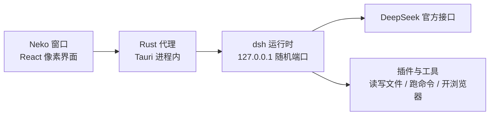

<div align="center">


# Neko

**用 Mac OS 9 的风格打开 DeepSeek Harness。**


<br /><br />


<sub>那只猫会眨眼，眼珠还跟着鼠标走</sub>

</div>

---

Neko 把 [DeepSeek Harness](https://github.com/deepseek-ai/deepseek-harness)（dsh）整个装进一个复古 Mac 桌面 app：**运行时一行没改**，profile 层叠、插件热插拔、MCP、sandbox 全都在，只是把它自带的那套网页换成了像素窗口。

Node、dsh、pnpm 全部随包分发。**下载、拖进应用程序、填一个 API key，就能用了 —— 不需要装 Node，不需要开终端。**

## ✨ 能做什么

| | 功能 | 说明 |
|:--:|---|---|
| 💬 | **完整的对话面** | 思考过程、工具调用、权限弹框、排队发送、中途打断，都在窗口里 |
| 🗂️ | **会话找得回来** | 会话列表按工作区分组，支持全文搜索、改名、复刻分叉 |
| 💰 | **按时段算账** | 按 DeepSeek 官方的高峰 / 空闲时段分别计价，今天花了多少一眼看到 |
| 🧩 | **插件面板** | 装、卸、重启，不用记 `dsh plugin add`，也不会装错 profile |
| 🖼️ | **粘图就能看** | ⌘V 直接贴图，图不进对话、走视觉端点转成文字，纯文本模型也能用 |
| 🌐 | **开浏览器** | 内置 browser-use：点按钮、填表单、读正文，登录状态留到下次 |
| ⏰ | **定时任务** | 到点自己跑一轮，不用开着 app |
| 🎛️ | **模式** | 存一套 Model + 思考强度 + 权限档，下次一键切过去 |
| 🎨 | **明暗两套皮** | 像素字体、经典窗框，深色也是复古的那种深色 |

## 💰 花了多少钱，一眼看到

DeepSeek 按时段计价：**北京时间 9:00–12:00、14:00–18:00 是高峰，其余时间是空闲，空闲五折。** 终端不会提醒你现在是哪个档，Neko 会。

<div align="center">
  
</div>

上面那条 24 格是一天，实心是高峰、斜纹是空闲、蓝色那格是现在。下面的账按两个档分开算，还告诉你全挪到空闲时段能省多少。

## 🔄 它是怎么跑起来的



- 运行时是 npm 上的官方包 `@deepseek-ai/dsh`，**没有 fork，没有打补丁**，升级就是换个版本号
- 它只监听 `127.0.0.1` 的随机端口，dsh 自己就拒绝对外开放
- 窗口不直接连那个端口，所有请求过一层 Rust 代理，界面拿不到运行时的完整权限
- 只接 DeepSeek 官方线路，没有别家 provider 的配置项要填

## 📦 安装

> ⚠️ 目前是 **Apple Silicon（M 系列）专用**，Intel Mac 装不了。

从 [Releases](../../releases) 下载最新版，解压，把 `Neko.app` 拖进「应用程序」。

这个版本没买 Apple 的开发者公证，首次打开会被系统拦一下：

**在 Finder 里右键点 `Neko.app` → 打开 → 再点一次「打开」。** 只需要做这一次。

要是右键也不给开，去 **系统设置 → 隐私与安全性**，往下翻到被拦住的那条，点「仍要打开」。

嫌麻烦的话，一条命令也一样：

```bash
xattr -dr com.apple.quarantine /Applications/Neko.app
```

## 🚀 上手

第一次打开会让你填一个 DeepSeek API key，去 [platform.deepseek.com](https://platform.deepseek.com/api_keys) 申请。

填完就能用了，没有第二步配置。运行时会自己初始化 profile、装好内置插件，大概等十几秒。

## 🧩 内置的三个插件

首次启动自动装好，在「插件」面板里能删能换：

| 插件 | 干什么 |
|---|---|
| `dsh-better-edit` | 读文件时给每行编号，改的时候按编号定位，对不上就报错，不会改错地方 |
| `dsh-plugin-browser-use` | 开真实浏览器：点按钮、填表单、读正文，登录一次下次还在 |
| `@linxin666/dsh-tool-describe-image` | 看图 |

面板里还有几个推荐的可以一键装，也能直接填 npm 包名装任意 dsh 插件。

### ⚠️ 关于看图，这段请看一下

DeepSeek 的模型不收图片。所以粘进来的图**不进对话**，而是发到一个视觉端点转成文字，再把文字给模型。

这个端点默认是 **`vision.anionex.me`**（免费、不用 key），**不是本项目运营的第三方服务**。也就是说，你粘的图会发到别人的服务器上。

介意的话有两条路：

- 去 **设置 → 高级 → describe-image**，把 `baseURL` / `model` / `apiKey` 改成你自己的 OpenAI 兼容端点
- 或者直接在插件面板里把它卸了，不影响别的功能

除此之外，Neko 只往 DeepSeek 官方接口发请求。

## 💾 数据存在哪

```
~/Library/Application Support/io.github.feitangyuan.neko/dsh-home/
├── .credentials.yaml    # 你的 API key，只在本机
├── sessions/            # 所有会话记录
├── profiles/web/        # dsh 的 profile 和插件
└── settings.yaml
```

- **备份**：拷走这个文件夹
- **重置**：删掉这个文件夹，下次打开就是全新状态
- 仓库里不含任何会话数据

窗口里那些 `web` 字样是 dsh 的 profile 名字，**不是联网服务**。

## 🛠️ 自己构建

需要 Node 20+、Rust 稳定版、Xcode Command Line Tools：

```bash
git clone https://github.com/feitangyuan/neko-dsh.git
cd neko-dsh
npm install
npm run tauri:build
```

`tauri:build` 会先跑 `scripts/fetch-dsh-runtime.mjs`，把 Node、dsh、pnpm 抓下来装进 `src-tauri/`（带 sha256 校验，第二次跑会跳过）。

产物在 `src-tauri/target/release/bundle/macos/Neko.app`，大概 300 MB —— 里面是一整套真实的 `node_modules`，不是单文件打包。这是故意的：`dsh plugin add` 要往磁盘上真装包，打成单文件就没法装插件了。

开发模式：

```bash
npm run tauri:dev
```

## 🧱 技术栈

- **界面** React 18 · TypeScript · Tailwind CSS 4 · Vite
- **桌面** Tauri 2（Rust）
- **运行时** `@deepseek-ai/dsh` 官方 npm 包 + 随包分发的 Node 24 和 pnpm 11
- **字体** [Fusion Pixel](https://github.com/TakWolf/fusion-pixel-font)，10px / 12px 两档

## ⚠️ 已知限制

- **只有 macOS，只有 Apple Silicon**。内置的 Node 是按芯片分的，Intel 要单独打一个包
- **没有公证**，首次打开要手动放行一次
- **只接 DeepSeek**。别家模型没做，也不打算做
- **看图依赖第三方端点**，人家挂了看图就用不了（能自己换，见上文）
- **价目表是手抄的**。DeepSeek 调价的话，用量面板的数字要等这边跟着更新
- dsh 上游还在 rc 阶段，一周一个版本，偶尔会有 breaking change

## 📄 License

[MIT](LICENSE)。上游 dsh 也是 MIT。
