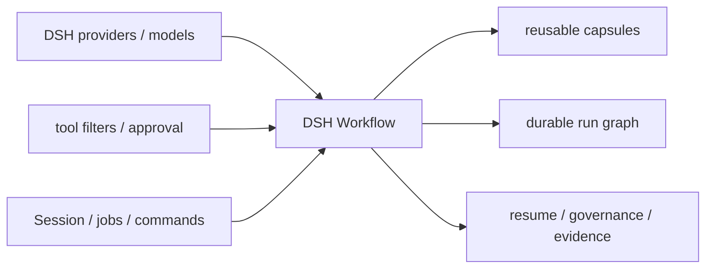

<h1 align="center">DSH Workflow</h1>

<p align="center">
  <strong>把 DeepSeek Harness 的一次性多 Agent 调度，升级为可生成、可保存、可治理、可观察、可恢复的 Workflow 层。</strong>
</p>

<p align="center">
  <a href="LICENSE"></a>
  
  
  
</p>

<p align="center">
  中文 · <a href="README.en.md">English</a> ·
  <a href="#快速开始">快速开始</a> ·
  <a href="#它为-dsh-带来什么">DSH 价值</a> ·
  <a href="#能力">能力</a> ·
  <a href="docs/KODAX_PARITY.md">对标矩阵</a>
</p>

`@dsh-external/workflow` 是一个官方 bundle 形态、零核心 patch 的 DSH 插件。它完整参考 KodaX 的 workflow 设计能力，并针对 DSH 的 Cordis、`ctx.subagents`、Session、后台 jobs、审批、命令和工具机制做独立实现。

它不替换 DSH 已有的前台 `workflow` 工具。原生工具适合“这一次把若干工作并行跑完”；本插件负责更高一层的流程产品能力：命名、发现、生成、复用、暂停/恢复、重跑/续跑、持久证据、成本记录和治理。

## 它为 DSH 带来什么

DSH 已经有很强的 Harness 基础设施：模型路由、子 Agent provider、工具权限、审批、Session 日志、后台 jobs 与 UI 事件。但仅有这些“执行原语”，团队仍需在每次会话里重新描述如何拆解、并发、验证和汇总。

| 只有一次性调度时 | 安装 DSH Workflow 后 |
| --- | --- |
| 每轮重新提示如何拆任务，策略难复用 | 保存为项目或个人 workflow，按名字运行 |
| 并行结果散落在会话里 | run graph、事件、artifact、结果摘要和成本永久落盘 |
| 中断后通常从头重来 | 按 run snapshot 重跑，或用 effect cache 续跑未完成部分 |
| provider/模型/并发/预算靠提示词约束 | manifest + preflight + 运行时硬限制 |
| 生成的脚本容易越权或不可复现 | capability-only VM、JSON 边界、确定性 guard、审批分级 |
| 复杂流程只有作者自己知道怎么用 | capsule 自带 intent、inputs、requirements、provenance |
| 多 Agent 是一次性技巧 | 多 Agent 变成可审计、可分享、可演进的工程资产 |

对 DSH 项目本身，这个插件的价值是把已有 Harness 能力串成完整闭环：



因此，DSH 不只会“调用 Agent”，还可以承载长期维护的 Agent 工作流库。

## 快速开始

要求：Node.js `>=22.19`，以及与 [`compatibility.json`](compatibility.json) 一致的 DSH 快照。

```sh
# 构建产物已提交，git 源安装不需要在用户侧编译
dsh plugin --profile web add "github:dsh-external/dsh_workflow#main"

# 验证 bundle 已进入 profile 合成树
dsh --profile web --dump-config
```

预期配置中出现：

```yaml
- id: dsh-external-workflow
  name: '@dsh-external/workflow'
```

重启对应 DSH profile 后，在会话中输入：

```text
/workflow list
/workflow parallel-investigation {"question":"为什么这个测试会间歇失败？"}
/workflow create 为这个仓库设计一个并行安全评审流程
/workflow review --risk high --requirement "不得破坏公开 API" --test-evidence "pnpm test 通过" --wait
/workflow runs
```

`/workflow create <request>` 和未知名称的 `/workflow <自然语言请求>` 会像 KodaX 一样立即结束命令处理，并把显式 workflow 意图交给当前主 Agent。用户原始 query 以真正的 user message 进入 Session，所以会在对话中显示、参与 DSH 会话标题生成并可在左侧工作区中按标题识别；内部 authoring contract 则作为独立的折叠 plugin context 交给模型，不会污染标题或用户气泡。主 Agent 先用自身工具调查真实 workspace，再以 `source + manifest` 调用 `run_workflow` 生成和启动流程；长时间 scout/authoring 不会把斜杠命令卡在 `command/run`。这条命令只为对应消息中的第一次**通过预启动冒烟校验**的 inline workflow 提供一次性显式授权；如果脚本或子任务字段无效（例如 `modelHint` 不是 `fast | balanced | deep`），插件会在启动任何真实子 Agent 前返回精确错误，并保留本 turn 的一次性授权供主 Agent 修正后重试。内部 relay、后续直接用户消息或重复的有效调用都不能复用授权；工具产生的 scouting context 不会误撤销它。`approvalMode: always` 和 trusted-local workflow 的审批仍然保留。由于 authoring 由当前 Agent turn 接管，create/free-text 形式不接受 `--wait`；需要同步等待时请对命名 workflow、rerun、review 使用 `--wait`，或在工具调用中使用 `wait: true`。

> DSH Web 的左侧工作区在“手动排序”且会话数超过 5 条时会折叠其余会话；新 workflow 会话已归属对应工作区，必要时点击“展开其余 N 个会话”，或将视图排序切换为“最近更新”让活动会话自动前置。

workflow 启动和 `run_workflow` 默认立即返回 `{ runId, status, jobId? }`，不会让一个长流程占住当前 turn；支持等待的子命令显式传入 `--wait`（工具参数为 `wait: true`）才等待终态。`/workflow show` 默认显示最新 run，`/workflow stop` 默认停止当前活动 run。

模型也可以调用三个工具：

- `workflow_list`：发现 built-in、pattern、项目和个人 workflow；无效条目会报告但不会执行。
- `run_workflow`：运行命名 workflow、从自然语言 scout-then-author，或执行受限 inline workflow。
- `workflow_manage`：查看、暂停、恢复、停止、重跑、续跑、保存、改名、修订、删除和清理。

## 能力

### 与 KodaX workflow 对标的执行模型

- 版本化 `dsh.workflow` v1 capsule：manifest、source、intent、inputs、requires、provenance。
- 统一 `async function run(wf, args)` 模型。
- 完整 WorkflowApi：`phase`、`spawnAgent`、`runAgent`、`wait`、`snapshot/output`、`send/stop`、`parallel`、`pipeline`、`synthesize`、单层嵌套 workflow、artifact、log、budget。
- `runAgent` 对普通子任务失败返回 `null`，让 workflow 能按策略降级；显式 handle 的 `wait` 仍保留完整失败结果。要求 object JSON Schema 的任务在原生 structured capture 缺失时只做一次同路由、无工具修复，仍不合规则明确失败。
- Agent 元数据：phase、scope、constraints、read-only、provider/subagent type、fast/balanced/deep 路由、显式 model、isolation、token、evidence、verification、output schema、terse result。
- 两个 built-in：可按 rubric/agent/concurrency 参数化的 `parallel-investigation`，以及完整 packet/schema/read-contract/双 primary/逐 finding verifier/audit artifact 的 `scoped-review`。公共 `writeReviewPackets()` 从调用方已经捕获的 diff、约束和测试证据生成工作区内 content-addressed、不可覆写的分区文件；`/workflow review` 可直接捕获当前 Git 范围并启动该流程，不依赖 DSH 核心额外提供 `/review` patch。
- 稳定的 ProcessSnapshot、WorkflowOutcome 与 AgentResult 投影：包含 item/count/progress、失败与未验证结果、structured output、验证证据、路由、usage、artifact 和缓存重放来源。
- 六个标准 pattern：classify-and-act、fan-out-and-synthesize、adversarial-verification、generate-and-filter、tournament、loop-until-done。

完整逐项验收见 [KodaX 对标矩阵](docs/KODAX_PARITY.md)。本项目只参考行为与能力，不复制 KodaX 的受限许可源码。

### 发现与复用

搜索顺序是 deterministic 的：

1. 插件内置 workflow 与 pattern（不可被磁盘文件遮蔽）；
2. 项目目录 `.dsh/workflows`；
3. 个人目录 `$DSH_HOME/workflows`。

项目同名条目覆盖个人条目；同一目录中 `.workflow.json` 优先于 `.ts/.mjs/.js`。符号链接、路径逃逸、超大文件、未知 capsule 字段、版本不兼容和 manifest/文件名不一致都会在执行前失败。

受限 capsule 示例见 [examples/review.workflow.json](examples/review.workflow.json)。可信本地模块适用于人工维护的高权限流程，但每次执行都需要显式确认。

### 生命周期、持久化与续跑

每个 run 都有 `running → paused/completed/failed/denied/stopped` 状态和稳定 id。默认在项目中写入：

```text
.dsh/workflow-runs/<run-id>/
├── run.json                    # 状态、结果摘要、成本
├── events.jsonl                # append-only 事件图
├── workflow.workflow.json      # 不可变执行快照（生成型 workflow）
├── results/                    # 只保存已完成且验证通过的确定性 effect cache
└── artifacts/                  # workflow 命名证据
```

- 按 run id 重跑：使用该 run 的不可变 capsule snapshot。
- 按 saved name 重跑：使用当前保存版本。
- `resume-run`：相同调用序号 + 相同 task input 命中缓存，其余任务继续执行。
- 终态 run 自动按 `maxRetainedRuns` 清理；也可 preview/执行 `prune`。
- 同时记录原生 `tool-workflow/*` Session 事件，复用 DSH 已有 UI/可观察性。动态 workflow 的 run-start 使用 Session 生命周期：启动它的 tool step 或 Agent turn 结束时，后台流程仍保持 `running`，直到真实 `run-end` 决定完成、失败或取消，不再被 UI 误标为“已中断”。

## 常用命令

```text
/workflow help
/workflow list
/workflow create <request>
/workflow review [base | sha <hash>] [--lean] [--risk low|medium|high] [--requirement "..."] [--test-evidence "..."] [--wait] [-- <focus>]
/workflow <name> [JSON args]
/workflow runs [--all|--limit N]
/workflow show [--full] [runId]
/workflow pause|resume|stop [runId]
/workflow rerun|resume-run <runId|savedName> [JSON args] [--wait]
/workflow save <runId> <name> [project|personal]
/workflow rename-run <runId> <display name>
/workflow rename-saved <from> <to> [project|personal]
/workflow revise <savedName> <change>
/workflow delete-run <runId> [--force]
/workflow delete-saved <name> [project|personal]
/workflow prune [--dry-run] [--keep N] [--older-than 7d|24h]
```

斜杠命令通过 `ctx.userQuestions` 做一次性人类确认；模型工具使用 DSH 当前 turn 的 `ctx.approval`。后台运行会尽可能注册到 `ctx.jobs`，并始终保留插件自己的 durable run id。三条路径共享同一个引擎、run store 和安全策略。

## 配置

常见配置如下；完整字段和治理建议见 [配置参考](docs/CONFIGURATION.md)。

```yaml
- id: dsh-external-workflow
  name: '@dsh-external/workflow'
  config:
    approvalMode: generated-and-local  # never | generated-and-local | always
    maxAgents: 64
    maxConcurrency: 8
    maxRetainedRuns: 500
    fastProvider: spawn              # ctx.subagents transport
    fastModelProvider: deepseek-official
    fastMaxTokens: 4096
    balancedProvider: spawn          # ctx.subagents transport
    balancedModelProvider: deepseek-official
    balancedMaxTokens: 8192
    deepProvider: spawn              # ctx.subagents transport
    deepModelProvider: deepseek-official
    deepMaxTokens: 16384
    readOnlyAllowedTools:       # 与当前父 Agent 可见工具动态求交集
      - read
      - read_image
      - glob
      - grep
      - lsp
      - skill
      - web_search
```

`availableTools`、`availableMcp`、`availableSkills` 是部署能力清单，供 capsule preflight 使用。workflow 声明的 requirement 不在清单中时会失败，不会偷偷降级。

## 安全与能力边界

- 生成型脚本只能通过冻结的 WorkflowApi 发起 effect；脚本结果、参数和 RPC 值必须可 JSON 序列化。
- 生成脚本运行在 QuickJS WebAssembly 独立堆中；宿主只暴露 JSON capability RPC。静态 policy 还会拒绝 import/require、process、文件、shell、网络、timer 与非确定性 API。
- 同步执行、总墙钟、WASM 内存与栈都有上限；主函数返回或墙钟超时时会关闭 RPC、abort run，并等待所有已接收的宿主 RPC 与已发布 child 静默退出。可信本地模块仍具有宿主权限。
- `readOnly: true` 使用“当前父 Agent 可见工具 ∩ 可信只读 allow-list”，未来新增写工具默认不可见；provider 不支持 `toolFilter` 时直接失败。
- token budget 在子 Agent 发布前预留，本地 Agent 有 usage 时按 Session 实际值核算。
- read-path、成功 mutation tool + Git workspace 指纹变化、每个 required changed path 的前后内容指纹、final-text 与 bounded same-actor repair 已内建；部署可以用带稳定 `cacheIdentity` 的 `registerVerificationAdapter()` 叠加非 Git 或更强的 workspace 证据。worktree 通过 `registerIsolationAdapter()` 接入，未注册时明确失败。
- catalog 保存/替换/改名/删除使用规范化根目录、逐段 junction/symlink 拒绝与原子独占发布；并发同名保存不会互相覆盖。
- DSH one-shot seam 没有原生 existing-agent target / effort 控制；部署可在首次运行前注册 `registerDispatchAdapter()` 完整承接这两个字段，否则 fail loud。

更多细节见 [安全模型](docs/SECURITY.md)和[架构说明](docs/ARCHITECTURE.md)。

## 开发与验证

仓库旁需有兼容 DSH checkout，默认路径为 `../test-icetomoyo`，也可设置 `DSH_SNAPSHOT_DIR`。

```sh
pnpm install
pnpm check           # 快照 pin + 真实 DSH 投影 + 179 tests + typecheck + build
pnpm test:coverage   # 语句/分支/函数/行全局阈值均为 80%
pnpm pack
```

兼容基线、commit 和验证时间记录在 [`compatibility.json`](compatibility.json)。发布前必须重新 fetch DSH 默认分支并更新此文件。

## 已知限制

- trusted-local `.ts` 使用 Node 22 原生 erasable-syntax TypeScript，并遵循 Node module cache（修改后重启 DSH）；需要 enum 等 transform-only 语法或热重载时请发布为 `.mjs/.js`。
- 当前 DSH 通用 subagent seam 不直接支持 existing-agent target、per-agent effort 和 worktree；相应请求需要部署注册 dispatch/isolation adapter，未注册时 fail loud。
- 内建 verification 能证明实际 read/mutation tool evidence、Git workspace 变化、每个 required path 的任务前后指纹与文本后置条件；非 Git 工作区或需要外部权威证据的策略由 verification adapter 补充。
- 仅生成型 capsule run 能保存不可变 script snapshot；纯函数 trusted-package/local run 不能从 run id 再保存。
- capsule v1 与 KodaX capsule 不做 wire compatibility；外部 capsule 不会被误执行。
- capability-generated 源码与宿主对象隔离；但 trusted-local workflow 会以 Node 宿主权限执行，不要把不可信第三方源码标为 trusted-local。

## 致谢

- [DeepSeek Harness](https://github.com/dsh2026/test-icetomoyo) 提供 Harness、插件和子 Agent 能力面。
- [KodaX](https://github.com/icetomoyo/KodaX) 提供 workflow 产品设计的行为参考；本插件为独立实现。
- `dsh-external` 社区插件为 bundle 安装、验证、安全边界和文档结构提供了实践参考。

## License

MIT，见 [LICENSE](LICENSE)。
