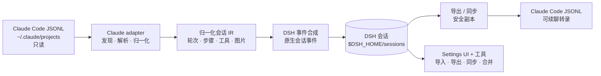
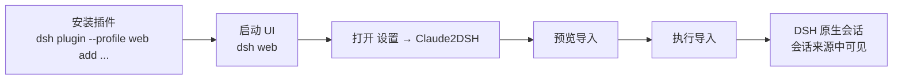

# Claude2DSH

**把 Claude Code 的会话、技能、记忆与插件资产迁移为 DeepSeek Harness（DSH）原生可续聊会话；需要时，还能把 DSH 新轮次带回 Claude Code JSONL。**

[](https://awesome-dsh-plugin.com)
[](https://www.npmjs.com/package/@claude2dsh/plugin)
[](https://github.com/kirkchinese/claude2dsh/releases)
[](package.json)
[](LICENSE)

[English](README.md)


Claude Code 是多工具迁移层的第一个会话源适配器。Claude2DSH 保留有用的会话结构，通过 DSH 原生持久化 API 写入，并默认把原始 Claude 目录视为只读源。

> [!NOTE]
> `0.2.0-rc.5` 是候选发布版。Awesome badge 只表示项目被精选列表 [awesome-dsh-plugin](https://github.com/awesome-dsh-plugin/awesome-dsh-plugin) 收录在 **Sessions & Messages（会话与消息）** 分类。自动雷达 [awesome-dsh-plugins](https://github.com/AdamPlatin123/awesome-dsh-plugins) 尚未标记“运行级验证”；badge 不代表已经获得该验证。

## 为什么选择 Claude2DSH

| DSH 原生续聊                                                     | 不只迁移聊天正文                                                                   | 返回 Claude 也不冒险                                                            |
| ---------------------------------------------------------------- | ---------------------------------------------------------------------------------- | ------------------------------------------------------------------------------- |
| Claude 轮次转换为 DSH 原生会话事件，DSH 可直接检查、重放与续聊。 | 技能、用户全局指令、项目记忆、工具输出 sidecar、子会话与插件资产都有明确迁移路径。 | 导出与同步默认只写 `$DSH_HOME` 下的安全副本；双端并发修改时暂停，不覆盖任一侧。 |

项目坚持**零配置开箱即用**：默认路径不要求用户先理解 profile 或 bundle，也能看到明确结果；危险写回仍必须显式授权。



## 快速开始

要求：Node.js `>=22.19.0`、pnpm 与 `dsh` CLI。

```sh
# 把已发布插件安装进 DSH 内置的有头 profile
dsh plugin --profile web add @claude2dsh/plugin@0.2.0-rc.5

# 启动浏览器 UI；终端会打印本地 URL
dsh web
```

然后：

1. 打开 `dsh web` 在终端打印的 URL。
2. 全新 DSH 首次打开时如出现模型 API Key 提示，可选**稍后配置**；迁移本身不会调用模型。
3. 进入**设置 → Claude2DSH**。
4. 选择语言，确认 Claude 会话目录，并按需勾选 subagent/workflow 子会话。
5. 先点**预览导入**检查统计与逐项报告，再点**执行导入**。



**设置 → Claude2DSH** 的第一个分区就是迁移向导；界面默认中文，也可切换 English。若 3080 已被占用，运行 `dsh web --port 0` 并打开 DSH 打印的 URL。


预览只读，并在任何 DSH 写入前给出逐项计划。


下面是真实成功结果。截图来自 `0.2.0-rc.5` 界面，输入为不含隐私的合成 Claude 转录。


### 仓库辅助脚本

如果已经克隆本仓库，辅助脚本会执行同样的主 `web` profile 安装，并在 DSH 默认本地端口（`3080`）启动 UI：

```sh
bash scripts/install-claude2dsh.sh
```

只有确实需要自定义 profile 时才设置 `CLAUDE2DSH_PROFILE`。Headless profile 暴露同一组工具，但不包含浏览器 UI。

## 能力：什么场景、怎么用

| 能力             | 使用场景                                                  | 入口与可见结果                                                                                                                                                    |
| ---------------- | --------------------------------------------------------- | ----------------------------------------------------------------------------------------------------------------------------------------------------------------- |
| 会话导入         | 首次迁移，或 Claude 转录新增轮次后                        | **设置 → Claude2DSH → 首次迁移**，或 `claude2dsh_import`；报告 `previewed/imported/already/appended/skipped/failed`                                               |
| 技能导入         | 让 Claude skills 成为 DSH 原生可发现资产                  | `claude2dsh_import_skills`；技能复制到 `$DSH_HOME/skills` 并进入 DSH 技能发现                                                                                     |
| 全局上下文       | 把用户全局 `~/.claude/CLAUDE.md` 迁入 DSH 全局指令        | `claude2dsh_import_context`；先预览，绝不覆盖内容不同的 `$DSH_HOME/AGENTS.md`                                                                                     |
| 项目记忆         | 让一个项目的 `MEMORY.md` 与 `memory/*.md` 在 DSH 中可发现 | `claude2dsh_import_memory`；每个项目生成一个 DSH 技能包                                                                                                           |
| 导出回 Claude    | 想在 Claude Code 继续某个 DSH 会话                        | `claude2dsh_export`；在 `$DSH_HOME/claude2dsh/exports` 写入经校验的 JSONL 副本                                                                                    |
| 同步回写         | 把 DSH 新轮次追加到已有 Claude 导出副本                   | `claude2dsh_sync`；报告追加的轮次、事件与 JSONL 记录数                                                                                                            |
| 自动镜像         | 持续监控 Claude 新轮次，并把 DSH 轮次镜像到安全副本       | **设置 → 自动镜像**；`claude2dsh_autosync` 查看状态或恢复暂停队列                                                                                                 |
| 冲突合并         | 同步水位后双端都增长，且任一版本都不能丢                  | `claude2dsh_merge`；计算或创建新的合并副本，不修改两侧原件                                                                                                        |
| 工具输出 sidecar | 转录引用了较大的持久化工具输出                            | `claude2dsh_sidecars`；列出/解析复制文件，并记录缺失或超限项                                                                                                      |
| 会话来源         | 区分 Claude 主会话、子会话与合并会话                      | **设置 → 会话来源**，或 `claude2dsh_session_sources`；显示来源类型与路径                                                                                          |
| 插件盘点         | 不运行 Claude 插件代码，只检查其中的资产                  | `claude2dsh_plugin_inventory`；dry-run 报告技能、命令、agent、prompt、hook 与 marketplace                                                                         |
| 图片策略         | 保留转录图片，同时尊重所选模型的输入模态                  | `imageMode: "auto"` 自动跟随当前 DSH 会话路由；探测路由 provider/model 留空即跟随会话，填写则覆盖。Settings 页面显示当前探测结论，每个导入条目记录降级/升格原因。 |
| Hook bridge      | 复用当前已支持的 Claude command hook 子集                 | **设置 → Claude hook bridge** 只读扫描 Claude 设置与插件 hooks，预览可映射的 command hook，并可保存候选供下次启动启用；不支持类型会报告并跳过                     |

会话导入具备幂等性：再次运行会报告已存在，不会复制一份。默认递归搜索并感知 `CLAUDE_CONFIG_DIR`（回退到 `~/.claude/projects`），首启向导会显示实际来源目录与发现/导入数量。项目级 `CLAUDE.md` 不需要复制，因为 DSH 已原生读取它；只有用户全局上下文需要转换。

## Settings 界面导览

Claude2DSH 把首次迁移与安全关键默认值放在同一个设置页：

- **首次迁移**：语言、来源目录、可选子会话、预览、执行与逐项结果。
- **自动镜像**：需显式开启的 watcher、防抖与 DSH → 安全副本方向。
- **导入默认值**：图片模式/provider/model、子会话默认值与 sidecar 大小上限。
- **导出 / 写回**：默认目标是安全副本；写真实 `~/.claude` 是独立危险开关。
- **Claude hook bridge**：只在启动时生效的路径与激活说明。
- **会话来源**：已导入会话 ID、来源类型与来源路径。

以下真实截图使用默认中文界面与合成数据；切换语言后标签会同步变化。


## 安全边界

- 导入把 Claude 源视为只读；预览不会写 DSH。
- DSH 写入只经过宿主持久化与 `$DSH_HOME/sessions`、`$DSH_HOME/skills`、`$DSH_HOME/claude2dsh` 下的 DSH 原生目录。
- 导出与同步默认写 `$DSH_HOME/claude2dsh/exports`，不会写原始 `~/.claude`。
- 写原始 Claude 目录必须显式授权 `allowOriginalClaudeDir: true`，默认始终拒绝。
- 插件盘点只读资产，不执行插件代码。
- 自动镜像检测到双端并发增长就暂停；显式合并工具创建新的安全副本，不猜哪一侧获胜。

## 当前局限

- **候选发布状态：** 当前公开包为 `0.2.0-rc.5`；项目尚未把接口与磁盘格式承诺为稳定兼容层。
- **Hook bridge：** 上游只支持 **Claude Code 30 个 hook 事件中的 7 个**、仅 `type: "command"` handler，且已支持事件也只有部分语义。完整 hook 兼容是路线图目标，不是现状承诺。
- **视觉模型验收：** 原生图片路径已实现，但尚未在真实支持视觉的 DSH 模型路由上验收；随附 DeepSeek adapter 声明仅文本输入。
- **自动镜像：** 默认关闭、需显式开启；DSH 轮次只写安全 Claude 导出副本。双端同时增长时暂停并报告冲突，不代表会自动合并。
- **插件兼容：** 可以盘点并迁移选定资产，但任意 Claude 插件运行时行为不能自动移植到 DSH。
- **来源适配器：** 当前只有 Claude Code；Codex 与其他工具仍属于路线图工作。
- **会话列表装饰：** DSH 没有逐会话侧栏行扩展点，因此来源身份显示在 Settings 与 `claude2dsh_session_sources` 中。

## 常见问题

<details>
<summary><strong>插件装好了，但为什么看不到 UI？</strong></summary>

很可能装进了 headless profile。把插件安装进内置 `web` profile 并启动 `dsh web`；页面位于**设置 → Claude2DSH**。

</details>

<details>
<summary><strong>会写我的真实 ~/.claude 吗？</strong></summary>

迁移不会。导出与同步默认也只写 `$DSH_HOME` 下的安全副本。写原始目录需要另一项显式授权。

</details>

<details>
<summary><strong>为什么自动镜像与 Hook bridge 默认关闭？</strong></summary>

两者都会在首次导入后继续执行工作，因此保持 opt-in，让用户先看清并接受其范围；Hook bridge 还只覆盖文档明示的 7/30 command-only 子集。

</details>

## 许可与致谢

[MIT](LICENSE)。项目独立设计，并受益于 [`dsh-chat-import`](https://github.com/Nwflower/dsh-chat-import)（MIT）与 [`dsh-claude-move`](https://github.com/PerryLink/dsh-claude-move)（Apache-2.0）的公开成果；感谢两个项目提供有价值的参照。Hook 兼容委托给 DeepSeek Harness 官方 Claude Code hook bridge 包。
