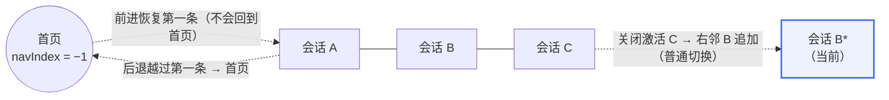
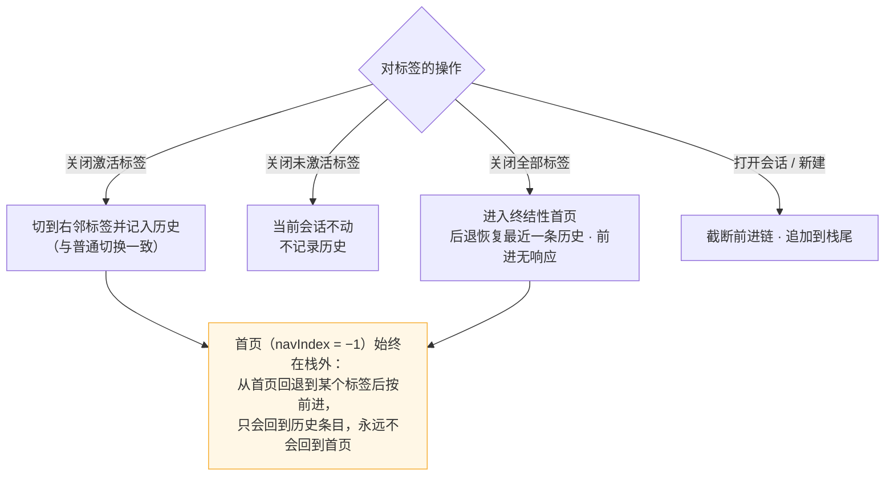

# dsh-session-tabs（DSH 会话标签页）

[English](README.en.md) ｜ 中文

浏览器式会话标签页导航栏 for DeepSeek Harness (DSH)：每打开一个会话就多一个顶部标签——像浏览器那样点击切换、关闭、新建。当前会话高亮，运行状态一目了然。

## 界面预览


## 会话历史导航

标签历史是一份**激活日志**：每次切换（点标签、关闭激活标签、新建会话）都截断前进链并把当前会话追加到栈尾；关闭标签只移除标签条上的条目，**不**从历史中删除——回退落在已关闭的标签上时会把它重新打开。



不同操作的结果：



## 与既有布局的关系

标签栏位于**侧边栏旁边**（从侧边栏右缘开始，`position: fixed` 顶部条），**不会挤占侧边栏位置**：

- 侧边栏列保持原位（可拖拽 264–420px，折叠 rail 56px 时标签栏自动跟随）；
- 仅中心列内容下移 34px 为标签栏让位；
- 主题感知：使用 DSH 主题 token（`--dsw-alias-*`），亮/暗色自动适配。

## 功能

- 每个打开的会话一个标签（按打开顺序，MRU）
- 当前会话高亮（品牌色下划线，`data-active`）
- 状态点：运行中（品牌色脉冲）/ 等待交互（琥珀）/ 已完成（绿）
- × 关闭标签：
  - 关闭激活标签 = 普通切换——跳到**右邻标签**（最右则左邻），并按正常切换记入标签历史；
  - 关闭未激活标签：当前激活不动，**不记录历史**（关闭的会话仍可经历史回退恢复）；
  - 关闭最后一个标签：进入首页（无选中会话），回退键恢复最近的历史条目，前进键无响应。
- 鼠标中键：标签上 = 关闭该标签；侧边栏会话行上 = 后台打开为标签（不切换当前会话）
- 鼠标侧键：浏览器式会话历史导航——后退/前进在历史中逐条移动（回退时落在已关闭的标签上会重新打开为标签）；首页具有特殊性：从首页回退到某个标签后，前进键**不会**回到首页
- ＋ 新建会话（`workspaces.startSession()`）
- 标签过多时横向滚动（隐藏滚动条）
- 纯客户端实现，无 Host 依赖，无持久化写入

## 安装（部署级，刷新后自动加载）

```sh
dsh plugin --profile web add ./dsh-session-tabs
```

或手动：在 profile 的 `package.json` 加入依赖、在 `cordis.patch.yml` 插入：

```yaml
- insert:
    - id: dsh-session-tabs
      name: dsh-session-tabs
```

然后 `pnpm install` 并重启 DSH（或触发 profile patch 热重载后刷新页面）。之后每次页面加载标签栏自动出现，无需批准、无需手动激活。

## 快速开始

1. 刷新页面（或重启 DSH）后，顶部即出现标签栏，当前会话自动成为一个标签；
2. 打开更多会话：点侧边栏会话行（前台打开）或对其**鼠标中键**（后台打开为标签，不切换）；点标签栏 `＋` 新建会话；
3. 切换：点击任一标签；关闭：点击标签上 `×` 或对标签**鼠标中键**；
4. 历史导航：鼠标**侧键**后退/前进（浏览器式，见[会话历史导航](#会话历史导航)）。

## 卸载

```sh
dsh plugin --profile web remove dsh-session-tabs
```

移除后刷新页面，标签栏即消失（插件不做任何持久化写入，无需额外清理）。

## 兼容性

| 项 | 值 |
| --- | --- |
| 支持的 DSH 版本 | 实测 `0.1.0-rc.6`（npm 发行版）与 `0.1.0-rc.7`（mainline 源码）；理论上支持 `0.1.0-rc.6` 及之后的所有版本 |
| 最后验证日期 | 2026-08-18 |
| 验证覆盖 | 加载/卸载、标签切换、关激活/非激活/全部标签、中键关闭与后台打开、侧键前后退、归档标签清理、亮暗主题 |
| 接口依赖 | `shell.overlay` 槽位标准 prop（`useSessions`/`useWorkspaces`）、`sessions.open`/`sessions.clear`、`workspaces.startSession` |
| 配置项 | 无（纯客户端，无 Config） |

兼容性依据：插件只使用自 `0.1.0-rc.6` 以来保持稳定的公开接口（槽位标准 prop 与 sessions/workspaces 公开方法），并在两个不同来源上实测通过——npm 发行版（官方命令 `npx @deepseek-ai/dsh web` 真机验证）与 mainline 源码（全量功能实测）。DSH mainline 快速演进，接口漂移可能导致旧结论失效；若在新版本上遇到问题，请提 issue 并附 DSH 版本与 commit。

## 权限与数据

- **纯客户端实现**：不注入任何 Host 端代码，无 Host 依赖，无持久化写入；
- **读取**：会话列表与选中态（`useSessions`）、归档清单（`useWorkspaces`）、`sessions.open`/`sessions.clear`/`workspaces.startSession` 调用——全部为 DSH 公开接口，数据仅用于渲染标签与导航；
- **无网络、无凭据、无文件访问**；标签顺序与导航历史仅存活于当前页面内存，刷新即重置。

## 故障排查

| 现象 | 处理 |
| --- | --- |
| 标签栏没出现 | 确认 profile 依赖已装（`pnpm install`）且 `cordis.patch.yml` 有插入行；触发 patch 热重载后**硬刷新**页面 |
| 标签文字是旧标题 | 归档/改名后需刷新页面（标签 MRU 以会话列表为准，刷新即重新对齐） |
| 标签栏位置不对 | 检查是否与其它注入了 `shell.overlay` 的插件冲突（同一槽位多 occupant 时顺序由 `order` 决定） |
| 侧键触发浏览器历史跳转 | 确认加载的是最新 bundle（部署级插件随页面加载，硬刷新一次） |

## 开发说明

- `lib/client.js` 是 `__ModuleLoader__.load` 格式的浏览器 bundle（与已安装社区插件一致），经 `exports["./client"]` 由 web shell 的模块系统加载；
- `package.json` 声明 `dsh.client`（`platform: 'web'`）；
- 依赖仅 `react`（shell 种子）与 Cordis 运行时；`sessions.clear()`（列表 store 的"清除选择到无会话视图"）仅在关闭最后一个标签时使用。

## License

MIT
