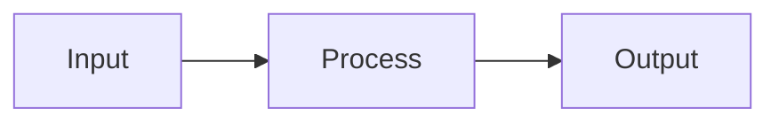

# dsh-plugin-mermaid

[](./LICENSE)
[](https://github.com/topics/dsh-plugin)
[](https://github.com/deepseek-ai/deepseek-harness)

A [DeepSeek Harness](https://github.com/deepseek-ai/deepseek-harness) (DSH) web
client plugin that renders ` ```mermaid ` code blocks in chat messages, with a
**chart ↔ source** toggle and live theme switching.

- Mermaid v11 loaded on demand from a CDN (no bundle bloat).
- Follows DSH dark/light theme automatically.
- 500 ms debounce so streaming tokens don't thrash the renderer.
- Native DSH code-block banner integration: buttons sit right next to the
  built-in **Copy** button; source view keeps Shiki highlight and copy.
- Zero build step — the browser entry is hand-written factory-form CJS exactly
  as DSH's `client-modules` service expects.

## Install

### From GitHub (recommended)

This package ships prebuilt `lib/` files and declares `dsh.bundle`, so it can
be installed directly into the DSH web profile:

```bash
dsh plugin --profile web add github:lj970926/dsh-plugin-mermaid
```

Then restart `dsh web` and hard-refresh the browser (Cmd+Shift+R).

To pin a revision for reproducibility, append a commit SHA or tag:

```bash
dsh plugin --profile web add github:lj970926/dsh-plugin-mermaid#<commit-or-tag>
```

> Because the published files are already in `lib/`, this package has no
> `prepare` build step and does not require pnpm `allowBuilds` authorization.
> If you fork the repository and add a build step, follow DSH's [packaging
> docs](https://deepseek-harness.github.io/deepseek-harness/develop/basic/publish)
> and add the package key under `allowBuilds` in the profile's
> `pnpm-workspace.yaml` when prompted.

### From a local checkout

If you are developing the plugin, install the checkout as a linked bundle:

```bash
dsh plugin --profile web add /absolute/path/to/dsh-plugin-mermaid
```

### Legacy copy script

The repository also keeps `install.sh` for copying files directly into an
existing web profile:

```bash
git clone https://github.com/lj970926/dsh-plugin-mermaid.git
bash dsh-plugin-mermaid/install.sh
```

The script:

1. Copies this folder into `$DSH_HOME/profiles/web/node_modules/dsh-plugin-mermaid/`
   (defaults to `~/.dsh/profiles/web/...`).
2. Appends an `insert` entry to
   `$DSH_HOME/profiles/web/cordis.patch.yml` (idempotent).

Then restart `dsh web` and hard-refresh the browser (Cmd+Shift+R).

### Manual install (no script)

```bash
mkdir -p ~/.dsh/profiles/web/node_modules/dsh-plugin-mermaid
cp -R lib package.json cordis.patch.yml ~/.dsh/profiles/web/node_modules/dsh-plugin-mermaid/
cat >> ~/.dsh/profiles/web/cordis.patch.yml <<'EOF'

- insert:
    - id: dsh-plugin-mermaid
      name: dsh-plugin-mermaid
EOF
```

> Prefer `dsh plugin add`; it records the bundle in the profile manifest and
> keeps it enabled across profile updates. Newer DSH releases require the
> profile's `cordis.patch.yml` to parse as a top-level YAML array; if the file
> has no entries, keep it as `[]`. The legacy install script normalizes this
> for you.

## Usage

Send any message containing a fenced mermaid block, e.g.:

````markdown

````

DSH renders it as a code block; the plugin enhances it with:

- **源码 / 图表** toggle — switch between Mermaid source and rendered SVG.
- **重渲染** — force a re-render (useful after streaming or CDN hiccup).

Theme changes (Settings → Appearance) re-render all blocks with the matching
Mermaid theme.

## How it works

| File | Role |
|---|---|
| `package.json` | Declares `dsh.client.platform = "web"` and `./client` export. The `./package.json` subpath export is required because DSH resolves plugins via `require.resolve('<pkg>/package.json')`. |
| `lib/index.js` | Host half (ESM, no-op). DSH's Cordis loader needs named `name`/`inject`/`apply` exports; it does nothing on the host because all work is browser-side. |
| `lib/client.js` | Browser half: registers itself with `window.__ModuleLoader__.load({id, factory})`, injects styles, scans `.md-code-block` rows for `mermaid` infostrings, and installs a MutationObserver for streaming blocks. |
| `install.sh` | Copies the package into the web profile and patches `cordis.patch.yml`. |

The plugin detects Mermaid blocks by reading DSH's banner `.infostring` text
(rather than relying on `code.language-mermaid`), because DSH uses Shiki which
may not add the standard language class for grammars it doesn't bundle. It also
falls back to `code[class*='language-mermaid']` for forward compatibility.

## Requirements

- DSH `>= 0.1.0-rc.6` (tested on rc.6).
- Network access to `cdn.jsdelivr.net` on first render (Mermaid is cached by
  the browser afterwards). To vendor it, change `MERMAID_CDN` in
  `lib/client.js` to a local URL.

## Development

The browser file is plain JavaScript; no build step. Edit `lib/client.js`, then:

```bash
# Re-sync into the profile
bash install.sh
# Restart dsh web (DSH's client-hmr plugin is disabled in the default web
# profile, so file changes are not picked up automatically).
```

If you are running DSH from a source checkout with `pnpm run dev:web` and
re-enable `client-hmr`, edits to `lib/client.js` hot-reload without restart.

## Uninstall

1. Remove the block from `~/.dsh/profiles/web/cordis.patch.yml`.
2. `rm -rf ~/.dsh/profiles/web/node_modules/dsh-plugin-mermaid`.
3. Restart `dsh web`.

## License

MIT © [lj970926](https://github.com/lj970926)
