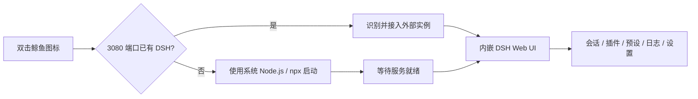

<div align="center">
  
  <h1>DeepSeek Harness Manager｜DeepSeek Harness 桌面端</h1>
  <p><strong>把 <code>npx @deepseek-ai/dsh web</code> 变成可以双击启动、独立运行和集中管理的 Windows 桌面应用。</strong></p>
  <p>自动启动或接管本机 DSH，在自己的窗口中内嵌 Web UI，并提供会话观察、插件与代理预设管理、软件回收站、API 切换、系统托盘和应用内更新。</p>

  [](https://github.com/luocuiyu/deepseek-harness-manager/releases/latest)
  [](https://github.com/luocuiyu/deepseek-harness-manager/releases)
  [](LICENSE)
  
  

  [下载最新版](https://github.com/luocuiyu/deepseek-harness-manager/releases/latest) · [查看 v0.2.3](https://github.com/luocuiyu/deepseek-harness-manager/releases/tag/v0.2.3) · [English](README.en.md) · [提交问题](https://github.com/luocuiyu/deepseek-harness-manager/issues)
</div>

> [!IMPORTANT]
> 本项目是独立社区项目，并非 DeepSeek 官方产品。项目基于 [MarcoG-h/DSH-Launcher](https://github.com/MarcoG-h/DSH-Launcher) 的 MIT 许可代码继续开发，完整归属见 [THIRD_PARTY_NOTICES.md](THIRD_PARTY_NOTICES.md)。

## v0.2.3 重点更新

- 点击更新提示中的“下载更新”后，立即唤醒主窗口并显示全局下载进度，不再需要自己寻找软件更新页面。
- 更新进度卡显示百分比、已下载大小、总大小、实时速度和预计剩余时间，可收起到后台继续下载。
- 侧边栏持续显示下载、等待安装或失败状态；Windows 任务栏同步显示下载进度。
- 下载完成后提供醒目的“重启并安装”，应用在后台时还会发送 Windows 通知。
- 下载失败时可以直接重试、打开 GitHub Release 手动下载或复制错误信息。
- 修复 Release 更新说明直接显示 `<h2>`、`<li>` 等 HTML 标签的问题，并对渲染内容进行安全过滤。

## 为什么需要它？

DeepSeek Harness Web 模式通常需要打开终端、执行命令、等待服务启动，再访问本机端口：

```powershell
npx @deepseek-ai/dsh web
```

Manager 将这些步骤收敛成一个桌面应用：



1. 双击桌面的蓝色鲸鱼图标。
2. 自动检测端口、进程和已有 DSH 实例。
3. 没有实例时自动启动；已有实例时直接接入，不重复运行第二份。
4. 端口就绪后，在应用自己的 Electron 窗口中显示 DSH。
5. 任务栏保留 Manager 自己的图标，不依赖默认浏览器标签页。

## 真实界面

以下均为 `v0.2.1` Windows 实际运行截图，不是设计稿。

### 内嵌 DeepSeek Harness

DSH 使用 Electron 原生 `WebContentsView` 显示在应用内部，工作区、会话、模型和 Agent 预设仍由 Harness 管理。


### 启动控制台

集中查看运行模式、PID、端口、就绪状态、API 余额和启动日志。检测到手动运行的 DSH 时会显示“外部运行中”，不会重复启动。


### 会话观察台

通过本机只读 API 汇总会话目录、状态、父子关系、Agent 预设以及可用的 Token/上下文统计。


### 代理预设与软件回收站

`Anchored Standard` 属于代理预设，不是第三方 npm 插件。Manager 会扫描 `DSH_HOME/.agent-presets`，并显示来源、占用情况和文件信息。

第一次删除只会移动到软件自己的回收站；清空 Windows 回收站不会影响这里的备份。只有在软件回收站中再次确认“永久删除”才会彻底清除。


### 插件市场

搜索 DeepSeek Harness 相关插件仓库，查看热度、语言、简介和 README；支持 GitHub URL、本地路径与 npm 包名安装。


## 功能一览

| 模块 | 能力 | 说明 |
| --- | --- | --- |
| DSH 内嵌界面 | 原生子视图、自动进入、侧边栏联动 | 不打开外部浏览器，保持独立任务栏图标 |
| 进程控制 | 启动、停止、重启、进程树终止 | 避免遗留 Node/DSH 子进程 |
| 外部实例识别 | 端口探测、PID 查询、自动接入 | 已运行 `npx` 时不会再启动第二份 |
| 实时日志 | stdout/stderr、自动滚动、任务进度 | 启动失败时可以直接定位错误 |
| 会话观察 | 会话目录、运行状态、父子会话、代理预设 | 数据来自本机 DSH，只读展示 |
| 外部插件 | 安装、启用、停用、卸载、本地扫描 | 支持 GitHub、本地目录和 npm spec |
| 代理预设 | 扫描、来源识别、占用检测、打开目录 | 管理 `.agent-presets`，不再误当作插件 |
| 软件回收站 | 恢复、同名冲突保护、永久删除 | 独立于 Windows 回收站 |
| 插件市场 | 搜索、分页、README 预览、私有仓库 Token | 外部链接打开前会确认 |
| 来源追踪 | 官方、第三方、本地开发、用户安装、历史推断 | 同时标注 confirmed / inferred 可信度 |
| API 管理 | 多厂商预设、Base URL、API Key、余额查询 | 切换后随 DSH 重启注入 |
| 应用内更新 | 启动检查、更新提示、下载进度、重启安装 | 更新源为本仓库 GitHub Releases |
| 安装引导 | Node.js 官网入口、DSH 预下载与验证 | 避免首次启动时临时下载导致超时 |
| 系统托盘 | 最小化到托盘、状态灯、单实例唤醒 | 再次双击快捷方式会显示已有窗口 |
| 故障诊断 | 脱敏配置、进程状态、会话概览、最近日志 | 报告不会包含 API Key 和 GitHub Token |

## 插件、代理预设和会话是什么关系？

| 对象 | 默认位置 | Manager 提供的操作 |
| --- | --- | --- |
| 外部插件 | 当前 profile 的 `package.json` / `node_modules` | 安装、启用、停用、卸载、来源识别 |
| 本地插件源码 | 默认 `~/DSH-Plugin` | 扫描、安装到当前 profile、打开目录 |
| 代理预设 | `DSH_HOME/.agent-presets` | 查看、会话占用检测、移入回收站、恢复、永久删除 |
| 会话 | DSH 本地会话存储 | 只读观察，不修改会话内容 |

> [!NOTE]
> 插件是当前 DSH profile 的“可用能力”，不代表某个会话已经调用过它。代理预设决定会话使用的 Agent 能力组合，也不等同于 npm 插件。

## 安装

### Windows 安装包（推荐）

1. 打开 [Releases](https://github.com/luocuiyu/deepseek-harness-manager/releases/latest)。
2. 下载最新的 `DeepSeek-Harness-Manager-<版本>-Setup.exe`。
3. 运行安装向导，选择安装目录。
4. 安装完成后，双击桌面或开始菜单中的鲸鱼图标。

已安装旧版本时不需要先卸载，直接运行新版安装包覆盖升级即可。

### Windows 显示“已保护你的电脑”怎么办？

当前社区版本没有受信任机构签发的 Authenticode 代码签名证书，因此 Microsoft Defender SmartScreen 可能显示“无法识别的应用”或“发布者未知”。这表示 Windows 无法验证数字签名及下载信誉，**不等同于已经检测到病毒**。

程序属性和“已安装的应用”中的公司/发布者元数据为 `lcy`，但元数据不能代替受信任的数字签名，所以 SmartScreen 仍可能显示“发布者未知”。


如果安装包来自本仓库官方 Release：

1. 确认下载地址的仓库是 `luocuiyu/deepseek-harness-manager`。
2. 使用 PowerShell 核对 SHA-256。
3. 哈希与 Release 页面一致后，在 SmartScreen 界面点击“仍要运行”。部分 Windows 版本需要先点击“更多信息”。

`v0.2.3` 的校验命令：

```powershell
Get-FileHash .\DeepSeek-Harness-Manager-0.2.3-Setup.exe -Algorithm SHA256
```

预期 SHA-256：

```text
642A6EFB069A70C3F519D2EF9ED1A60FEDC8CB8689F86AFF41FA6DF2273CA92D
```

> [!CAUTION]
> 不要从网盘、群文件或不明镜像运行无法核验来源的安装包。正式代码签名或 Microsoft Store 分发已列入后续计划。

### 已安装 Node.js / npx

默认使用“本机 npx”模式，实际启动方式等效于：

```powershell
npx @deepseek-ai/dsh web
```

### 没有 Node.js

进入“设置 → DSH 部署 / 修复”：

1. 在“部署运行环境”中打开 Node.js 官网，安装 Node.js 22.19.0 或更高版本。
2. 重新打开 Manager，在“部署 DeepSeek Harness”中预下载并验证 `@deepseek-ai/dsh`。

Manager 不再提供便携 Node 环境，普通运行方式与官方文档保持一致。

## 应用内更新

- 每次启动约 6 秒后自动检查 GitHub Releases。
- 发现新版本时弹窗提示“下载更新 / 稍后处理 / 跳过此版本”。
- 不会静默下载，也不会强制安装。
- 下载完成后，需要用户点击“重启并安装”。
- 跳过某个版本后，只有出现更高版本才再次提示；手动检查会重新显示当前可用版本。

`v0.1.x` 需要手动安装一次 `v0.2.1`；从 `v0.2.1` 开始，后续版本可以使用应用内更新。

## 两种运行模式

| 模式 | 适用场景 | 实际启动方式 |
| --- | --- | --- |
| 本机 npx | 已安装 Node.js，绝大多数用户 | `npx @deepseek-ai/dsh web` |
| 源码模式 | 开发、调试或修改 DeepSeek Harness 源码 | 本机 Node 运行 Harness checkout |

## 配置与数据安全

| 数据 | 默认位置 / 处理方式 |
| --- | --- |
| Manager 普通配置 | Electron `userData/launcher-config.json` |
| API Key / GitHub Token | `safeStorage` 加密后写入 `launcher-secrets.bin`；Windows 使用 DPAPI |
| 插件来源台账 | Electron `userData/plugin-provenance.json` |
| 代理预设回收站 | Electron `userData/agent-preset-trash`；只有再次确认“永久删除”才清除 |
| DSH profiles / sessions / storage | 默认位于 `~/.dsh`，Manager 不会迁移或覆盖 |
| 本地插件目录 | 默认 `~/DSH-Plugin`，可以在设置中修改 |
| 诊断报告 | 用户主动导出；秘密值会替换为 `[configured]` |

应用启用了 Electron `contextIsolation`，渲染层通过受限 preload API 与主进程通信；外部链接不会直接在 Manager 主窗口内导航。

## 常见问题

<details>
<summary><strong>为什么显示“外部运行中”？</strong></summary>

说明 3080 端口已经存在 DSH，通常是之前手动执行了 `npx @deepseek-ai/dsh web`。Manager 会直接嵌入它；如果希望 Manager 完整接管，可先停止外部实例，再从控制台启动。
</details>

<details>
<summary><strong>为什么 DSH 里能选择 Anchored Standard，外部插件却显示 0？</strong></summary>

`Anchored Standard` 位于 `DSH_HOME/.agent-presets`，属于代理预设，不是当前 profile 的 npm 插件依赖。请进入“第三方插件管理 → 代理预设”查看。
</details>

<details>
<summary><strong>关闭窗口后 DSH 为什么还在运行？</strong></summary>

默认启用了“关闭到托盘”。右键系统托盘鲸鱼图标并选择退出，或在设置中关闭该选项。是否在退出 Manager 时停止 DSH 可以独立配置。
</details>

<details>
<summary><strong>会不会破坏现有的 ~/.dsh？</strong></summary>

不会。Manager 默认复用现有 DSH_HOME。更新内置运行环境不会覆盖 sessions、第三方插件台账或手动配置；代理预设首次删除也只会进入软件回收站。
</details>

<details>
<summary><strong>插件为什么显示“历史安装·推断”？</strong></summary>

说明插件在来源台账建立之前就已存在。Manager 会根据包名和依赖 spec 推断来源，但不会伪装成已确认信息。通过 Manager 新安装的插件会记录为 confirmed。
</details>

## 本地开发

需要 Node.js 22+ 与 pnpm：

```powershell
git clone https://github.com/luocuiyu/deepseek-harness-manager.git
cd deepseek-harness-manager
pnpm install
pnpm dev
```

验证与构建：

```powershell
pnpm typecheck
pnpm build
pnpm dist
```

主要技术栈：Electron 43、Electron Vite、React 19、TypeScript 7、Tailwind CSS 4、NSIS、`electron-updater`、`WebContentsView` 与 `safeStorage`。

## 路线图

- [x] GitHub Releases 应用内更新
- [x] 代理预设识别与软件回收站
- [ ] 更完整的会话事件时间线与工具调用观察
- [ ] 插件安装前权限与变更预览
- [ ] 插件更新检查、回滚与快照
- [ ] 受信任的 Windows 代码签名 / Microsoft Store 分发
- [ ] 更多 DSH profile 管理能力
- [ ] macOS / Linux 适配评估

欢迎通过 [Issues](https://github.com/luocuiyu/deepseek-harness-manager/issues) 提交问题、建议和兼容性反馈。

## 许可证与归属

本项目以 [MIT License](LICENSE) 开源，发布者元数据名称为 `lcy`。

上游 DSH Launcher、DeepSeek Harness、DeepSeek 名称和相关标识的归属说明见 [THIRD_PARTY_NOTICES.md](THIRD_PARTY_NOTICES.md)。DeepSeek 和 DeepSeek Harness 相关商标归其各自权利人所有。
