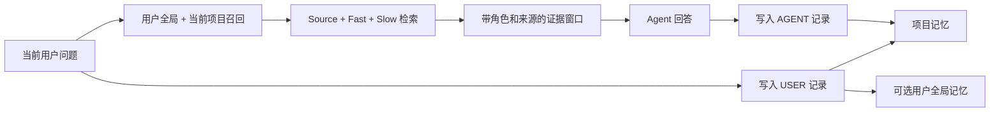

# TMCRA — 本地 Agent Memory OS

<p align="center">
  
</p>

<p align="center"><a href="README.md">English</a></p>

TMCRA 为长期运行的 Agent 提供跨会话、跨软件且可追溯来源的持久记忆。当前用户提出问题后，系统从用户全局作用域和当前项目作用域召回证据，随后保存 USER 来源记录；Agent 完成回答后，再保存独立的 ASSISTANT 来源记录。

本仓库包含可独立运行的本地版。用户克隆仓库后，可填写自己的 OpenAI 兼容 API Key，也可以选择本地生成模型；完整记忆服务只监听 `127.0.0.1`，不要求注册 TMCRA 账号，也不依赖 TMCRA 生产服务器。

## 功能详解

| 能力 | 用户得到的结果 |
| --- | --- |
| 自动记忆闭环 | 提问前自动召回并保存 USER 来源，回答完成后保存独立的 ASSISTANT 来源 |
| 跨会话、跨软件连续工作 | 同一项目在不同会话和已接入工具中共享项目进度，无需重新介绍上下文 |
| 项目隔离与用户全局记忆 | 项目内容分开管理；明确选择的用户信息可供多个项目使用 |
| Source / Fast / Slow 分层 | 保留可核对的原始来源，并建立面向快速召回和深层关系的派生记忆 |
| 有来源的召回注入 | 返回候选记忆、证据窗口、角色、来源和召回轨迹，供宿主加入下一轮提示词 |
| Visual Atlas | 按项目、会话、事件和证据查看个人记忆图谱 |
| Personal Knowledge | 将记忆整理为学习、项目和个人三类知识页面，每项结论保留证据引用 |
| 本地模型与 BYOK | 结构化写入和知识整理可使用本地模型，也可使用用户自己的 OpenAI 兼容 API |
| 用量账本 | 查看供应商、模型、任务、token、缓存命中和延迟；本地版不收取 TMCRA 服务费 |
| 数据控制 | 查看原始消息，删除单条消息或整个项目，并清理相关派生数据 |

### 自动写入与召回

一次完整对话由宿主生命周期自动驱动：

1. 根据当前仓库或工作目录解析稳定的项目身份，并恢复上次失败的待写任务。
2. 使用当前用户问题查询用户全局作用域和当前项目作用域。
3. 将去重后的候选整理为带角色、来源记录 ID 和作用域的 `evidence_windows`，再生成可直接注入的 `prompt_evidence`。
4. 宿主运行前写入 USER 来源记录；宿主完成回答后写入独立的 ASSISTANT 来源记录。软件、原生会话、消息 ID 和 Actor 信息继续保留。
5. 召回失败默认不阻断宿主回答。写入失败会进入当前操作系统用户专属的 outbox，并在下一次生命周期事件重试。

召回结果还包含每个作用域的候选数量与耗时轨迹。注入内容带有固定信任边界：记忆证据只作为数据，不能覆盖系统或用户指令。

### 项目、Session 与跨软件连续性

项目身份依次取自 `.tmcra/project.json`、Git origin、Git 根目录或规范化工作目录。在同一个仓库中接入 Codex、DeepSeek Harness 或其他适配器时，各工具共享 `project:<id>` 记忆，同时保留各自的 `source_app`、原生 thread、Session、角色和 Agent 身份。

- `global:owner`：用户明确允许跨项目使用的长期信息。
- `project:<id>`：需求、决策、进度、问题和 Agent 工作结果。
- `session_id`：项目内部的来源分组与追踪标识，不参与第三套独立召回。
- `visibility`：写入时可选择 `project`、`global` 或 `both`；自动接入默认让 Agent 回答留在项目内。

这套规则允许同一项目跨会话、跨软件继续工作，同时防止无关项目进入同一张图。当前开源版本地运行，不提供跨设备同步。

### 结构化记忆与证据召回

- **Source** 保存可检查的用户与 Agent 原始消息，派生层始终可以回到来源记录。
- **Fast / Slow** 由结构化 Writer 生成，处理实体、事件、关系、时间、状态更新和跨轮依赖。
- **本地召回** 使用 Embedding 索引、公开的图节点与路径打分器，并保留 Source 文本匹配作为证据入口。
- **结果封装** 对候选进行排序、去重与 Top-K 裁剪，输出 `hits`、`evidence_windows`、`prompt_evidence` 和逐作用域 `trace`。
- **角色来源** 在召回和知识整理阶段持续保留，用户陈述、Agent 建议与已确认决定不会被当成同一种事实。

### Visual Atlas 与 Personal Knowledge

Visual Atlas 把项目内容投影为可视化数据：项目与 Session 层级、事件和证据节点、关系、时间、角色、来源软件以及稳定来源 ID。它可以由 `/graph` 接口交给桌面端、网页或自定义可视化器呈现。

Personal Knowledge 使用 Visual Atlas 的完整快照生成可阅读的知识页，并按三类内容组织：

- `learned`：概念、方法、研究笔记和可复用经验；
- `project`：需求、决策、里程碑、当前状态、事故与待解决问题；
- `personal`：用户明确陈述的资料、偏好、人物关系和经验。

知识项区分 `confirmed`、`provisional`、`superseded` 和 `open`。每条 claim 和每个 section 必须引用现有证据 ID；系统会保留矛盾与不确定性，也不会把未经接受的 Agent 提议升级为用户决定。来源消息发生删除后，相应知识快照会失效，下一次构建基于剩余证据重新生成。

### 模型、用量与本地管理

用户可以分别设置 Writer 与 Personal Knowledge 的模型策略。`BYOK` 支持用户自己的 OpenAI 兼容接口；`local-model` 可连接本机 `llama-server`。Embedding 提供不同资源档位，模型命令支持列出方案、按内存与显存给出建议、展示锁定下载计划、校验文件、探测生成端点和执行 `doctor` 检查。

本地账本汇总调用次数、prompt/completion/total token、缓存命中与未命中，并保留近期任务的供应商、模型、项目、Session、耗时和供应商是否返回精确用量。其计费模式为供应商直付或本地运行，`tmcra_charge` 固定为 `0`。

### 接入状态

| 宿主 | 自动能力 | 当前状态 |
| --- | --- | --- |
| Codex | 提问前召回；USER / ASSISTANT 分轨写回；失败队列重试 | 一条命令安装，已通过本地 FastAPI 跨软件 E2E |
| DeepSeek Harness | 原生 `agent/pre-step` 召回；`turn/end` 写回；保留多 Agent 身份 | 技术预览，已通过真实 AgentLoop 双会话、类型、构建和包审计 |
| Claude Code | 共用本地 Hook 链路 | 手动注册，已通过共用 Hook 与跨软件 E2E |
| ZCode | 共用本地 Hook 链路 | 手动注册；宿主打包流程仍待干净环境验收 |
| 其他工具 | 通过本地 REST API 实现同一生命周期 | 接口可用；需由宿主提供已验证的生命周期入口 |

当前公开仓库是源码版，尚未包含桌面 GUI、旧聊天记录自动扫描与选择性导入、跨设备同步，以及 Qimi Code、GLM Code 等宿主的一键安装。线上账号、订阅与计费、员工后台、租户管理、生产部署和运维控制面也不会进入开源包。具体边界见[公开发布边界](docs/PUBLIC_RELEASE_BOUNDARY.zh-CN.md)，并由 `scripts/audit_public_release.py` 自动检查。

## 运行流程



Session 是项目内部的来源分组，不是第三个独立召回作用域。这样可以让同一项目的多次对话连续，又不会把十个无关项目塞进一张图。

## 本地快速安装

要求：Python 3.12、带 Git LFS 的 Git，以及至少 8 GiB 系统内存。默认 BYOK 安装会下载公开图打分权重、一个本地 Embedding 模型、PyTorch 和运行依赖。

### Windows PowerShell

```powershell
git clone https://github.com/reshuibuduo/TMCRA-Agent-Memory.git
cd TMCRA-Agent-Memory
git lfs install
powershell -ExecutionPolicy Bypass -File .\scripts\install-local.ps1
powershell -ExecutionPolicy Bypass -File .\scripts\start-local.ps1
```

安装器会询问无凭据的 OpenAI 兼容 `/v1` 地址、模型 ID 和用户自己的 API Key。Key 只写入 `.tmcra/config/runtime/secrets/byok-api.key`，不会进入运行配置 JSON。

### Linux 或 macOS

```bash
git clone https://github.com/reshuibuduo/TMCRA-Agent-Memory.git
cd TMCRA-Agent-Memory
git lfs install
bash scripts/install-local.sh
bash scripts/start-local.sh
```

无人值守安装可向安装进程提供 `TMCRA_BYOK_BASE_URL`、`TMCRA_BYOK_MODEL` 和 `TMCRA_BYOK_API_KEY`。GPU 选择、模型档位、本地生成模式、健康检查与卸载方式见[本地部署指南](docs/LOCAL_DEPLOYMENT.zh-CN.md)。

API 启动后，Linux/macOS 运行 `.tmcra/venv/bin/python scripts/smoke_local_api.py`，Windows 运行 `.\.tmcra\venv\Scripts\python.exe .\scripts\smoke_local_api.py`。它会用一个可清理的临时项目核验写入、召回、角色来源、图谱、由所选模型生成且带证据引用的知识整理、用量与删除。若知识整理退回确定性降级结果，测试默认失败；只有主动关闭该可选任务时才应添加 `--allow-knowledge-fallback`。

### 接入 Codex

保持本地 API 运行，再执行：

```powershell
powershell -ExecutionPolicy Bypass -File .\scripts\install-codex-local.ps1
```

重启 Codex，打开 `/hooks`，检查四个本地生命周期命令并授予信任。此后每次新问题都会自动召回相关本地记忆，问题和完成后的回答会按角色分别保存。

源码版还包含已测试的 DeepSeek Harness 技术预览，以及 Claude Code、ZCode 共用 Hook 清单。支持状态与验收证据见[本地工具接入](docs/LOCAL_INTEGRATIONS.zh-CN.md)。

## 本地 API

服务地址为 `http://127.0.0.1:2009`。从 `.tmcra/config/runtime/secrets/local-api.token` 读取本地 Token，并作为 Bearer Token 调用。

主要接口：

| 方法 | 路径 | 用途 |
| --- | --- | --- |
| `GET` | `/v1/health` | 不包含敏感信息的健康状态 |
| `GET` | `/v1/projects` | 列出本地项目 |
| `GET` | `/v1/sessions` | 按项目列出 Session 来源分组 |
| `POST` | `/v1/recall` | 根据当前用户问题召回证据 |
| `POST` | `/v1/messages` | 写入一条带角色的原始消息 |
| `GET` | `/v1/messages` | 查看已保存的原始消息 |
| `DELETE` | `/v1/messages/{message_id}` | 删除一条消息及其派生记忆 |
| `DELETE` | `/v1/projects/{project_id}` | 删除项目、全局派生、知识库和用量元数据 |
| `GET` | `/v1/projects/{project_id}/graph` | 生成 Visual Atlas 数据 |
| `POST` | `/v1/projects/{project_id}/knowledge/build` | 生成 Personal Knowledge |
| `GET` | `/v1/projects/{project_id}/knowledge` | 读取最近一次 Personal Knowledge 快照 |
| `GET` | `/v1/usage` | 查看本地模型调用 token 用量 |

完整字段与一轮对话的调用顺序见[本地 API 文档](docs/LOCAL_API.zh-CN.md)。

## 生成模型选择

默认模式为 `BYOK`：用户填写 OpenAI 兼容接口、模型 ID 和 API Key。所选模型负责结构化记忆写入与重整；启用个人知识库投影后，它也负责知识页面生成。召回始终在本地完成，使用 Embedding 索引和公开的图节点、路径打分器，不调用供应商模型。

如果希望生成过程也留在本机，可以使用 `local-model`。推荐的完整质量档位使用 Qwen3.6 35B-A3B GGUF，通过 `llama-server` 以 32K 上下文运行，下载约 12.74 GiB；建议硬件为 RTX 5090D 32 GB 或更高。模型策略命令会先展示资源需求，用户确认后才下载。

## 安全与隐私

- API 拒绝绑定非回环地址。
- 供应商 API Key 存在本地权限受限的密钥文件中；配置、健康状态、用量和错误响应均不输出 Key。
- 公开图打分权重只使用 `weights_only=True` 加载，并按公开清单校验字节数与 SHA-256。
- BYOK 会把记忆处理请求发送到用户明确选择的模型接口；本地模型模式只在回环地址完成这些生成调用。
- 显式删除会重写 SQLite 空闲页并截断 WAL。文件系统备份、快照或外部模型供应商已经持有的副本不在本地删除范围内。

发布前执行：

```bash
python scripts/audit_public_release.py --history
```

## LongMemEval 成绩

TMCRA 在公开的 LongMemEval S500 成绩单中取得 **411 / 500 = 82.2%**。

| 任务 | 正确数 / 总数 | 准确率 |
| --- | ---: | ---: |
| 信息更新 | 71 / 78 | 91.0% |
| 跨会话整合 | 90 / 133 | 67.7% |
| 单会话助手信息 | 55 / 56 | 98.2% |
| 单会话偏好 | 27 / 30 | 90.0% |
| 单会话用户信息 | 67 / 70 | 95.7% |
| 时间推理 | 101 / 133 | 75.9% |
| **总成绩** | **411 / 500** | **82.2%** |

机器可读成绩位于 [`results/latest_benchmark.json`](results/latest_benchmark.json)，复现说明位于 [`benchmarks/longmemeval/`](benchmarks/longmemeval/README.zh-CN.md)。保留的 310/500 文件是历史基线，已经在 [`results/README.md`](results/README.md) 中单独标注。

## 仓库结构

```text
runtime/                  本地记忆引擎与回环 API
scripts/                  安装、启动、卸载与公开发布审计
integrations/             Codex、DSH、Claude Code 与 ZCode 的纯本地适配器
benchmarks/longmemeval/   LongMemEval 复现链路
models/                   公开推理权重与完整性清单
results/                  当前成绩单和已标注的历史产物
docs/                     部署、API、安全边界与训练文档
code/                     较早的公开运行时与适配器快照
```

## 开发者

- **Yu Haoxin**（[@reshuibuduo](https://github.com/reshuibuduo)）— 创建者、主要开发者与 TMCRA 算法工程。
- **OpenAI Codex** — 开发与可复现性工程协作。

署名与引用方式见 [`AUTHORS.md`](AUTHORS.md) 和 [`CITATION.cff`](CITATION.cff)。

## 许可

TMCRA 采用 [Apache License 2.0](LICENSE)。第三方数据集、模型和组件保留各自许可，详见对应声明与模型卡。
