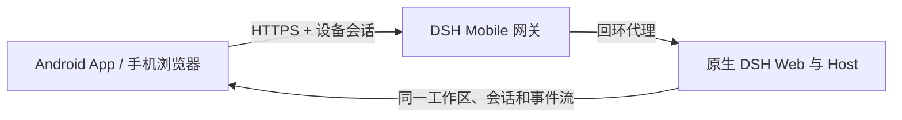

<p align="center">
  
</p>

<h1 align="center">DSH Mobile</h1>

<p align="center">在手机上安全、实时地使用电脑中的 DeepSeek Harness。</p>

<p align="center">
  <a href="https://www.npmjs.com/package/dsh-mobile"></a>
  <a href="https://github.com/saya-ch/dsh-mobile/actions/workflows/ci.yml"></a>
  <a href="https://github.com/saya-ch/dsh-mobile/releases"></a>
  <a href="LICENSE"></a>
</p>

<p align="center">
  <a href="#能做什么">能做什么</a> ·
  <a href="#快速开始">快速开始</a> ·
  <a href="#扩展与自定义">扩展与自定义</a> ·
  <a href="README.en.md">English</a>
</p>

> Alpha 版本，当前原生 App 仅支持 Android；iOS 客户端仍为未发布的本地开发实验，不进入构建与 Release。本项目为 DeepSeek Harness 社区插件。

<p align="center"><a href="https://github.com/saya-ch/dsh-mobile/releases"><strong>下载 Android App</strong></a></p>

DSH Mobile 是一个 DeepSeek Harness 插件，让手机浏览器或 Android App 在受保护的局域网内连接电脑，继续使用同一份会话、工作区、消息和工具。它只作为移动入口接入，不修改 DeepSeek Harness 源码。

移动访问使用独立的 HTTPS 与证书固定，只有配对过的设备能通过校验接入。

它还能在 DSH 对话里用 `/mobile <需求>` 定制手机端。

## 能做什么

- **在手机上继续电脑端的工作**：同一份会话、工作区、消息和工具，实时同步。
- **用对话定制手机端**：直接在 DSH 对话里改手机页面的布局、交互和功能，几秒内刷新。
- **专属触屏布局**：会话抽屉、工具详情、设置和输入栏都按手机重新组织。
- **自动发现、无需重新配对**：切换 Wi-Fi、热点或 IP 后通常自动恢复。
- **三种配对方式**：扫码、配对链接、密钥。

配对设备被视为完全信任，可以操作电脑上的 DSH；建议只在可信的家庭、办公局域网或可信 VPN 中使用。

## 快速开始

已经安装 `dsh` 命令：

```powershell
dsh plugin --profile web add dsh-mobile@alpha
dsh plugin --profile web exec dsh-mobile setup
dsh --profile web
```

直接使用 DeepSeek Harness 源码：

```powershell
corepack enable; pnpm install
pnpm dsh plugin --profile web add dsh-mobile@alpha
pnpm dsh plugin --profile web exec dsh-mobile setup
pnpm dsh --profile web
```

启动后，在 DeepSeek Harness 左下角打开“移动访问”，然后：

1. 点击“生成并复制密钥”或“复制配对链接”，面板会显示配对二维码。

<p align="center">
  
</p>

2. Android App 点击“扫码配对”，把手机对准电脑屏幕上的二维码即可；也可以点击“扫描”选择电脑后粘贴密钥或配对链接。
3. 配对完成后会建立持久设备信任，以后打开 App 无需重复输入。

`setup` 会自动选择并记住当前局域网，切换 Wi-Fi、热点或 IP 后通常自动恢复；仅在自动选择失败时使用 `--address 192.168.x.x`。设置、证书、设备和自定义文件保存在 `$DSH_HOME/mobile-access/`。

## 扩展与自定义

在 DSH 对话里输入 `/mobile <需求>`，DSH 会直接修改手机端的文件，几秒内生效。例如：

```text
/mobile 把手机端做成老式终端的样子，让消息像终端输出一样逐行滚动
```

也可以让手机端调用电脑端的能力，比如实时读取电脑状态：

```text
/mobile 为手机端添加赛博朋克风格的电脑监控面板，实时显示电脑的 CPU、内存和磁盘占用
```

`/mobile` 把需求交给 DSH 对话中的 agent，由它直接修改本机 `$DSH_HOME/mobile-access/` 下的文件，保存后手机端自动生效。改动分两类：界面和交互在 `mobile.css`/`mobile.js`；需要电脑能力时用 `extensions/` 下的扩展，其 `host.mjs` 以本机用户权限在电脑上运行。不修改 DeepSeek Harness 源码。

示例的实际效果：

<p align="center">
  
  
  
  
</p>

## App 与手机浏览器


| 方式        | 适合场景         | 说明                                                                    |
| ------------- | ------------------ | ------------------------------------------------------------------------- |
| Android App | 日常使用         | 自动发现；App 内保存私有证书信任，无需在浏览器手动信任证书              |
| 手机浏览器  | 临时或跨平台访问 | 打开“移动访问”卡片显示的 HTTPS 地址；首次连接需在浏览器手动信任该证书 |

Android App 只是 Kotlin WebView 薄壳，不内置另一份网页；手机浏览器访问的是同一页面。需要排查兼容性时，可在浏览器地址后追加 `?frontend=stock`，临时回到旧的桌面页面适配模式。

## 工作原理



插件包含三层：Host face 负责发现、配对、HTTPS、回环代理和扩展注册表；Client face 提供独立的移动布局与扩展 SDK；Android App 提供受限的原生 Bridge。DeepSeek Harness 的源码和 3080 桌面页面都不会被修改，安装和卸载完全通过插件机制完成。

## 安全

- 仅在可信家庭、办公局域网或可信 VPN 中使用，不要转发到公网。
- 配对设备拥有控制电脑端 DeepSeek Harness 的能力，应视为完全可信设备；丢失手机后应在电脑端撤销设备。
- 移动网关开启时才监听局域网；关闭后 DeepSeek Harness 仍正常在电脑本机运行。

完整说明见 [SECURITY.md](SECURITY.md)。

## 兼容性


| DSH Mobile       | 已验证的 DeepSeek Harness                |
| ------------------ | ------------------------------------------ |
| `0.1.0-alpha.35` | `0.1.0-rc.5`、`0.1.0-rc.6`、`0.1.0-rc.7` |

插件启动时会检查 DSH Host 版本和移动布局所需的前端依赖，遇到未经验证的版本会直接报错而不是带病启动；CI 也会持续跟踪 DSH 主分支的布局契约。升级 DSH 后如遇兼容提示，请先升级 DSH Mobile。

## 卸载

```powershell
dsh plugin --profile web remove dsh-mobile
```

同时清除插件数据：

```powershell
dsh plugin --profile web exec dsh-mobile purge --yes
dsh plugin --profile web remove dsh-mobile
```

源码模式把上述 `dsh` 换成 `pnpm dsh`。

## 开发

```powershell
npm ci
npm run verify
```

Android 构建见 [App 文档](apps/mobile/README.zh-CN.md)。

Apache-2.0，详见 [LICENSE](LICENSE)。
