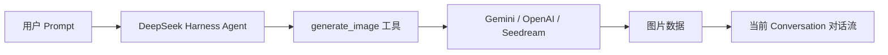

<div align="center">

# 🎨 dsh-image-gen

### DeepSeek Harness (DSH) 原生生图插件

**让 DeepSeek Harness 像 ChatGPT 一样，在对话里直接生成图片。**

支持 Google Gemini、OpenAI Images、OpenAI Compatible API、字节 Seedream / 火山方舟。

[](https://www.npmjs.com/package/dsh-image-gen)
[](https://github.com/deepseek-ai)
[](https://www.npmjs.com/package/dsh-image-gen)
[](LICENSE)

[English](README.en.md) | **简体中文**

<br />

<p align="center">💬 <b>直接对你的 DeepSeek Harness Agent 发送以下提示词：</b></p>

```text
帮我安装生图插件，执行命令：pnpm dsh plugin --profile web add dsh-image-gen
```

<p align="center"><sub>（也可以手动在终端执行：<code>pnpm dsh plugin --profile web add dsh-image-gen</code>）</sub></p>

<br />

<p align="center">安装完成后，在 DSH 设置中填入自己的 API Key，就可以直接对 Agent 说：</p>

```text
帮我画一张雨夜霓虹街头的赛博朋克猫咪。
```

<p align="center">Agent 会自动调用 <code>generate_image</code>，生成图片并直接显示在当前对话中。</p>

<br />


</div>

---

## 💡 它解决什么问题？

**`dsh-image-gen` 是专为 DeepSeek Harness (DSH) 打造的开源图像生成插件。**

DeepSeek Harness 已经可以让 Agent 调用不同工具完成任务，本项目为它补上了原生的**多模态生图能力**：



---

## 🚀 快速安装与使用

### 1. 安装插件

在你的 DeepSeek Harness 项目根目录下运行：

```bash
# 推荐方式：通过 pnpm 一键安装并注册插件
pnpm dsh plugin --profile web add dsh-image-gen

# 若已将 dsh 安装为系统全局命令：
dsh plugin --profile web add dsh-image-gen
```

<details>
<summary><b>🛠️ 其他安装方式（Git 仓库直装 / 本地调试）</b></summary>

```bash
# 方式 B：从 GitHub 仓库直接安装最新代码
pnpm dsh plugin --profile web add git+https://github.com/shanliuling/dsh-image-gen.git

# 方式 C：本地克隆源码开发安装
git clone https://github.com/shanliuling/dsh-image-gen.git
pnpm dsh plugin --profile web add ./dsh-image-gen
```

</details>

### 2. 配置 API Key

打开 DSH Web 页面（默认 `http://localhost:3080`）：

1. 进入 **Settings → Plugins → Image generation**。
2. 选择 Provider，填写 API Key，点击 **保存** 即可。

<div align="center">
  
</div>

### 3. 开始对话生图

现在直接在聊天框输入：

```text
生成一张极简主义的现代建筑客厅插画。
```

当前 Agent 就会自动调用 `generate_image` 工具并在对话流中返回图片。

---

## ✨ 主要能力

- 💬 **对话中直接生图**：不需要切换到其他网站，也不需要手动复制 Prompt，直接告诉 Agent 你想画什么即可。
- 🎨 **多 Provider 支持**：目前支持 Google Gemini、OpenAI Images、OpenAI Compatible API 以及 ByteDance Seedream / Volcengine Ark。Provider、模型和 Endpoint 都可以在设置界面中自由修改。
- 🔑 **BYOK (自带 Key)**：插件使用你自己的 API Key。API Key 通过 DeepSeek Harness 的 `credentials` 服务管理，采用写保护隔离，不需要写进项目源码或配置文件，前端不存明文。
- 🖼️ **图片跟随会话保存**：生成结果会接入 DeepSeek Harness 的 Attachment / Conversation 体系，重新打开历史会话后，仍然可以看到之前生成的图片。
- ⚙️ **原生设置界面**：Provider、API Key、模型和 Endpoint 都可以直接在 DSH Web 设置中修改，不需要手动编辑配置文件。

---

## 📦 支持的 Provider

| Provider | 默认模型 | 默认 Endpoint / Base URL |
| :--- | :--- | :--- |
| **Google Gemini** | `gemini-3.1-flash-image` | `https://generativelanguage.googleapis.com/v1beta/interactions` |
| **OpenAI Images** | `gpt-image-2` | `https://api.openai.com/v1` |
| **OpenAI Compatible** | 自定义 | 自定义 Base URL |
| **ByteDance Seedream / 火山方舟** | `doubao-seedream-5-0-260128` | `https://ark.cn-beijing.volces.com/api/v3` |

---

## 🛠️ 本地开发 (Development)

```bash
# 克隆仓库
git clone https://github.com/shanliuling/dsh-image-gen.git
cd dsh-image-gen

# 安装依赖与构建
pnpm install
pnpm run typecheck
pnpm run test
pnpm run build

# 检查 npm 打包内容
pnpm run pack:check
```

---

## 📄 开源协议 (License)

本项目基于 [MIT License](LICENSE) 开源。

如果这个插件对你有用，欢迎点一个 ⭐️ **Star** 支持！
