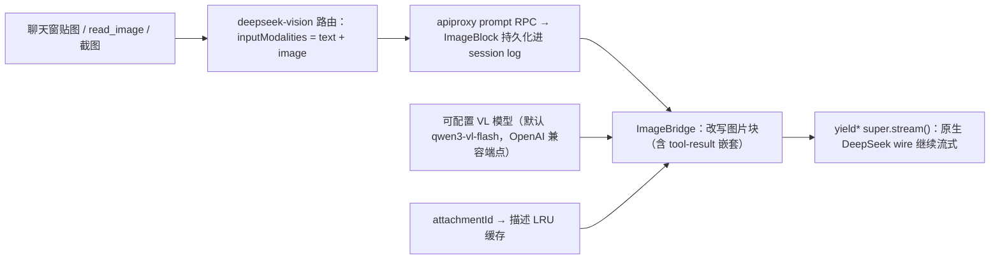

# dsh-deepseek-vision

[](https://github.com/deepseek-ai/deepseek-harness)
[](./CHANGELOG.md)
[](./tests)
[](./vitest.config.ts)
[](./LICENSE)
[](./package.json)
[](./cordis.patch.yml)

**安装：** `dsh plugin --profile web add dsh-deepseek-vision`

**dsh-deepseek-vision 是给 DeepSeek Harness 的视觉语言网关插件。** 纯文本的 DeepSeek 编程模型
通过一个"网关"provider 路由获得贴图能力：图片先由可配置的视觉模型（默认 Qwen-VL）
逐字描述成文字，再交给 DeepSeek 继续写代码。官方仓库零改动、跨机器安装不锁官方版本。
同类方案里它是**最薄的桥**：不注入 agent 工具、不经过第三方中转、不依赖本地模型。

[English](README.en.md) | [中文](README.md)

## 目录

- [亮点](#亮点)
- [为什么选它](#为什么选它)
- [快速开始](#快速开始)
- [效果](#效果)
- [工作原理](#工作原理)
- [配置](#配置)
- [使用](#使用)
- [安装](#安装)
- [版本对齐](#版本对齐)
- [开发](#开发)
- [边界与注意](#边界与注意)
- [FAQ](#faq)
- [许可](#许可)

## 亮点

- **贴图即用，不用换模型：** 注册独立路由 `deepseek-vision`（显示名 *DeepSeek + Vision*），
  真实声明 `inputModalities: ['text','image']`——聊天窗贴图、`tool-fs read_image`、浏览器
  截图工具全部放行。
- **每张图只描述一次：** 按 `attachmentId` 进程内 LRU 缓存，重试、上下文压缩、后续轮次
  复用同一份描述，不重复计费。
- **会话不变量保持：** 原始图片仍持久化进 session log，历史 / 回放 / 重构不受影响。
- **官方机制安装：** bundle 声明 + `dsh plugin add`，四种 spec（npm / git / 目录 / tarball）、
  web 与 headless 双 profile，与官方插件完全同一路径。
- **换 VL 模型零改码：** 端点 / 模型 / 提示词 / 密钥全在设置卡片，兼容任意
  OpenAI 风格 `/chat/completions` 网关（DashScope、vLLM、OpenRouter、LM Studio…）。
- **失败语义明确：** 默认 fail-closed，稳定错误码（`AUTH` / `TIMEOUT` / `TRANSPORT` /
  `IMAGE_TOO_LARGE`…），或 `placeholder` 降级为文字占位继续。
- **跨版本不锁死：** 发布版不锁定官方 dsh 版本——目标机安装时用**自己的** dsh 重建，
  构建成功即兼容证明；装前检查分级提示，绝不静默失败。

## 为什么选它

dsh 视觉插件生态在官方 harness 发布后的几十小时内密集涌现，机制与取舍各不相同。本插件的
立场是一句话：**最薄的桥**——只加一条 provider 路由，其余什么都别加。

- **不注入 agent 工具**：不新增 `vision_describe` / `analyze_image` 之类的工具，agent
  的行为面不变，贴图走的就是"贴图"这条原路；
- **不经过第三方中转**：没有匿名回退端点、没有代理服务器、没有磁盘答案缓存——图片
  只经过**你自己配置的 VL 端点**（你的 key、你的端点、你的数据）；
- **不依赖本地模型**：无 Python / MLX / llama.cpp / Ollama 要求，装上即用；
- **与官方插件同一发布质量**：官方 bundle 机制安装、装前兼容门禁、构建锚点章、
  102 个测试 / 97% 覆盖率、双语文档。

| 维度 | 本插件 | 工具型（如 [dsh-vision-any](https://github.com/tianmingwan/dsh-vision-any)、[dsh-vision](https://github.com/linenxi-ctrl/dsh-vision)） | 路由型（如 [dsh-vision-router](https://github.com/ysr666/dsh-vision-router)） | 代理型（如 [dsh-vision-proxy](https://github.com/Flyvhidbwo/dsh-vision-proxy)） | 本地管线型（如 [DeepSeek-Harness-Vision-Tools](https://github.com/tonyd2wild/DeepSeek-Harness-Vision-Tools)） |
| --- | --- | --- | --- | --- | --- |
| 机制 | provider 网关路由 | 注入 agent 工具 | 工具 + 多供应商路由 | 透明代理路由 | Python 本地 VLM 管线 |
| 图片数据流 | 只经你自己的 VL 端点 | 你自己的 API | 含第三方匿名回退 | 自有端点 + 回退链 | 本地模型，不出网 |
| 换 VL 模型 | 设置卡片，零改码 | 配置文件 | 配置文件 | 配置 + 自动探测 Ollama | 换本地模型 |
| 答案/描述缓存 | 进程内 LRU（仅描述） | — | 内容哈希答案缓存 | SHA-256 缓存 | — |
| 失败语义 | fail-closed + 稳定错误码 | — | — | 超时保护 | — |
| 发布链路 | 官方 bundle 机制 + 兼容门禁 + 锚点章 | — | — | — | 非 bundle |

> 上表只列方向性差异，各项目仍在快速迭代；选型时请以各项目最新 README 为准。

## 快速开始

前置：`dsh` CLI 已可用并启动过一次、PATH 里有 `pnpm`（`dsh plugin` 命令经 pnpm 安装插件）。

**第一步：新机器装 `dsh`（一次性，二选一）。** `dsh` 是官方 CLI（npm 包
`@deepseek-ai/dsh`）：

```sh
npm install -g @deepseek-ai/dsh        # 推荐：dsh 永久进入 PATH，之后命令直接敲
# 或（官方一行启动方式）：
npx @deepseek-ai/dsh web               # 不装全局：CLI 只在 npx 缓存里运行，不会进 PATH
```

> ⚠️ 用 `npx` 方式时 `dsh` **不会**进入 PATH——新开终端直接敲 `dsh` 会报
> "command not found"。要么全局安装，要么所有命令都带 `npx @deepseek-ai/dsh` 前缀。

**第二步：安装**（npm 发布版，推荐方式）：

```sh
dsh plugin --profile web add dsh-deepseek-vision
# 没装全局、走 npx 时：
npx @deepseek-ai/dsh plugin --profile web add dsh-deepseek-vision
```

**部署使用：** 重启一次 `dsh web` → Models 页选 **DeepSeek + Vision** → 设置 → 插件 →
插件配置里填 VL 密钥 → 聊天窗贴图，发消息。

**卸载：**

```sh
dsh plugin --profile web remove dsh-deepseek-vision
```

headless profile、其他 spec 形式（git / 目录 / tarball）、无 CLI 的机器——见[安装](#安装)。

## 效果

聊天窗里选中 **DeepSeek + Vision** provider 之后：

|  |  |
| :---: | :---: |

- **粘贴 / 拖入图片** → 被配置好的视觉模型先描述成文字（逐字提取代码、报错、日志、
  UI 文案，并描述布局）；
- 描述文字替代图片发给 DeepSeek → 你继续用 DeepSeek 写代码，同时获得图片理解能力；
- 每张图片只描述一次，重试 / 压缩 / 后续轮次都复用同一份描述，不重复计费；
- session 日志仍然持久化原始图片，历史 / 回放 / 重构不变量不受影响。

## 工作原理



为什么是"网关适配器"而不是中间件：DSH 有两道硬门槛——`prompt` / `selectModel` RPC 按
`inputModalities` 拒绝不含 `image` 的模型（纯 `llm/stream` 中间件拦不到），llm-deepseek
序列化器对 image block 抛 `UNSUPPORTED_CONTENT`。本插件注册新的 provider 路由，继承官方
导出的 `DeepSeekAdapter`，`stream()` 里把图片块经 VL 模型改写为文本后再走原汁原味的
DeepSeek wire；reasoning efforts / context 窗口 / 默认 maxTokens / retry policy 全部从
父类继承。

## 配置

全部可省略（走默认值）。两个 key 都支持 credential-ref（环境变量名），凭据经 dsh 的
credentials seam 解析（Web Models 页写入的凭据即可用），无 seam 时回退到启动环境变量：

| 路径 | 默认值 | 说明 |
| --- | --- | --- |
| `provider` | `deepseek-vision` | 注册的路由 id（避开 `deepseek-official`） |
| `displayName` | `DeepSeek + Vision` | 模型选择器里的名字 |
| `deepseek.*` | — | 与官方 `llm-deepseek` 段完全同构（apiKeyEnv / baseURL / thinking / reasoningEffort / maxTokens / models / retryPolicy…） |
| `deepseek.apiKeyEnv` | `DEEPSEEK_API_KEY` | DeepSeek key |
| `vl.apiKeyEnv` | `QWEN_VL_API_KEY` | VL 模型 key |
| `vl.baseURL` | `https://dashscope.aliyuncs.com/compatible-mode/v1` | 任意 OpenAI 兼容 `/chat/completions` 网关 |
| `vl.model` | `qwen3-vl-flash` | VL 模型 id（贴图 OCR 型描述性价比最高；复杂视觉推理可换 `qwen-vl-max`） |
| `vl.describePrompt` | 详述 + 逐字提取的英文提示词 | 图片描述指令 |
| `vl.timeoutMs` | `120000` | 单次描述请求硬超时 |
| `vl.maxCacheEntries` | `64` | 进程内描述缓存容量（LRU） |
| `vl.onFailure` | `fail` | `fail` = 描述失败整个请求失败；`placeholder` = 降级为文字占位继续 |

`llm-vl-gateway` 也是一个 settings namespace，三个编辑入口：**设置 → 插件 → 插件配置**
的"DeepSeek + Vision（视觉语言桥接）"卡片（`vl.*` 全字段 + VL 密钥）、Web Models 页
（`deepseek.*` 子段由可配置 provider 目录接管）、`settings.yaml`（两个子段都可写）。


`provider` / `displayName` 是注册期事实，修改即时生效（adapter 路由 + 可配置 provider
目录原子重注册，不需重启）；改成已被占用的路由 id 时两个注册表保留旧值并记日志。

patch 行内配置示例（全部可选）：

```yaml
- insert:
    - id: llm-vl-gateway
      name: dsh-deepseek-vision
      config:
        deepseek:
          reasoningEffort: high
        vl:
          apiKeyEnv: DASHSCOPE_API_KEY
          model: qwen3-vl-flash
```

## 使用

1. 设置两个 key：**设置 → 插件 → 插件配置 → "DeepSeek + Vision（视觉语言桥接）"**
   卡片里填 VL 密钥（写入凭据存储，不出现在任何响应/设置里）；DeepSeek key 沿用现有凭据；
2. Models 页选择 provider **DeepSeek + Vision**（会话内切换即持久化为默认）；
3. 聊天窗贴图，发消息——图片自动被描述，DeepSeek 看到的是文字。

设置卡片是本插件的**客户端面**（`dsh.client`）：以官方解耦插件的方式注册进
`settings.plugin.item` 槽位，编辑 `llm-vl-gateway.vl` 段，与官方内置卡片（终端 /
Agent 循环 / 网页搜索）同机制、同交互（暂存草稿、覆盖状态显示、保存时整体写入）。

## 安装

安装走**官方 bundle 机制**：本包在 `package.json` 声明 `dsh.bundle.patch`（指向包内
`cordis.patch.yml`），`dsh plugin add` 把包链接进 profile 并把包名对账进 profile
manifest 的 `dsh.profile.bundles` 层栈，loader 启动时按层挂载——**不需要手工往
`cordis.patch.yml` 加任何行**（旧版本加过的受管块会在下次安装/卸载时自动迁移移除）。

四种 spec 任选：

```sh
dsh plugin --profile web add dsh-deepseek-vision                          # npm（推荐）
dsh plugin --profile web add github:siegfly/dsh-deepseek-vision#<sha>       # git，锁 commit
dsh plugin --profile web add file:<本仓库路径>                        # 本地目录（开发）
dsh plugin --profile web add ./dsh-deepseek-vision-<version>.tgz              # tarball
```

headless 同理：`dsh plugin --profile headless add dsh-deepseek-vision`（客户端卡片只在
web 生效）。验证 bundle 层已挂载：`dsh --profile web --dump-config | grep llm-vl-gateway`。
卸载与安装一一对应：`dsh plugin --profile <name> remove dsh-deepseek-vision`。

无 CLI 的机器用等价复刻（需 Node 22.19+ 或 24+、PATH 里有 `pnpm`；init 布局 → pnpm add → bundles 对账）：

```powershell
pnpm install        # 只装 devDeps（typescript/vitest），不会装 @deepseek-ai/*
pnpm install-profile          # 或 node scripts/install-profile.mjs [profile] [dshHome]
```

两种方式做同样的事：

- 把 `dsh-deepseek-vision` 链接进 profile 的 node_modules（运行时 `@deepseek-ai/*` 依赖经
  官方 healed fallback 解析到**同一个** dsh 安装，共享同一个 cordis 实例，无双实例问题）；
- 把 `dsh-deepseek-vision` 对账进 `dsh.profile.bundles`——loader 按层挂载包内
  `cordis.patch.yml` 的 insert 行（注册路由 + 设置段）；
- 首次安装时如 profile 布局缺失，按官方 `initProfile` 语义补齐（manifest + 空用户
  patch 层 + `pnpm-workspace.yaml`），**已存在的文件从不改动**。

装完**重启一次 `dsh web`**（bundles 层栈变化 + 客户端模块扫描按包名缓存）。

> 本仓库是独立 git 仓库，与 deepseek-harness 官方仓库没有任何 git 关系
> （无 fork / 子模块 / 远程关联）；官方 checkout 零改动。

## 版本对齐

插件的运行时 `@deepseek-ai/*` 依赖从**目标机器自己的 dsh 安装**解析（healed fallback），
且安装脚本在检查之前会**先在目标机器上用目标机器自己的 dsh 类型重新构建**插件。因此：

> **发布版不锁定任何官方版本**——目标机器用比锚点更新（或更旧）的官方 dsh 都可以安装；
> 构建成功本身就是兼容性证明。若新官方版改了本插件用到的 API，构建会自然失败并给出明确
> 的 tsc 错误，那时才需要发新版适配。**作者无需跟随官方每次升级重新发布。**

- `dshCompat.anchorVersion` 只声明提交的 `lib/` 的**构建出处**（出处声明，不是安装
  许可）；`pnpm build` 写入的 `lib/build-anchor.json` 让出处无法撒谎。
- `node scripts/check-compat.mjs [dshHome]` 安装前对目标机分级：完全一致 = exit 0；
  **任何不一致 = exit 1 提示并放行**；残缺发布 / 复刻漂移 = 拒绝（有环境变量强制开关）。

完整策略、退出码分级与发版触发条件：[docs/VERSIONING.md](docs/VERSIONING.md)。

## 开发

```powershell
pnpm test      # vitest
pnpm build     # tsc（宿主面 + 客户端面）+ tsdown 浏览器 bundle
```

- `scripts/harness-paths.mjs` 是仓库唯一的解析缝：`$DSH_CHECKOUT` → 仓库根
  `harness-paths.json`（gitignored）→ 本机已安装 dsh 的 healed fallback。
- 纯 npm 机器上 2 个客户端测试套件自行跳过（npm 只发布浏览器闭包里的客户端运行时）；
  有官方源码 checkout 的机器跑全量。
- 产物里的 `@deepseek-ai/*` 导入保持裸说明符，运行时走 profile fallback。

细节：[docs/DEVELOPMENT.md](docs/DEVELOPMENT.md)。贡献指南：[CONTRIBUTING.md](CONTRIBUTING.md)；
安全漏洞报告：[SECURITY.md](SECURITY.md)。

## 边界与注意

- **compaction**：默认继承会话 provider（即网关路由），图片被改写且命中缓存；若把压缩
  策略显式 pin 到 `deepseek-official` 且历史含图，会按原逻辑 `UNSUPPORTED_CONTENT` 失败。
- **卸载后的含图会话**：卸载插件后，含图历史会话无法切回文本模型（官方 `selectModel`
  按 `inputModalities` 准入拒绝，属预期行为，不是数据损坏）；新会话不受影响，重装即恢复。
- **VL 失败语义**：默认 fail-closed——描述失败（如 key 失效）整个请求以稳定错误码
  （`AUTH` / `TIMEOUT` / `TRANSPORT`…）终止，不静默丢图；`onFailure: placeholder` 可降级。
- **图片上限 fast-fail**：描述前按部署图片准入上限（`ctx.attachments.imageLimits`）预检，
  超限图片在 base64 编码前就以 `IMAGE_TOO_LARGE` 失败（`placeholder` 策略下降级），不把
  几 MB 的 data URL 送进 VL 端点再死。插件不做图片降采样（官方 seam 没有公开的降采样
  能力）；部署上限内的图片仍可能超过 VL 供应商自己的大小上限，建议控制 `vl.timeoutMs`
  并留意供应商文档。
- 描述文本会占用 DeepSeek 的 context（每图几百 token，仅首次计费）。

## FAQ

**新机器上 `dsh` 命令不存在 / 报 command not found？** 先装官方 CLI：
`npm install -g @deepseek-ai/dsh`（一次性，之后 `dsh` 永久在 PATH）。如果平时用
`npx @deepseek-ai/dsh web` 启动（官方一行方式），CLI 只在 npx 缓存里运行、**不会进
PATH**，装插件时要用 npx 前缀：`npx @deepseek-ai/dsh plugin --profile web add
dsh-deepseek-vision`——插件本身装在 profile 里，与 CLI 从哪来无关，装一次永久有效。

**安装需要关心 Node 版本吗？** 官方 CLI 路径（`dsh plugin add`）不需要；只有无 CLI 的
复刻脚本需要 Node 22.19+ / 24+ 和 PATH 里的 `pnpm`。

**`#<sha>` 是什么？** git spec 形式的占位符——替换成具体 commit 哈希可锁死精确代码快照；
日常使用走 npm 形式即可。

**支持 CLI（headless）吗？** 支持。网关路由在两个 profile 行为一致；设置卡片是 web
专属，headless 用 `settings.yaml` 配置。

**卸载后，含图历史会话选不了模型？** 属预期行为：官方 `selectModel` 按
`inputModalities` 拒绝文本模型接入含图会话。新会话不受影响，重装即恢复。

**为什么图片不直接发给 DeepSeek？** 官方 DeepSeek 接口是纯文本的（会拒绝
`image_url`），所以先由 VL 模型描述成文字再转发——不换模型、不丢信息。

## 许可

[MIT](./LICENSE)
