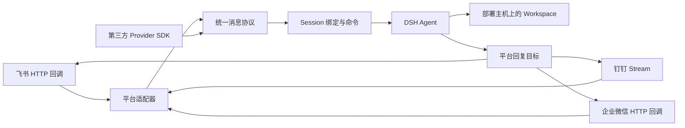

# DSH Collaboration Channels

`dsh-collaboration-channels` 是 DeepSeek Harness（DSH）的企业协作消息渠道插件。它把飞书、钉钉和企业微信中的文本消息转换成 DSH Agent 任务，并将执行结果回复到原聊天会话。

> 当前版本为 `1.0.0`。Collaboration Contract 已稳定为 `1.0.0`；目标运行时为 DSH `0.1.0-rc.6`，DSH 升级后请先执行完整测试并验证插件接口兼容性。

## 功能

- 飞书：加密 HTTP 事件回调、应用机器人文本及互动卡片回复、群聊 @ 策略。
- 钉钉：应用机器人 Stream 长连接、`sessionWebhook` 文本回复、可选互动卡片模板、群聊 @ 策略。
- 企业微信：加密回调验签与解密、自建应用文本及模板卡片回复。
- 将平台、租户、聊天和用户身份持久绑定到 DSH Session。
- 支持选择部署主机上的 Workspace，并保证 Session 的 `cwd` 创建后不被修改。
- 同一聊天身份串行执行，平台事件去重，长回复自动分段。
- 在 DSH Web UI 中配置公共策略和三个渠道。
- 普通参数写入 DSH settings，Secret、Token 和 Key 仅写入 write-only credentials 域。
- 配置保存后热重载对应渠道；修改插件服务端源码后仍需重启 DSH。
- 渠道健康状态、脱敏错误、持久化事件幂等和平台回复退避重试。
- `/workspaces`、`/sessions`、`/status` 和任务提交提示支持原生按钮；卡片不可用时自动降级为完整文本命令。
- 卡片操作使用一次性、限时并绑定企业身份与会话的令牌，防止伪造和重放。
- 三平台图片/文件/音频/视频附件接收，统一导入部署主机的 Session 隔离目录；Workspace 不会被自动写入。
- 附件数量、流式大小、MIME、危险扩展名与常见文件头准入，SHA-256 来源追踪、批量回滚和到期清理。
- 统一企业资源 URL Resolver 与只读 Provider：飞书 Docx/Wiki/云盘文件、钉钉 Wiki/文档块、企业微信文档/微盘文件。
- 资源缓存按平台、租户和用户隔离；默认拒绝跨平台凭据读取，外部文档内容显式标记为不可信。
- 三平台表格记录、审批实例和近期日历只读查询。
- 表格新增记录与日程创建使用持久草稿、操作白名单、同身份二次确认、一次性令牌和追加式脱敏审计。
- 公开 `collaborationProviders` 扩展服务、Channel/Resource/Business Manifest 契约、Capability/Permission 声明和 TypeScript 类型。
- 提供 Provider 脚手架、契约测试、有限请求体 Mock Server、本机回调代理和示例 Resource Provider。
- 按平台/租户/用户执行固定窗口消息限流，默认每分钟 30 条。

## 工作方式



Workspace 始终属于运行 DSH 的环境。假如 DSH 部署在服务器 A，无论消息来自手机、电脑 B、飞书、钉钉还是企业微信，Agent 操作的都是服务器 A 上注册到 DSH 的 Workspace，而不是消息发送设备的本地目录。

云文档和云盘不会自动成为 Workspace。聊天附件会先下载到受控的 Session 临时目录，Agent 通过来源可追踪的只读路径使用；只有用户后续明确要求并经过工具权限检查，才可能把产物写入 Workspace。

## 环境要求

- Node.js `22.19+` 或 `24+`
- DeepSeek Harness `0.1.0-rc.6`
- 可用的 DSH `web` profile
- 飞书和企业微信渠道需要可被平台访问的 HTTPS 地址
- 钉钉 Stream 渠道只要求 DSH 主机能够主动访问钉钉服务

## 安装

克隆项目后安装依赖并运行检查：

```bash
npm install
npm run check
```

把本地目录安装到 DSH `web` profile：

```bash
dsh plugin --profile web add /absolute/path/to/dsh-plugins
```

启动 DSH：

```bash
dsh web
```

打开 Web UI，进入“设置 → 插件”。页面中会出现以下配置卡：

1. 企业协作渠道
2. 飞书
3. 钉钉
4. 企业微信

建议先保存普通参数和凭据，确认平台侧配置完成后再启用渠道。凭据输入框不会读取或回显原文，只展示“已配置/未配置”和凭据来源。

## 公共配置

| 配置项 | 说明 | 默认值 |
|---|---|---|
| 默认 Workspace ID | 首次收到普通消息、尚未绑定 Session 时使用 | 只有一个 Workspace 时自动选择 |
| Session 隔离范围 | 按用户或按聊天会话绑定 Session | 按用户 |
| 单条回复最大字符数 | 超出后按段落拆分 | `3500` |
| 发送任务已提交提示 | 模型运行前先回复当前 Session 和 Workspace | 开启 |
| 单附件最大字节数 | 平台声明和实际下载流都执行硬限制 | `20971520` |
| 单消息附件上限 | 超过时拒绝导入 | `5` |
| 附件保留小时数 | 启动时及每小时清理过期附件 | `24` |
| 允许的 MIME 类型 | 逗号白名单，支持 `image/*` | 常见图片、音视频、文本、PDF、ZIP 和 Office Open XML |
| 自动读取同平台资源链接 | 识别消息中的官方文档/文件 URL | 开启 |
| 单消息资源链接上限 | 限制外部 API 扇出 | `3` |
| 单资源最大字符数 | 超出后截断进入 Agent 的内容 | `50000` |
| 资源缓存秒数 | 按平台/租户/用户/资源隔离 | `300` |
| 每用户每分钟消息上限 | 重复事件去重后不占额度 | `30` |
| 业务写操作模式 | 二次确认或全部禁用 | 二次确认 |
| 允许的写操作 | 逗号分隔的操作白名单 | `table.record.create,calendar.create` |
| 允许高风险写操作 | 当前版本仍不开放审批发起和删除入口 | 关闭 |
| 操作确认有效分钟数 | 一次性确认草稿有效期 | `10` |

按会话隔离会让同一群聊中的成员共享活动 Session 和上下文。生产环境建议保留“按用户”。

## 平台配置

### 钉钉

本插件使用“应用机器人 + Stream 模式”，不是群自定义 Webhook 机器人。

1. 在钉钉开发者后台创建企业内部应用。
2. 在应用信息中获取 Client ID（AppKey）和 Client Secret（AppSecret）。
3. 进入“机器人与消息推送”，启用机器人配置。
4. 将消息接收模式设置为 Stream，发布应用并设置可使用范围。
5. 在目标群的“群设置 → 机器人”中添加该机器人；群聊需要 @机器人。
6. 在 DSH 钉钉配置卡中填写：
   - 应用 Client ID（AppKey）
   - 应用 Client Secret（AppSecret）
7. 启用钉钉渠道。

互动卡片是可选能力。需要先在钉钉卡片平台创建符合插件变量契约的模板，再填写“互动卡片模板 ID”；未填写时 `/workspaces`、`/sessions` 等命令仍会返回可操作的文本。模板变量与回调参数见 [`docs/dingtalk-card-template.md`](docs/dingtalk-card-template.md)。

钉钉文档 Provider 需要 OpenAPI 的 `operatorId`。可在设置页填写拥有文档权限的用户 unionId；留空时尝试使用消息发送者 ID。

机器人是应用的一项能力，因此没有独立的机器人 Token。DSH 中填写的 Client ID 和 Client Secret 就是机器人所属应用的凭据。

钉钉 Stream 由插件主动建立出站长连接，不需要公网回调地址。配置完成后可在钉钉发送：

```text
/new 钉钉测试
```

收到 Session 创建回复后，再发送普通文本验证模型调用。

### 飞书

在飞书开放平台创建应用并启用机器人，开通接收和发送消息所需权限，订阅 `im.message.receive_v1`，然后发布应用版本。

如需接收附件，还需要允许应用读取消息资源。插件通过消息 ID 与资源 Key 下载用户发送的图片、文件、音频和视频。

如需读取云文档和云盘文件，还需开启 Docx、Wiki 与 Drive 的只读权限，并把目标资源授权给应用。

在 DSH 飞书配置卡中填写：

- App ID
- App Secret
- Verification Token
- Encrypt Key
- 公网访问地址

飞书事件订阅请求地址为：

```text
https://你的域名/dsh-collaboration/feishu/events
```

该地址需要通过反向代理或安全隧道转发到 DSH Web 服务。插件使用飞书官方 Node SDK 校验并解密事件。

### 企业微信

在企业微信管理后台创建自建应用，并配置接收消息 API。

在 DSH 企业微信配置卡中填写：

- Corp ID
- Agent ID
- Corp Secret
- 回调 Token
- EncodingAESKey
- 公网 HTTPS 根地址

企业微信回调 URL 为：

```text
https://你的域名/dsh-collaboration/wecom/events
```

插件支持 GET 回调校验、POST 加密文本和模板卡片事件，以及通过自建应用消息接口回复用户。当前未实现群机器人和微信客服入口。

图片、语音、视频和文件回调中的 `MediaId` 会通过临时素材接口下载；应用可见范围与素材权限必须覆盖发送者。

企业微信文档和微盘 Provider 还要求管理员在“协作 → 文档/微盘 → API”中配置可调用应用。

## 消息命令

| 命令 | 作用 |
|---|---|
| `/new [名称]` | 在当前 Workspace 创建新 Session |
| `/sessions` | 列出当前身份最近 10 个 Session |
| `/switch <ID 前缀>` | 切换已有 Session |
| `/session` | 查看当前 Session 和 Workspace |
| `/rename <名称>` | 重命名当前 Session |
| `/workspaces` | 列出 DSH 主机注册的 Workspace |
| `/workspace <ID 或名称>` | 在目标 Workspace 创建并切换到新 Session |
| `/status` | 查看当前任务是否运行中 |
| `/cancel` | 请求取消当前任务 |
| `/doctor` | 检查当前渠道、默认模型、Workspace 和 Session 状态 |
| `/resource <URL>` | 只读获取一个当前平台的企业文档或文件资源 |
| `/resources` | 查看三平台资源 Provider 可用性 |
| `/table <URL\|URI>` | 只读查看当前平台表格记录 |
| `/table-add <URI> <JSON>` | 生成新增表格记录草稿并二次确认 |
| `/approval <实例 ID>` | 只读查看审批实例 |
| `/calendar [天数]` | 只读查看近期日程 |
| `/schedule <ISO 时间> \| <标题>` | 生成一小时日程草稿并二次确认 |
| `/help` | 查看命令帮助 |

表格 URI、权限要求、写操作状态机和审计字段见 [`docs/business-operations.md`](docs/business-operations.md)。

## Provider SDK

第三方插件可通过 `dsh-collaboration-channels/sdk` 注册新的消息 Channel、只读 Resource 或 Business Provider。Registry 会校验 Provider ID、SemVer、平台、Capability、风险等级、实现方法和权限声明；自定义 Channel 复用 Core 的去重、限流、Session、Workspace 与 Agent 流程。

```bash
npx dsh-collaboration-create-provider \
  --name dsh-acme-resource \
  --platform acme \
  --kind resource \
  --out ./dsh-acme-resource
```

SDK、契约测试、Mock Server 和本机回调代理说明见 [`docs/provider-sdk.md`](docs/provider-sdk.md)，架构边界见 [`docs/architecture.md`](docs/architecture.md)，完整内置能力与权限声明见 [`capabilities.json`](capabilities.json)。

首次发送普通消息时，如果没有活动 Session：

- 配置了默认 Workspace：自动在其中创建 Session。
- 只有一个 Workspace：自动选择该 Workspace。
- 有多个 Workspace 且未配置默认项：返回 Workspace 列表，等待使用 `/workspace` 选择。

## 配置与数据存储

非敏感设置默认保存在：

```text
$DSH_HOME/settings.yaml
```

凭据由 DSH credentials Provider 保存。本地 profile 通常使用：

```text
$DSH_HOME/.credentials.yaml
```

渠道身份与 Session 的映射默认保存在：

```text
$DSH_HOME/storages/collaboration-channels.json
```

隔离附件与来源清单默认保存在：

```text
$DSH_HOME/storages/collaboration-attachments/<session-id>/
```

受控写操作的追加式脱敏审计默认保存在：

```text
$DSH_HOME/storages/collaboration-audit.jsonl
```

插件使用以下凭据引用：

```text
DSH_COLLAB_FEISHU_APP_SECRET
DSH_COLLAB_FEISHU_VERIFICATION_TOKEN
DSH_COLLAB_FEISHU_ENCRYPT_KEY
DSH_COLLAB_DINGTALK_CLIENT_SECRET
DSH_COLLAB_WECOM_CORP_SECRET
DSH_COLLAB_WECOM_CALLBACK_TOKEN
DSH_COLLAB_WECOM_ENCODING_AES_KEY
```

如果存在同名环境变量，DSH 可能将其识别为只读凭据来源，此时 UI 不能覆盖或删除。

## 安全边界

- 不要提交 `.env`、`settings.yaml`、`.credentials.yaml`、私钥或 `$DSH_HOME` 中的运行数据。
- 飞书和企业微信的 HTTP 回调应使用 HTTPS，并在反向代理层限制请求大小、速率和暴露范围。
- 默认使用按用户隔离 Session，避免群成员共享历史上下文。
- Workspace 权限等同于运行 DSH 进程的系统用户权限；请使用最小权限账号部署。
- 当前版本尚未实现企业 SSO 主体映射、Workspace ACL 和集中式管理员策略；本地 JSONL 操作审计不能替代企业 SIEM，不适合直接暴露给不受信任的多租户用户。
- 插件配置端点仅接受同源 UI 请求，并对白名单 namespace、字段和凭据引用进行校验。
- 企业资源只通过官方 API 与规范化 ID 访问；默认禁止跨平台 Token 使用，查询参数不会进入规范化来源。详见 [`docs/resources.md`](docs/resources.md)。
- 附件仅做隔离、准入与来源追踪，当前状态为 `quarantined-unscanned`；内置规则不能替代杀毒/EDR。详见 [`docs/attachments.md`](docs/attachments.md)。

## 项目结构

```text
.
├── client-src/index.jsx       # DSH Web 设置卡源码
├── client.js                  # 发布时需要提交的浏览器构建产物
├── cordis.patch.yml           # 将插件插入 DSH Host 配置树
├── index.js                   # 服务端入口
├── src/
│   ├── adapters/              # 飞书、钉钉、企业微信协议适配
│   ├── protocol-bridge.js     # 命令、Session、Workspace、Agent 生命周期
│   ├── state-store.js         # 渠道身份和 Session 持久绑定
│   ├── business.js            # 表格、审批、日历 Provider
│   ├── policy.js              # 受控写操作策略与确认状态机
│   ├── audit.js               # 追加式脱敏操作审计
│   ├── sdk/                   # v1 Contract、Registry、类型与测试工具
│   └── config-api.js          # 同源设置与凭据配置桥
├── examples/                  # 第三方 Provider 示例
├── scripts/                   # 脚手架与本机回调调试代理
├── test/                      # Node.js 测试
└── local_docs/                # 产品设计和后续规划
```

## 开发与验证

```bash
npm run build
npm test
npm run check
npm pack --dry-run
```

`npm run build` 会从 `client-src/index.jsx` 生成 `client.js` 和 source map。提交设置界面变更时，请同时提交构建产物。

当前测试覆盖：

- 浏览器插件注册和设置卡装载
- 同源配置边界与字段、凭据白名单
- Secret 单向写入
- 默认模型向渠道 Agent 的注入
- Session 状态持久化与身份隔离
- 回复分段
- 三平台互动卡片渲染、一次性动作令牌与身份隔离
- 附件隔离、流式硬限制、文件头校验、整批回滚、来源清单与生命周期清理
- 企业资源 URL 解析、三平台只读 Provider、结构化块转换、身份隔离缓存和提示注入边界
- 三平台表格 Provider、受控写操作白名单、持久草稿、一次性身份确认与无业务原文审计
- Provider Manifest/Registry、第三方 Channel 入站、契约测试、Mock Server 和脚手架非覆盖行为
- 每用户消息限流和限流健康计数
- 企业微信回调验签、解密和消息封装
- 渠道健康状态、错误脱敏、回复重试和跨重启事件幂等

## 已知限制与路线图

- 当前接收文本、图片、语音、视频和文件消息；交互式回复支持卡片。
- 附件发送、审批发起、删除和通用云资源写入尚未接入；当前只开放表格新增记录与日程创建。
- 飞书和企业微信部署需要自行提供 HTTPS、反向代理、访问控制和可用性保障。
- 企业微信当前主要支持自建应用单聊回复。
- 尚未实现统一的企业身份映射、细粒度 Workspace 授权、管理员审批门禁和审计导出。
- v1 后续小版本将优先完善 Artifact 回传、用户授权身份映射、真实三平台资源 API 兼容矩阵和集中式审计导出。

完整设计和里程碑见 [`local_docs/DSH_企业协作渠道插件规划.md`](local_docs/DSH_企业协作渠道插件规划.md)。

## 贡献

欢迎提交 Issue 和 Pull Request。提交代码前请：

1. 不提交任何真实平台凭据或本地 DSH 数据。
2. 为行为变更补充测试。
3. 运行 `npm run check`。
4. 如果修改了设置界面，提交重新生成的 `client.js` 和 `client.js.map`。
5. 在 PR 中说明所使用的 DSH 版本和验证过的平台场景。

## License

[MIT](LICENSE)
