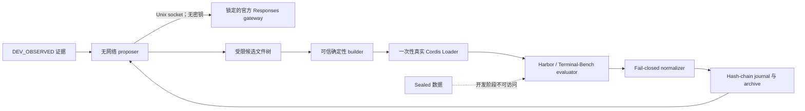

# dsh-self-evolving

[English](README.md) | [简体中文](README.zh-CN.md)

[](https://github.com/timwhitez/dsh-self-evolving/actions/workflows/ci.yml)
[](https://github.com/timwhitez/dsh-self-evolving/releases/tag/dsh-self-evolving-v0.2.0)
[](LICENSE)
[](package.json)
[](package.json)
[](docs/audits/2026-08-15-v0.2-provider-effectiveness.md)
[](https://www.npmjs.com/package/@dsh-self-evolving/core)
[](https://www.npmjs.com/package/@dsh-self-evolving/core)

一个面向 [DeepSeek Harness](https://github.com/deepseek-ai/DeepSeek-Harness) 的证据优先、可崩溃恢复的
自我进化引擎。它生成受限的 Cordis 插件候选，通过真实 Loader 的隔离验收，使用 Harbor 评测，并保存
可审计的完整谱系。

> [!IMPORTANT]
> v0.2.0 已证明系统能够稳定迭代，并产生可测量的固定回放工程效果；它**不代表** Terminal-Bench
> 分数提升、sealed 晋级、排行榜成绩或 SOTA。

## 为什么需要这个项目

自修改 Agent 很容易做出演示，却很难建立可信结论。`dsh-self-evolving` 把每个候选都视为不可信代码，
并将 controller、evaluator、预算、数据切分和安全策略固定在可信计算边界内。只有源码身份、证据、成本、
生命周期和恢复路径全部对账后，结果才会被接受。

本项目是标准 DSH Cordis plugin/service，不 fork DSH，也不是套在 DSH 外面的第二套 controller。

## 已验证范围

| 能力                                       | 有证据支持的状态                                             |
| ------------------------------------------ | ------------------------------------------------------------ |
| 标准 DSH/Cordis controller 与候选插件      | 已通过真实 Cordis Loader 验证                                |
| 受限多文件候选生成                         | 已通过无网络 proposer sandbox 验证                           |
| DeepSeek 官方 Responses provider           | 3 个真实付费 case 已通过                                     |
| 确定性构建与隔离 capsule admission         | 已通过双重构建和离线 Loader E2E                              |
| 持久化 journal、预算与崩溃恢复             | 已通过真实进程 kill 和 replay 审计                           |
| 稳定 K=3 迭代                              | 已验证 3 个 unique admitted descendants                      |
| 固定回放工程效果                           | `solve` 为 `ENGINEERING_EFFECT_VERIFIED`，`propose` 保持不变 |
| Terminal-Bench 提分 / sealed / leaderboard | **未运行，不作声明**                                         |

精确范围和哈希见 [v0.2 验收审计](docs/audits/2026-08-15-v0.2-provider-effectiveness.md)与
[当前项目状态](PROJECT_STATUS.md)。

## 架构



- controller 是唯一持久化写入者；
- provider 凭据只存在于可信宿主，不进入 proposer sandbox 或候选；
- 候选只能修改声明的 package，evaluator、scorer、split、route 和安全策略不可写；
- 每个外部 action 都先写 journal，重启后只允许完成一次对账。

详见[架构概览](docs/architecture-overview.md)和[信任边界规范](specs/05-safety.md)。

## 快速开始

### 环境要求

- Ubuntu 24.04 x86_64
- Node.js 22.19+ 或 24+
- 由 Corepack 管理的 pnpm 11.7.0
- 可用的 Docker daemon
- Python 3.12、`uv` 与 Bubblewrap
- 真实模型运行需要 DeepSeek API key；本地验证不需要 key

### 从 npm 安装控制器 bundle

控制器以 `@dsh-self-evolving/core` 发布到 npm。安装到 headless profile 时必须显式提供状态根目录与运行 ID，
缺失时 Config 校验会按设计 fail closed：

```bash
export DSH_SELF_EVOLVING_STATE_DIR="${XDG_STATE_HOME:-$HOME/.local/state}/dsh-self-evolving/demo-1"
export DSH_SELF_EVOLVING_RUN_ID=demo-1
dsh plugin --profile headless add @dsh-self-evolving/core@0.2.3
```

使用控制器优先走这条路径；开发、自托管或复现发布产物时再使用源码 checkout。

### 从源码安装（开发）

```bash
git clone https://github.com/timwhitez/dsh-self-evolving.git
cd dsh-self-evolving
corepack enable
pnpm setup:source
```

`setup:source` 会安装当前 workspace，并按照 [`provenance.lock.json`](provenance.lock.json) 固定的 commit
物化三个上游仓库。上游 remote 不匹配或工作树不干净时会直接拒绝继续。

### 初始化并检查一次运行

密钥只放在当前可信 shell 中：

```bash
export DEEPSEEK_API_KEY='...'
export DSH_STATE_DIR="${XDG_STATE_HOME:-$HOME/.local/state}/dsh-self-evolving/demo-1"

pnpm dsh-self-evolving init \
  --run-id demo-1 \
  --state-dir "$DSH_STATE_DIR" \
  --repo-root "$PWD" \
  --budget-usd 5

pnpm dsh-self-evolving doctor --state-dir "$DSH_STATE_DIR"
pnpm dsh-self-evolving run --state-dir "$DSH_STATE_DIR"
pnpm dsh-self-evolving status --state-dir "$DSH_STATE_DIR"
pnpm dsh-self-evolving audit --state-dir "$DSH_STATE_DIR"
```

运行中断后使用 `resume`，不能再次执行 `run`。state directory 属于私有证据，禁止提交。完整流程见
[快速开始](docs/quickstart.md)。

## 低消耗效果验证

effectiveness gate 要求一次真实 proposal 改变预注册的 `solve` 回放，同时保持 `propose` 控制回放不变：

```bash
export DSH_SELF_EVOLVING_EFFECT_RUN_ID='effect-local-1'
export DSH_SELF_EVOLVING_EFFECT_RECEIPT_PATH="$PWD/evidence/effectiveness/effect-local-1.json"
pnpm effectiveness:official
```

通过后的 receipt 只包含哈希、token 用量和估算成本，不包含 API key、reasoning 文本、provider 正文或私有
trajectory。仓库内接受证据按冻结价格表估算为 USD 0.0176861328；该数值只覆盖接受的 receipt，不是所有
重试或 benchmark campaign 的总费用。

## 验证当前 checkout

```bash
pnpm format:check
pnpm lint
pnpm typecheck
pnpm test
env -u DEEPSEEK_API_KEY pnpm test:e2e
pnpm provenance:check
pnpm upstream:check
pnpm byteequal:check
pnpm release:check
```

真实 provider 测试会产生 API 费用，因此必须显式运行：

```bash
pnpm test:provider:official
pnpm effectiveness:official
```

## 文档导航

| 从这里开始                                       | 用途                                          |
| ------------------------------------------------ | --------------------------------------------- |
| [文档中心](docs/README.md)                       | 查找安装、架构、运维、证据和发布文档          |
| [快速开始](docs/quickstart.md)                   | 安装并运行受限 stable demo                    |
| [配置](docs/configuration.md)                    | 冻结 profile、限制、provider route 与凭据边界 |
| [架构](docs/architecture-overview.md)            | 组件、数据流和隔离边界                        |
| [证据指南](docs/evidence-guide.md)               | 每种 artifact 能证明什么、不能证明什么        |
| [运维](docs/operations.md)                       | 停止、备份、恢复、回滚和卸载                  |
| [故障排查](docs/troubleshooting.md)              | Fail-closed 错误与恢复 procedure              |
| [DSH 上游策略](docs/upstream-policy.md)          | 可复现 pin 与最新版兼容性通道                 |
| [v0.2 release gates](docs/v0.2-release-gates.md) | 当前验收契约与发布后可选范围                  |

规范真源位于 [`specs/00`–`specs/07`](specs/)。冲突时优先级为：冻结 run manifest → specifications →
运维文档 → README → 历史讨论。

## 项目边界

- DSH、Harbor 和 Terminal-Bench checkout 是固定版本、只读的上游；
- `pnpm setup:source` 会自动安装已验收的 DSH pin；独立定时 workflow 验证当前 DSH `HEAD`，但不会静默
  改写既有 release；
- development evidence 可以驱动迭代，concealed/sealed 数据不可以；
- K=10/K=80、sealed confirmation、full-set 与 leaderboard submission 是发布后可选 profile，不属于
  v0.2 验收声明；
- 本仓库不授权金融交易或任何真实订单执行。

## 生态

- 已发布到 [npm](https://www.npmjs.com/package/@dsh-self-evolving/core)：`@dsh-self-evolving/core`。
- 已收录于 [awesome-dsh-plugin](https://github.com/awesome-dsh-plugin/awesome-dsh-plugin)（已合并）。
- 已收录于 [AdamPlatin123/awesome-dsh-plugins](https://github.com/AdamPlatin123/awesome-dsh-plugins)（已合并）。
- 已收录于 [0xsline/awesome-deepseek-harness](https://github.com/0xsline/awesome-deepseek-harness)（已合并）。
- 官方公告：[DeepSeek Harness Discussion #2547](https://github.com/deepseek-ai/deepseek-harness/discussions/2547)。
- 可通过 GitHub [`dsh-plugin`](https://github.com/topics/dsh-plugin) 与 `dsh` topic 发现。

## 贡献与安全

提交 PR 前请阅读 [CONTRIBUTING.md](CONTRIBUTING.md)。协议、信任边界、provider route、split、metric 或
retry 语义发生变化时，必须新增 ADR 和 run lineage。

凭据泄漏、sandbox escape 或 concealed data 暴露不能通过 public issue 报告。请遵循
[SECURITY.md](SECURITY.md)，发布后使用 GitHub private vulnerability reporting。

社区协作遵循 [CODE_OF_CONDUCT.md](CODE_OF_CONDUCT.md)。

## 许可证

项目使用 [Apache License 2.0](LICENSE)。DeepSeek Harness、Harbor、Terminal-Bench 及其依赖保留各自的
许可证和商标权利。
